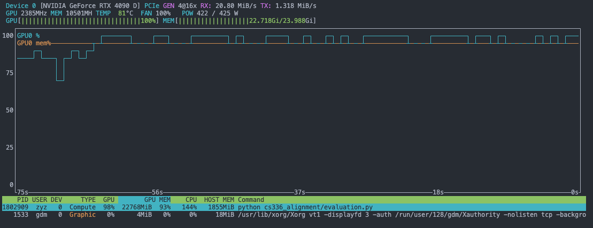
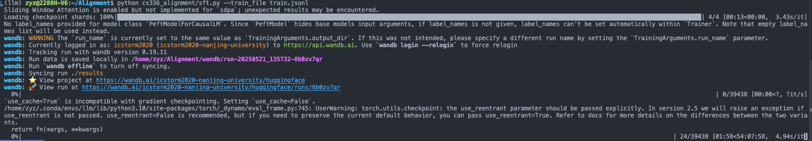

> Gott ist tot... Wir müssen selbst zu Göttern werden.

<!--more-->

## Intro


我们在预训练后，就得到了一个擅长续写的 AI。但是光是续写并不是十分有用，我们需要费尽思 prompt 才能得到想要的结果。为了更好的应对下游任务，如 QA Chatbot，总结，推理等，需要做一些适配。

下游任务往往需要模型有特定的回答模式，主题或者是新的知识。我们可以通过许多技术来适配。

1. SFT (Supervised Fine-Tuning) ：通过在数千条“提示-回答”对上继续训练，以塑造模型风格、提升指令遵循能力和解决安全性的经典方法，尤其适合风格控制。比较难注入新知识。目前也有 LoRA 等技术实现低成本微调。
2. RLHF (Reinforcement Learning from Human Feedback)：因为人类偏好的复杂性，我们很难有完善的预训练数据。但在很多情况下，即使我们不知道怎么回答，也很容易判断什么是好的回答。因此就有了 RLHF，通过训练一个奖励模型来学习人类对回答的偏好，再利用强化学习（如PPO）优化语言模型，使其生成更符合人类期望、更流畅且安全的输出。
3. Prompt：虽然简单有效，但其效果高度依赖设计技巧且对复杂任务有天花板。
4. RAG：通过从外部数据库查找资料，插入 prompt 作为上下文，有效解决了模型知识陈旧和事实性不足的问题，降低幻觉、增强专业性的经济高效手段，其核心在于高质量知识库与精准检索。

在这篇博客中，我们会在有一张 4090D 的服务器上，以 Qwen2.5-7B 为基础模型，对其进行微调，并在这个过程中学习相关知识。

##  Evaluation

在进行任何微调之前，建立一个健全的评估框架至关重要。如果没有评估标准，我们就无法衡量微调的效果，也无法判断模型是否在朝着期望的方向改进。在一般的深度学习任务中，交叉熵通常作为主要的衡量标准，但对于语言模型的某些能力（如结构化输出），单纯使用交叉熵并不合适。评估时，我们通常通过特定的 prompt 让模型生成规定格式的答案，然后通过文本解析或其他模型来评价这些答案的质量。

在进行评估时，我们需要选择合适的推理服务来运行模型。目前主流的选择包括：
- vllm：最高性能的推理服务
- ollama：专注于一键式部署，可自动在 CPU 和 GPU 间平衡计算
- Hugging Face Transformers：提供标准化的训练和微调接口，但不专注于推理性能

考虑到我们的 4090D 只有 24GB 显存，在 4096 序列长度下仅能勉强容纳 7B 参数模型及其 KV cache，而对于更大的模型（如 32B）则显存不足。因此，我们选择使用 vllm 作为基础模型的推理服务。



评估语言模型通常涉及以下几个方面：

首先是通用能力评估，我们使用 MMLU (Massive Multitask Language Understanding) 数据集来测试模型的事实性知识掌握程度。该数据集包含多个领域的选择题，每题提供 A、B、C、D 四个选项。我们使用如下统一格式的 prompt 来获取模型回答：

```
Answer the following multiple choice question about {subject}. Respond with 
a single sentence of the form "The correct answer is _", filling the blank 
with the letter corresponding to the correct answer (i.e., A, B, C or D).

Question: {question}
A. {options[0]}
B. {options[1]}
C. {options[2]}
D. {options[3]}

Answer:
```

通过解析模型输出，我们可以计算正确率。在测试中，我们的 Qwen2.5-7B 在 MMLU 上获得了 68.64% 的准确率。

其次是推理能力评估，我们采用 GSM8K 数据集。这个数据集包含一系列需要多步推理的数学问题，要求模型给出具体的数字答案。使用类似的评估方法，我们的 Qwen2.5-7B 在 GSM8K 上的得分为 22.52%。

此外，还有专门评估对话质量的 AlpacaEval 数据集，它使用一个强大的评估模型来对比被测模型与参考模型（通常是 GPT-4 Turbo）的表现。评估结果用被测模型相对于参考模型的胜率来表示。

最后，SimpleSafetyTests 用于评估模型输出的安全性，但同样需要一个较强的评估模型来判断输出是否安全。

受限于我们 4090D 的计算能力，以及成本考虑，我们只能进行 MMLU 和 GSM8K 这两项基础测试来评估模型的通用能力和推理能力。

## Supervised Fine Tune

如前所述，SFT 是通过在“提示-回答”对的数据集上继续训练预训练模型来适配下游任务的常用方法。这个过程相对直接，目标是让模型学习到在给定特定类型的提示时，生成特定格式或内容的回答。能够显著提升模型理解和执行指令的能力。不过它很难向模型注入新的事实性知识，或者纠正预训练阶段学到的错误知识，而且模型可能学会了模仿期望的输出格式，但并没有真正理解任务的本质。最后，数据非常重要，garbage in，garbage out。

SFT 的效果在很大程度上取决于数据的质量和数量。数据来源可以多种多样，包括人工标注的数据、开源指令数据集（如 Alpaca, Dolly, OpenOrca 等）、用户反馈数据等。数据通常需要处理成统一的“提示-回答”格式。例如：

```
{
  "instruction": "解释一下什么是黑洞。",
  "output": "黑洞是时空展现出极端强大的引力，以至于任何形式的物质和辐射都无法从中逃逸的区域。"
}
```

或者对于对话格式：

```
{
  "messages": [
    {"role": "user", "content": "你好，你是谁？"},
    {"role": "assistant", "content": "我是一个大型语言模型，由 Llama 团队训练。"}
  ]
}
```
最经典的方法是全参数微调，即更新模型的所有参数。虽然效果通常最好，但计算资源消耗大，训练时间长。作为替代，我们可以进行参数高效微调 (Parameter-Efficient Fine-Tuning - PEFT)，只更新模型的一小部分参数，或者引入少量额外的可训练参数。

常见的 PEFT 方法包括：
- LoRA (Low-Rank Adaptation)：通过在模型的某些层（通常是注意力层）注入低秩适配器矩阵来进行微调。它能以极少的额外参数（通常不到原模型参数的1%）达到接近全参数微调的效果，大大降低了微调的成本和存储需求。
- QLoRA：是 LoRA 的进一步优化，结合了量化技术，使得在更小的硬件上微调更大的模型成为可能
- 其他方法：如 Adapter Tuning、Prefix Tuning、Prompt Tuning 等

在我们的实验中，先尝试使用经典的全参数微调。使用 transformers 框架，微调的代码非常简单：

```python
def main():
    config = parse_args()
    
    if config.use_wandb:
        wandb.init(project="qwen-finetuning")
    
    # Initialize model and tokenizer
    tokenizer = AutoTokenizer.from_pretrained(config.model_name, trust_remote_code=True)
    model = AutoModelForCausalLM.from_pretrained(config.model_name, trust_remote_code=True)

    # Create dataset
    train_dataset = CustomDataset(config.train_file, tokenizer, config.max_length)

    # Training arguments
    training_args = TrainingArguments(
        output_dir=config.output_dir,
        num_train_epochs=config.num_epochs,
        per_device_train_batch_size=config.batch_size,
        gradient_accumulation_steps=config.gradient_accumulation_steps,
        learning_rate=config.learning_rate,
        weight_decay=config.weight_decay,
        warmup_steps=config.warmup_steps,
        logging_steps=config.logging_steps,
        save_steps=config.save_steps,
        eval_steps=config.eval_steps,
        logging_dir="./logs",
        fp16=True,
        report_to="wandb" if config.use_wandb else None,
    )

    # Initialize trainer
    trainer = Trainer(
        model=model,
        args=training_args,
        train_dataset=train_dataset,
    )

    # Start training
    trainer.train()
```

但是很快，显存不够，训练被迫中止了... 😢

那么让我们计算一下微调到底需要多少显存。结合 [Building a Transformer LM](https://rzyn2020.github.io/posts/building-a-transformer-lm/) 与 [Optimize the Performance of a LM](https://rzyn2020.github.io/posts/optimize-the-performance-of-a-lm/) 中的估算和测量，我们知道 20M 参数在 FP32 精度下训练时，包括优化器状态和激活值在内，峰值显存约为 2GB。由于显存占用和参数量成正比，7B 参数的模型理论上需要约 700GB 显存！

不过，我们可以通过一些优化方法来降低显存需求：
1. 混合精度训练：可以将显存需求减半至 400GB
2. Gradient Checkpointing：通过重计算中间激活值，可以节省约 70% 的激活值显存（以 30% 的计算时间开销为代价）
3. Gradient Accumulation：通过减少每次计算的 batch size 来降低显存使用

即便采用这些优化，估计也需要至少 80GB 显存，或者使用 DeepSpeed 等分布式训练框架将参数、激活值和优化器状态分散到多个 GPU 上。但我们只有一块 24GB 显存的 4090D，似乎只能尝试 1.5B 规模的小模型了。

不过，我们还有最后一招 —— PEFT。使用 QLoRA 技术，我们不直接调整原始参数，而是在特定层旁增加并调节新的参数（约原参数量的1%），再配合 4bit 量化等技术，24GB 显存就足够了：

```python
def main():
    config = parse_args()
    
    if config.use_wandb:
        wandb.init(project="qwen-finetuning")
    
    # Configure quantization
    bnb_config = BitsAndBytesConfig(
        load_in_4bit=True,
        bnb_4bit_use_double_quant=True,
        bnb_4bit_quant_type="nf4",
        bnb_4bit_compute_dtype=torch.bfloat16
    )

    # Initialize model with quantization
    model = AutoModelForCausalLM.from_pretrained(
        config.model_name,
        quantization_config=bnb_config,
        trust_remote_code=True,
        device_map="auto"
    )
    
    # Prepare model for k-bit training
    model = prepare_model_for_kbit_training(model)

    # LoRA configuration
    lora_config = LoraConfig(
        r=8,
        lora_alpha=32,
        target_modules=["q_proj", "k_proj", "v_proj", "o_proj"],
        lora_dropout=0.05,
        bias="none",
        task_type="CAUSAL_LM"
    )

    # Apply LoRA
    model = get_peft_model(model, lora_config)
    
    # Initialize tokenizer
    tokenizer = AutoTokenizer.from_pretrained(config.model_name, trust_remote_code=True)

    ...
    
    trainer.train()
```

此外，我们还可以使用 wandb（Weights & Biases）来监控训练过程。

但即便使用了 QLoRA，训练速度依然非常慢！



让我们估算一下训练时间：每条数据平均 512 个 token，共 39438 条微调数据，3 个 epoch，总 token 数约为 39438 * 256 * 3 ≈ 30M tokens。即使按照 vllm 推理的速度（约 1000 tokens/s）来算，也需要大约 8 小时才能完成训练。

所以...也许知道理论上可行就好了吧～

## RLHF

在 SFT 中，我们训练模型模仿一组高质量样本中的回答。然而，这往往不足以消除预训练过程中模型学到的不良行为。与 SFT 依赖外部优质样本不同，为了更好地对齐语言模型，我们通常需要从待改进的模型本身获取回答，并根据这些回答的质量和适当性来进行奖励或惩罚。

RLHF（基于人类反馈的强化学习）是一种通过人类反馈来优化语言模型的方法。它的核心思想是：即使我们难以直接给出完美的回答示例，但我们通常能够判断哪个回答更好。

最初的 RLHF 实现采用 PPO 算法，但目前更多地使用 DPO 算法。接下来我们将简要介绍强化学习的基础知识，并在最后深入理解 DPO 算法的原理，然后进行实践操作。

### RL Theory

https://hrl.boyuai.com/chapter/intro

https://spinningup.openai.com/en/latest/user/introduction.html

如何理解 policy： https://zhuanlan.zhihu.com/p/268100059

https://awjuliani.github.io/web-rl-playground/

1. 什么是强化学习
2. 多臂老虎机 exploration vs. exploitation
3. 马尔可夫决策过程 key concepts
   1. MRP 是有解析解的（但求解时间复杂度为三次方）
   2. 同时给一个 MDP 和一个 Policy，就能转化为一个 MRP
   3. 其他求解价值函数的方法
      1. 蒙特卡罗
      2. 动态规划

   4. 在确定 MDP 时，占用度量和策略一一对应
   5. 最优策略存在
4. 动态规划算法
   1. 策略迭代
      1. 策略迭代中的策略评估使用贝尔曼期望方程来得到一个策略的状态价值函数，这是一个动态规划的过程
      2. 首先策略评估，迭代贝尔曼期望方程直到不动点（可证明）
      3. 策略提升：贪心应用策略提示定理

   2. 价值迭代
      1. 而价值迭代直接使用贝尔曼最优方程来进行动态规划，得到最终的最优状态价值。
      1. 一种策略评估只进行了一轮更新的策略迭代算法。需要注意的是，价值迭代中不存在显式的策略
      
   3. 动态规划的这两种强化学习算法要求事先知道环境的状态转移函数和奖励函数。另外，策略迭代和价值迭代通常只适用于有限马尔可夫决策过程，即状态空间和动作空间是离散且有限的。
5. 时许差分和蒙特卡罗算法
   1. 模型的强化学习中的两大经典算法：Sarsa 和 Q-learning，它们都是基于**时序差分**（temporal difference，TD）的强化学习算法。

6. Sarsa = 时序差分 + 策略迭代 -》在线算法
7. Q-Learning = 时序差分 + 价值迭代 -》离线算法（和离线强化学习不同）
8. Dyna-Q 算法：通过采样估计模型
9. DQN
10. 基于策略的算法：策略参数化
    1. REINFORCE算法：蒙特卡罗估计
    2. Actor-Critic 算法：也学习值函数，但目的是为了辅助策略更新

11. TPRO算法：保证策略学习的性能单调性
12. PPO 基于 TRPO 的思想，但是其算法实现更加简单。

PPO (Proximal Policy Optimization) 是 RLHF 中最常用的强化学习算法。它通过限制策略更新的幅度来保证训练的稳定性，并通过引入价值函数来减少梯度的方差。然而，PPO 的实现相对复杂，涉及到多个组件（Actor, Critic, Reward Model）的训练和协调，并且对超参数敏感。

近年来，研究者们开始探索更简单、更直接的对齐方法。**DPO (Direct Preference Optimization)** 就是其中一种备受关注的方法。

### DPO in Action

代码实现以及

## Result

