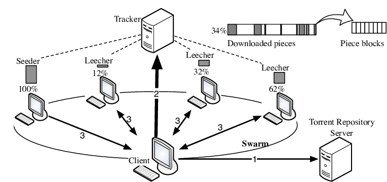
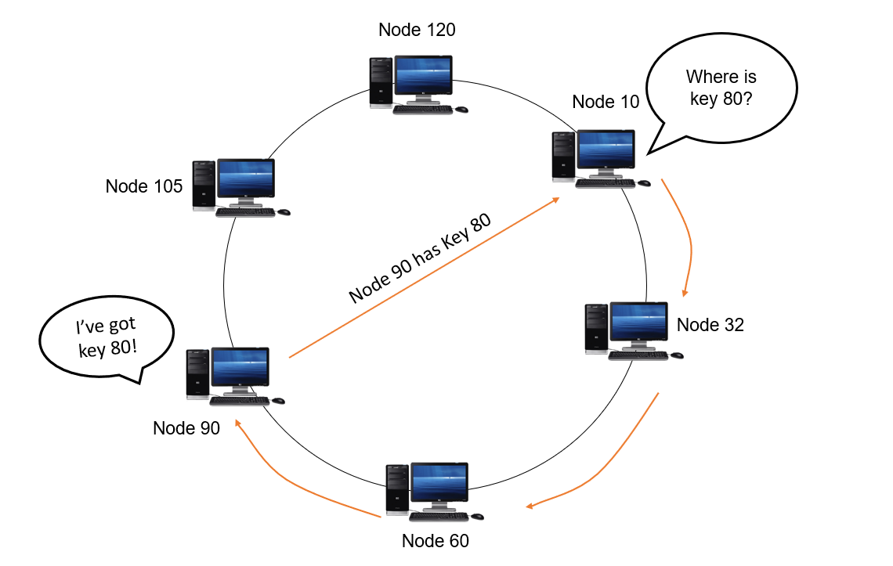

“I call architecture frozen music...” - Goethe

<!--more-->

BitTorrent 是一个 p2p 下载协议，官网网站见[这里](http://bittorrent.org/)。官方网站内不仅含有标准规范，而且仿照PEP（Python Enhancement Protocol），有着自己的 BEP，用来对协议进行增强。

不过官方标准规范较为难懂，这里有一份协议的非官方版本，更易于理解： [Unofficial Specification](https://wiki.theory.org/BitTorrentSpecification)

这里也有一份简介： https://web.cs.ucla.edu/classes/cs217/05BitTorrent.pdf

# p2p 网络

最严格的 p2p 网络定义为：

> A communications model in which each party has the same capabilities and either party can initiate a communication session 

也就是网络中每个节点都起相同功能，且不会出现单点故障。与之相反，server-client  式的架构就被称为 集中式 网络。

ARPNET 就是 p2p 式的；DNS system 可以算 p2p 和 集中式 的一个折中。

> 假如 DNS 是集中式的，一个主机负责全世界的 IP 查询，则很容易碰上 单点故障 和 性能限制。因此，DNS 采取了分布式的架构——树形递归查询加上多级缓存。有许多起相同功能的本地 DNS 服务器，挂掉一个也不影响整个系统运作，未尝不可称之为某种程度上的 p2p。

因此，一个宽松一点的 p2p 定义：

> “A distributed network architecture may be called a Peer-to-Peer (P-to-P, P2P,...) network, if the participants share a part of their own (hardware) resources (processing power, storage capacity, network link capacity, printers,...). These shared resources are necessary to provide the Service and content offered by the network (e.g. file sharing or shared workspaces for collaboration). They are accessible by other peers directly, without passing intermediary entities. The participants of such a network are thus resource (Service and content) providers as well as resource (Service and content) requestors (Servant-concept).” 

这样的定义下，虽然不能完全避免单点故障，但的确体现出来 p2p 的本质：

1. 每个参与者即是 服务提供者 又是 服务享受者

因此，p2p 就有着以下特点：

1. 相对可扩展性：增加服务享受者的同时也增加了服务提供者
2. 相对稳定性：许多服务提供者，挂掉一个也无妨

# BitTorrent

下面再来介绍典型的 p2p 协议 —— BitTorrent。

BitTorrent 主要被用来分发/下载文件，因为其 p2p 的特性而不需要耗费上传者太多带宽 —— p2p 网络中的每个用户在下载文件的同时也把自己已下载好的文件传给别人。

BitTorrent 协议与在它之前的 p2p 协议相比，有一个特点：它会把每个文件都切分为许多小块（piece），一个用户可以同时向许多同伴（peer）请求同一个文件的不同部分。

而它之前的 p2p 协议往往是一对一协议，一个下载好的人负责给一个没有下载好的人传送文件。但是因为一般网卡的上传带宽都远远小于下载带宽，因此这种模型下，文件传送的最大速率最大也只能等于peer的上传带宽。

但是在 BitTorrent 下，对于一个非常火爆的已经有很多人下载好的文件，我们就可以同时向他们所有人请求文件块，充分利用自己的下载带宽了。这也是为什么 BitTorrent 一经推出就统治了 p2p 下载界。

> 比如上面的文件，有 169 人上传，只有 18 人下载，可想而知下载速度是非常快的

BitTorrent 的架构中含有如下实体：

+ 一个元信息文件： torrent file
+ 一个集中式 tracker
+ 第一个参与者：seed
+ 其他参与者：leecher

tracker 会记录哪些 peer 正在下载文件，并帮助他们互相认识。peer 通过 http 协议和 tracker 进行通信，以获取相关信息。

世界上有许多公开的 tracker 服务器，比如这个列表里收录的：[trackerlist](https://github.com/ngosang/trackerslist)

在一开始，一个用户决定分发某个文件时，会先**做种**（seed）：他会使用本地的bt软件，把文件分为通常是 512 KB 或 256Kb 许多小块（piece），并计算每个小块的 SHA-1 哈希值 ，然后把所有的哈希值和相关元信息封装在一个 torrent 文件里，传给别人。同时他也在 tracker 处登记自己持有这个文件。（通常 torrent 文件里也包含推荐的 tracker）

当某个用户要下载时，他会向 tracker 请求 peer 列表，然后向 peer 们请求不同的文件块，并用 torrent 文件里的哈希值验证数据是否出错。

在这个流程中，有两个算法决定着 bt 网络的正常高效运转：

1. 决定先向 peer 请求那个块（The Piece Selection Algorithm） —— 以达到最大下载速度
2. 决定是否给某个 peer 发送数据（Resource Allocation） —— 以避免懒汉（free rider）

# The Piece Selection Algorithm

快选择算法的核心目标有两个：

1. 尽快在不同 peer 上复制不同的块（确保任何时刻网络中总能拼凑出一份完整的文件）
2. 尽快下载完成文件

### sub pieces

BitTorrent peer 之间通过 TCP 协议进行连接，因此需要避免 TCP 慢启动机制 对传输速率的影响。块常常被划分为 16kb 大小的子块进行传输，BitTorrent 协议保证和一个 peer 之间无论何时总是有一些 子块 等待被传输，以此来维持高速连接。一个块的不同子块可以从不同的 peer 处下载。

### policys

1. strict policy：每开始下载一个块时，就优先下载该块的所有子块。
2. random first piece：刚开始下载时，为了尽快得到能给其他 peer 上传的块，就随机选择一个块进行下载。
3. rarest first：优先下载网络中最稀有的块。
4. endgame mode：当到最后一块时，向所有 peer 都请求该块的子块，以快速下载完文件。

# Resource Allocation

Resource Alllocation 算法用来决定和哪个 peer 进行合作。我们采用[“tit-for-tat”](https://www.wikiwand.com/en/articles/Tit_for_tat) （以牙还牙）策略，以达到利益最大化。一般来说，你上传的越多，下载的也就越快。

# Enhancements

自从 BitTorrent 被发明以来，许多 BEP 提出了一些改进，下面介绍一些有趣的改进功能。

## Decentralized tracker

[youtube视频简介](https://www.youtube.com/watch?v=1wTucsUm64s&ab_channel=Recessive)

BitTorrent 中，由于 tracker 服务器的存在，所以不能达到 "真p2p"，因此就有了 去中心化tracker 拓展。它基于 DHT （Distributed hash table）在 peer 间存储 peerlist，以取代中心化 tracker。

DHT 的基本思想为：将所有 node 连接成一个环，环上每个 node 都负责存储某一范围内的 key，且知道相邻 node 的地址。查询时沿着环就可以找到目标key了。当添加或删除新 node 时，都调整数据分布以使得环结构仍然成立。

## Upnp

[问题的起因](https://www.downloadprivacy.com/how-to-torrent/port-forwarding)是这样的：我们的 bt客户端 大都运行在内网，可以通过路由器的 NAT机制 访问外网，可是外网设备就访问不到我们的 bt客户端 了，这就让其他 peer 没办法主动和我们建立连接。为了解决这个问题，我们可以在路由器上手动设置端口转发（当然前提是你的路由器就拥有公网 IP），或者使用 VPN。

Upnp （Universal Plug and Play）是一个应用层协议，可以在路由器上开启，接受到客户端的请求后，进行自动端口转发。其原本目标是为了让设备之间无需手动配置就能相互连接，不过许多 bt客户端 也实现了 Upnp协议，可以和路由器协商进行自动端口转发。但目前 Upnp协议 存在安全漏洞，很容易成为黑客攻击的目标。

## DDNS

DDNS 即 动态（dynamic）DNS服务。如果机器每次启动都是不同的 IP，那么就可以使用 DDNS 服务，在机器每次启动时都向 DDNS 服务器告知新 IP。这适用于当你的路由器被运营商分配动态公网 IP 时，也能对外界提供一个稳定的地址。

## 内网穿透

但当路由器本身就被运营商分配了局域网 IP 时，就只能通过内网穿透才能使我们的 bt客户端 暴露在公网中，接受其他 peer 的请求了。内网穿透即是通过外网中持有公网 IP 的服务器提供的中介服务，来暴露我们的客户端（相当于简化版 VPN）。
