Once upon a time, there was a mountain.

<!--more-->

> 输入提示 ➜ Once upon a time, there was a mountain.
>
> 生成结果 ➜ 
> Once upon a time, there was a mountain. In the sky, there was a big, round ball. A little boy named Tim and his mom went to the park to play. The sun was shining, and the sky was blue.
> In the park, Tim saw a big tree. He wanted to play near it. His mom said, "Okay, but be careful." Tim was happy. He played near the tree. He got up and down.
> While playing, Tim saw a small bird. The bird was sad. Tim said, "The bird has a hurt wing. Can you help me?" The bird said, "Yes, I can help you." Tim took the bird to his mom. He gave her a magic rock. The bird said, "Thank you, Tim. You are a good friend." Now, Tim and the bird were friends. They played together every day.

## Intro

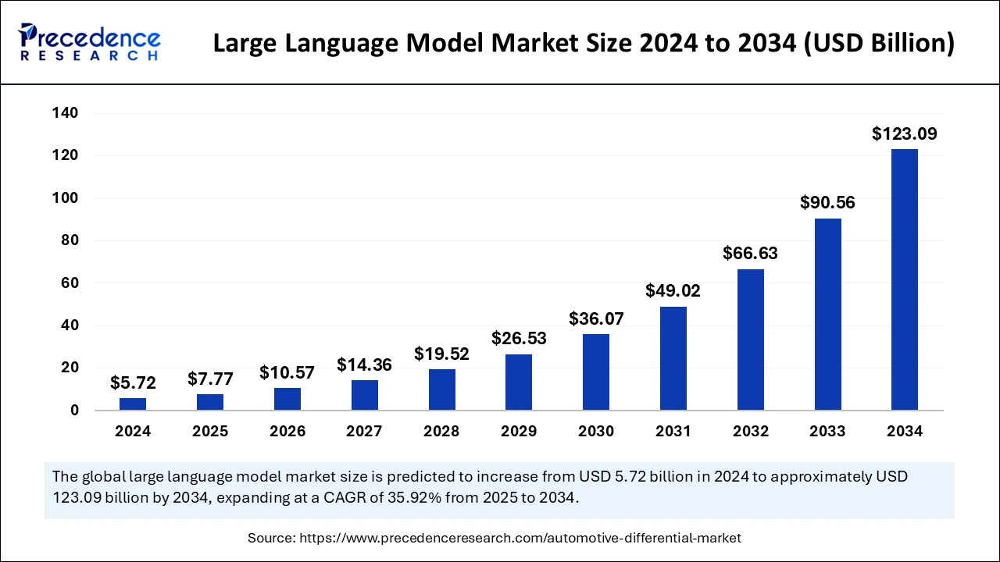

自从 2022 年 ChatGPT 发布后，LLM 开始席卷世界，俨然有一次新的科技浪潮之势。大模型资本市场以每年近 40% 的速度狂飙突进，在 2025 年初已接近 [77 亿美元](https://www.precedenceresearch.com/large-language-model-market#:~:text=work%20for%20everyone.-,U.S.%20Large%20Language%20Model%20Market%20Size%20and%20Growth%202025%20to,36.17%25%20from%202025%20to%202034.)，且预计在 2034 年可达千亿级别，与之相比，较为成熟但应用领域略窄的的计算机视觉市场规模也有 250 亿美元。

资本市场的火热与否在于应用的前景，而大模型的应用前景也显然十分广阔。现在许多 app 已接入 AI， 增强功能，而 RAG, Agent 等技术也正在迅速发展，更何况未来还有大模型辅助智能制造的广阔的场景。

应用前景引来资本投资，资本投资引起硬件，算法，以及系统的全方面发展。在摩尔定律失效之后，[领域专用硬件成为了提升计算力的绝妙法门](https://dl.acm.org/doi/pdf/10.1145/3282307)。英伟达的 GPU 针对训练和推理做了许多优化，华为，Google 也推出了许多深度学习专用计算设备。算法层面，模型结构和参数量也都在不断演化。而系统层面，也不断有新技术和新项目来适应新的模型和硬件。在这[几者的共同协作](https://hardwarelottery.github.io/)下，即使科技树点偏了，其探索之深也足以改变世界了。

在这个背景下，无论是出于好奇还是功利，学习大模型，理解其基本原理就显得有必要了。因此，我参考[cs336课程](https://stanford-cs336.github.io/spring2024/),，试着 build a transformer-language model from scratch。在过程中，我也大量参考了 [Umar Jamil](https://www.youtube.com/@umarjamilai) 的 live coding 以及李宏毅的[机器学习课程](https://speech.ee.ntu.edu.tw/~hylee/ml/2023-spring.php)。

最终我使用 [TinyStory](https://arxiv.org/abs/2305.07759) 数据集，在一张 4090 显卡上花费一个半小时训练出了一个讲故事模型，且称之为 StoryLM。文章开头的故事续写就由 StoryLM 生成。

这篇文章介绍该模型构建的全过程，并解释相关概念。目标读者是有一些深度学习基础的计算机专业学生（也就是年初的我）。

## Architecture


首先，从宏观上来介绍大模型的结构以及其生命周期。

就像任何深度学习模型一样，大模型的训练离不开**模型结构，优化器，损失函数**三个组成部分。优化器一般为常见的 AdamW，损失函数为分类任务常用的交叉熵，而几乎所有大模型的结构都基于 Transformer。Transformer 可分为编码器和解码器两部分，最初用于语言翻译等任务。编码器理解源语言，自回归解码器生成目标语言。而在生成式语言模型中，我们仅仅保留解码器即可。

> 在实际训练中，为了防止过拟合，梯度爆炸/消失，训练难以进行三个问题，会对上面三个组成部分做诸多调整

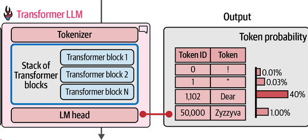

除了上面三者之外，训练数据也需要做一些处理。具体而言，我们需要通过 Tokenizer 加上词嵌入把句子变为模型能够理解的形式。具体可见 Tokenizer  和 Model 两小节。简而言之，一个句子会被切分成许多 token，每个 token 会被转化为一个词向量。输入一个句子后，模型会输出一个表示接在该句子后可能的 token 的概率分布。

StoryLM 的训练数据只有2GB，而真实世界大模型的训练数据动辄数TB，为了爬取并清洗得到这些训练数据，真实的 LLM system 也包含了许多数据处理相关技术。本文暂时不涉及。

同时 StoryLM 的参数量仅为 22M，而真实的大模型参数量均为 Billion 以上，因此其训练和推理过程的性能优化也是必不可少的。我会在后续文章介绍相关优化。

最后，通过大量语料进行的自监督训练只是预训练，得到的是基座模型，只具有续写能力。为了使模型更像语言助手，还需要进行监督微调与 RLHF。不过我们现在只考虑训练基座模型。

## Tokenizer

### Byte-Pair Encoding

Tokenizer 的目的是把句子转化为 Token 序列，每个 Token 都可以用一个数字表示，以便于模型处理。一个最简单的想法是 word-level tokenizer，但是 word 太多会导致词汇表过大，降低计算效率。而且会将如 "played" "playing" 编码为完全不同的两个Token，没能考虑到两者之间关系。因此，就有了第二个想法—— byte-level tokenizer：既然所有语言在计算机中的表示都是字节序列，那么我们把字节序列送给模型就好了！但是它也有一个问题：这种编码方式有太多冗余，word level 中的一个 Token 可能在 byte level 中就对应了好几个 Token，这样也会降低计算效率。

而 [Byte Pair Encoding](https://huggingface.co/learn/llm-course/en/chapter2/4?fw=pt#and-more) 是一种**折中**的算法：首先基于 byte-level tokenizer，这样就可以使用很小的词汇表处理各种语言了，但同时为了防止 Token 数目过多，BPE 会不断将最常见的 Token Pair 合并为一个新的 Token，直到达到预设的词汇表数目上限，以压缩 Token 长度。

在实践中，BEP有训练和运行两个过程。训练阶段会学习到哪些 Token 可以合并，构建词汇表。而运行阶段接受一个句子，根据训练好的词汇表将其编码为 Token 数组。

### BPE Implementation

#### Train BPE

首先考虑训练。训练时我们要不断识别最频繁出现的 Token-Pair 并将其合并。最简单的暴力算法就是每次合并时都扫描一遍，找到最出现最多的 Pair。假设 `n` 为语料长度，`m` 为词汇表大小上限。显然这个 `O(mn)` 的算法开销太大。

但是考虑到每合并一个 Pair 后，只有与这个 Pair 相邻的 Pair 数目才产生变化，我们可以这样设计程序：

数据结构：

1. 将 Pair 与其对应 count 存在一个数据结构 PairCounter 中，我们可以获取频率最高的 Pair，并方便地进行增删查改
   1. 比如
      1. 存储子树最值的平衡搜索树
      2. 支持`O(logn)`删除的堆
         1. 延迟删除法（原堆+删除堆）
         2. 即时删除法（哈希表记录元素索引）
2. 训练语料转化而来的 Token 链表，L
3. 一个从 Pair 到其出现位置的 map，M

算法：

1. 每次获取最频繁 Pair
   1. 增加到词汇表中
   2. 通过 M 修改 Token 链表 L
   3. 通过 Token 链表 L 信息更新 PairCounter 和 M

但考虑到大部分语言中常见单词只为几千个，如果忽略跨词 Pair，我们就可以考虑把 Token 链表 L 替换为一个 `从单词到该单词 Token 链的 map` 加上一个`从单词到该单词在训练集中出现数目的map`。这样，并把 M 修改 `从 Pair 到其出现的单词的 map`。这样，又能大大降低实际计算的开销。

这样，假设`k1`为最大 Pair 数目，`k2`为最大单词数目，该算法就可以在`O(n + mlogk1 + mk2)`的时间内完成训练。

此外，这个算法比较复杂，实现时要注意：

1. 及时把大函数拆分为小函数，方便理解
2. 采用 OOP 的设计方法，把数据结构和对其操作的方法结合起来

#### Run BPE

训练完成后，实际运行时，我们要编码的语料更多，因此更要考虑性能问题。

**首先是算法上的性能。**

假设语料长度为`n`，词汇表长度为`m`，简单的暴力算法时间复杂度显然为 `O(mn)`。

考虑到我们在训练时，合并的 Pair 都处于一个单词内，所以可以这样设计程序：

数据结构：

1. 一个代表原语料的单词 ID List
2. 一个从单词 ID 到该单词 Token 链的 map，M
3. 一个从 Pair 到其出现的单词的 map

算法：

1. 仿照训练过程，初始化这些数据结构
2. 根据训练过程得到的词汇表，不断进行 Pair 合并
3. 根据单词 ID List 和 M 得到最终编码结果

假设`k`为最大单词数目，则时间复杂度为 `O(n + mk)`

**其次是工程上的性能。**

考虑到 TinyStory 语料文件在 GB 级别，我们没办法一次把所有内容都放在内存中，因此只能process incrementally, save incrementally。

考虑到编码时会在词汇表中指定一个分隔符，而 Pair 是不能跨分隔符的。我们就可以每次从源文件中读取一个 chunk，找到距末尾最近的分隔符，并将之后的内容放进 buffer。然后处理该 chunk 并写入目标文件。处理第二个 chunk 前先在它之前加上 buffer 中内容。

```python
    def encode_file(self, file_path: str, out_path: str):
        with open(file_path, "r") as f:
            encoded = []
            i = 0
            while True:
                chunk = f.read(self.chunk_size)
                if not chunk:
                    break
                i += 1
                encoded_chunk = self._process_chunk(chunk)
                encoded.extend(encoded_chunk)
                
                # 增量保存（每处理100个分块写入一次）
                if len(encoded) > 100*self.chunk_size:
                    self._save_incrementally(encoded, out_path)
                    encoded = []
            
            # 处理最终缓冲区的剩余数据
            if self.buffer:
                final_tokens = self._process_chunk("")
                encoded.extend(final_tokens)
            
            self._save_incrementally(encoded, out_path)   
```

## Model

当 Tokenizer 把输入转化为 int 数组后，我们就可以直接把该数组输入模型，并得到 [logit](https://www.zhihu.com/question/60751553) 了。

下图是 TinyStory 的模型结构：

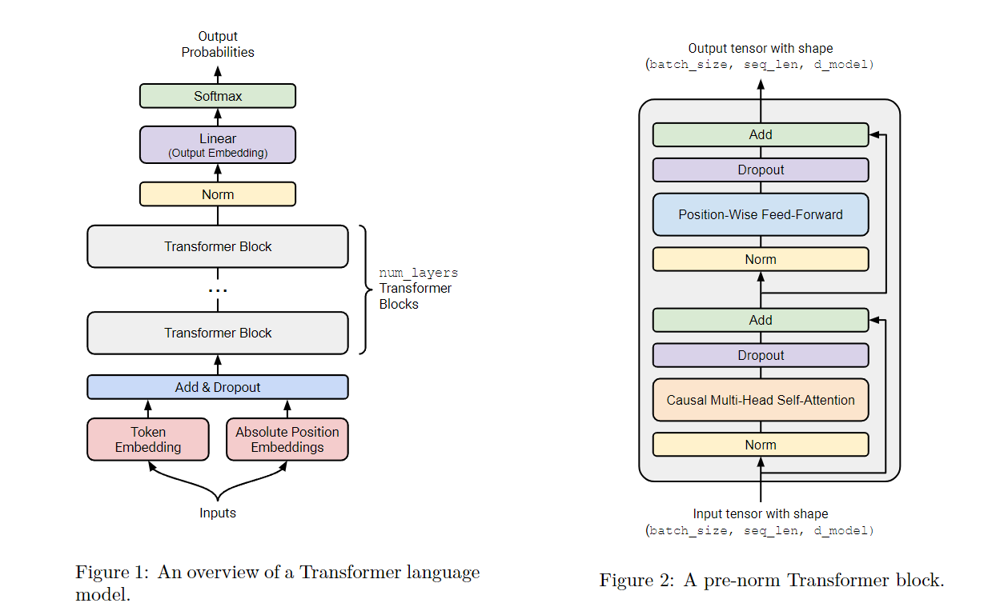

下面是其代码实现：

```python
class TransformerLM(nn.Module):
    def __init__(
        self,
        vocab_size: int,
        context_length: int,
        d_model: int,
        num_layers: int,
        num_heads: int,
        d_ff: int,
        attn_pdrop: float,
        residual_pdrop: float,
        **kwargs
    ):
        super().__init__()
        self.embed = nn.Embedding(vocab_size, d_model)
        self.pos_embed = nn.Parameter(torch.zeros(context_length, d_model))
        self.drop = nn.Dropout(residual_pdrop)
        self.layers = nn.Sequential(*[TransformerBlock(d_model, num_heads, d_ff, attn_pdrop, residual_pdrop) for _ in range(num_layers)])
        self.ln_f = RMSNorm(d_model)
        self.head = nn.Linear(d_model, vocab_size, bias=False)
        self.context_length = context_length
    
    def forward(self, x):
        # x (batch_size, context_length)
        x = self.embed(x)
        x = x + self.pos_embed[:x.size(1), :]
        x = self.drop(x)
        x = self.layers(x)
        x = self.ln_f(x)
        x = self.head(x)
        return x
```

可以看到，模型基本由 Embedding，Attention，FFN，Linear 以及负责把函数变平滑的 Norm，Dropout 和 Residual Connection 组成。不同的大模型结构也大体类似。

Embedding 层负责生成词向量，TransformerBlock 是主要计算发生的地方，而最后的 Linear 层负责生成下一个 Token 的概率分布。

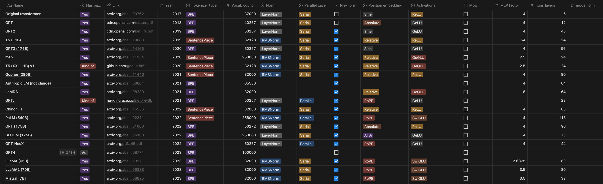

下面分别介绍每个层。

### Positional Embedding

这个 layer 负责将 Token 转化为词向量（Word Vector），并在附加上位置信息。

词向量处于一个高维语义空间中，两个向量间的位置关系即可表示他们的语义关系。如 `V(法国)-V(巴黎) = V(德国)-V(柏林)`。

具体的词向量信息我们在神经网络中学习即可。我们首先要做的是把 Token 转化为高维向量。这个功能由 `nn.Embeding` 实现。该层会维护一个形状为 `(num_embeddings, embedding_dim)` 的查找表，把每一个 Token 都映射为高维向量。具体的参数在梯度下降时更新。

除了词嵌入外，我们还需要记录 Token 的位置信息，这个功能由 Positional Embedding 完成。 Positional Embedding 层会给每个不同位置的词都生成一个表示位置的向量，该向量与 Token Embedding 生成的向量相加，得到最终的词向量。

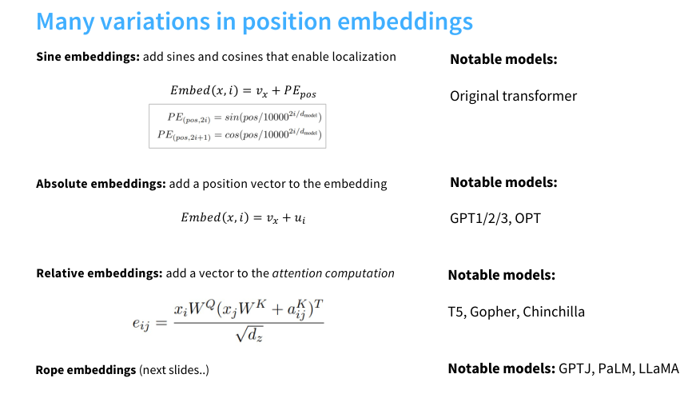

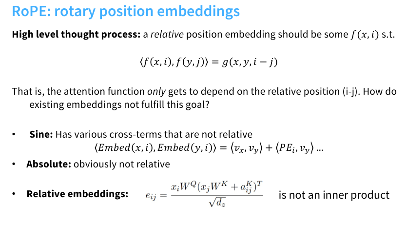

Positional Embedding 存在多种实现方法，其中旋转位置编码（RoPE）已被证明效果最优。但鉴于其实现复杂度较高，我们选择采用基础的 Absolute Positional Embeddings。具体实现方式为：创建一个可训练的位置嵌入矩阵，其行数设置为预定义的上下文最大长度（`context_length`）。在模型前向传播时，根据实际输入序列长度对矩阵进行动态截取，并与词嵌入向量进行逐元素相加。其优点是位置编码可以由学习得到，效果好，缺点是不能处理长度超出 `context_length` 的句子。

### TransformerBlock


上图是一个简化版的 Transformer，其核心组件由两个，Self-Attention 和 FFN。Attention 负责捕捉序列信息，将单独的词向量变为语境中的词向量（真正的能指）；而 FFN 负责存储知识信息，是整个 LM 中参数量最多的地方，也是训练推理时计算量最大的地方。

#### Attention

对于变长序列信息，我们需要有一种办法来考虑序列信息。在 attention 之前，我们一般使用 RNN 来完成这点。RNN 会引入隐状态，每个 Token 的计算都会依赖前一个 Token 的隐状态，并重新写入隐状态，以此来传递序列信息。

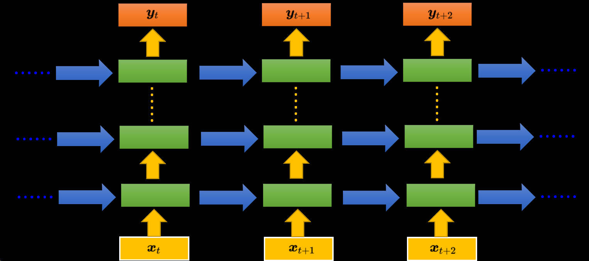

但是因为隐状态的相邻依赖关系，RNN 难以**并行化**，且难以捕捉**长距离依赖**，因此就有了 self-attention。最初的 attention 的在 RNN 语言模型的 input 序列和 output 序列间传递信息，但是 Transformer 的研究者发现让序列自己做 self-attention，就可以取代 RNN 了。

虽然 RNN 有着上述缺点，但是因为其恒定推理成本和在短序列中的低成本，也被广泛使用。

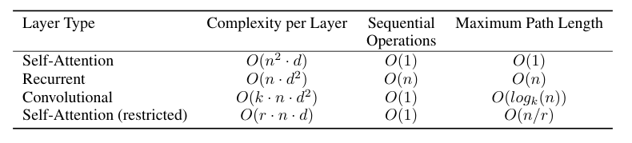

在 attention 机制中，我们有 Q, K, V 三个可学习矩阵。每个词向量分别乘着三个矩阵得到 q，k，v 三个向量。每个词的 q 向量和其他词的 k 向量先点积再做 softmax，得到注意力分数。再根据注意力分数对所有 v 做加权和，得到 attention 值。此时的 attention 值就包括了句中其他词的信息。

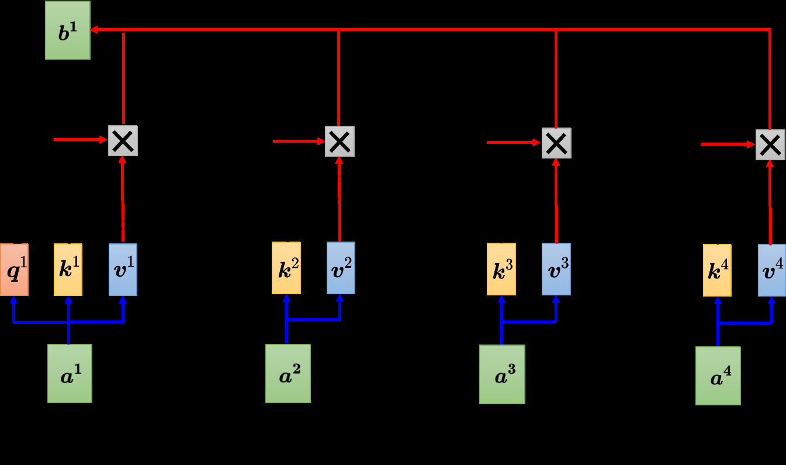

上述过程写成矩阵的形式如下：

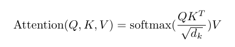

下面是[图示](https://jalammar.github.io/illustrated-transformer/)：


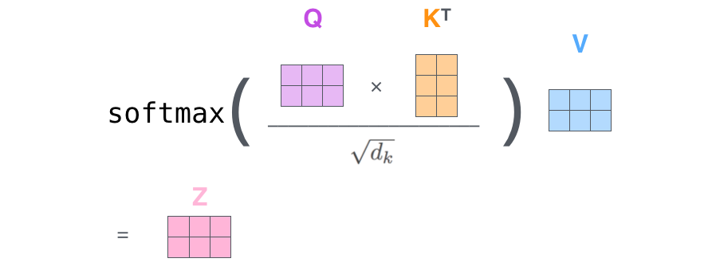

但在 decoder-only LM 中，我们要预测下一个 Token，因此计算 attention 时，一个 Token 的 q 只能于它之前的 Token 的 k 做计算，否则在训练时就提前泄露了未来信息。所以我们在计算注意力分数时要加上掩码，不需要的分数设置为一个极小值，这样 softmax 后其概率就接近为 0 了。

一个 attention 头（即一组 Q,K,V）可以学习一种关联模式，我们可以使用多组 attention 头来实现多头注意力机制（Multi-Head Attention）。简而言之，多头注意力就是使用多个 Q,K,V计算多个 attention 值，然后把所有的 attention 值连在一起，经过一个 Linear 层得到最后的 attention。

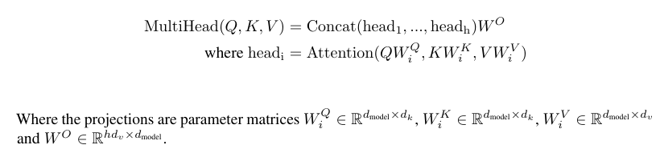


在实际实现中，多个 Q K V 可以拼成一个矩阵，一起运算，这样就减少了计算开销。

```python
def scaled_dot_product_attention(K, Q, V, mask=None, pdrop=None):
    # K, Q (batch_size, [num_heads,] seq_len, k_dim)
    # V (batch_size, [num_heads,] seq_len, v_dim)
    # attn_scores (batch_size, [num_heads,] seq_len, seq_len)
    attn_scores = torch.matmul(Q, K.transpose(-2, -1))
    attn_scores = attn_scores / math.sqrt(K.shape[-1])
    if mask is not None:
        attn_scores = attn_scores.masked_fill(mask, -1e9)
        attn_scores = softmax(attn_scores, dim=-1)
        attn_scores = attn_scores.masked_fill(mask, 0.0)
    else:
        attn_scores = softmax(attn_scores, dim=-1)
    if pdrop is not None:
        attn_scores = nn.Dropout(pdrop)(attn_scores)
    return torch.matmul(attn_scores, V)


class MultiHeadSelfAttention(nn.Module):
    def __init__(self, d_model: int, num_heads: int, dropout: Optional[float] = None):
        super().__init__()
        assert d_model % num_heads == 0
        self.num_heads = num_heads
        self.d_model = d_model
        self.d_k = d_model // num_heads
        self.w_q = nn.Linear(d_model, d_model, bias=False)
        self.w_k = nn.Linear(d_model, d_model, bias=False)
        self.w_v = nn.Linear(d_model, d_model, bias=False)
        self.w_o = nn.Linear(d_model, d_model, bias=False)
        self.dropout = dropout
            
    def forward(
        self,
        in_features: torch.FloatTensor,
    ):
        Q = self.w_q(in_features)
        K = self.w_k(in_features)
        V = self.w_v(in_features)
        
        batch_size, seq_len, _ = Q.size()
        Q = Q.view(batch_size, seq_len, self.num_heads, self.d_k).transpose(1, 2)
        K = K.view(batch_size, seq_len, self.num_heads, self.d_k).transpose(1, 2)
        V = V.view(batch_size, seq_len, self.num_heads, self.d_k).transpose(1, 2)
        
        mask = torch.triu(torch.ones(seq_len, seq_len, device=K.device), diagonal=1).bool()
                
        attn_scores = scaled_dot_product_attention(K, Q, V, mask, self.dropout)
        attn_scores = attn_scores.transpose(1, 2).contiguous().view(batch_size, seq_len, -1)
        return self.w_o(attn_scores)


```

#### FFN

FFN 层是 Transformer 中计算最多的地方。这里可以控制的变量有：

1. 隐藏层的维度
2. 激活函数的选择

```python
class PointwiseFeedForward(nn.Module):
    def __init__(self, d_model: int, d_ff: int):
        super().__init__()
        self.w1 = nn.Linear(d_model, d_ff, bias=False)
        self.w2 = nn.Linear(d_ff, d_model, bias=False)

    def forward(self, x):
        return self.w2(gelu(self.w1(x)))
```

此外，现在许多 LLM 在 FFN 层采用 [MoE](https://www.youtube.com/watch?v=sOPDGQjFcuM&ab_channel=MaartenGrootendorst)  架构。关键在于，把 FFN 拆成许多小 FFN，运行时选择一个 FFN （专家/export）传播。这样就能保证模型参数的同时提升推理速度。

### Others

模型剩下的组件还包括，RMSNorm，Residual Connection，以及 Dropout。

RMSNorm 和 Residual Connection 都可以避免梯度消失和梯度爆炸，保证函数的 [Lipschitz 连续](https://www.bilibili.com/video/BV1B64y157DC/?share_source=copy_web&vd_source=70a8bfe51ff36d2bca97cf3df1c52fed)性质。

而 Dropout 属于一种正则化方法，通过随机将某些参数置为 0，来避免模型过分依赖某些参数，从而保证了其泛化性。

此外，模型参数的初始化也十分重要。有许多实验表示初始化的好坏对于模型训练过程有很大影响，并且训练结果与初始化偏差并不大。通过合理的初始化（比如对于方差，均值的调整），我们可以使得函数更易于训练。

## Train

深度学习除了作为 hypothesis 的模型结构，损失函数和优化方法也是训练时不可或缺的组成部分。

### Cross-entropy loss

在熵的公式中，熵越大，分布越均匀（不确定性越高）；熵越小，分布越集中（确定性越高）。

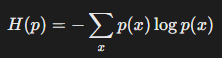

交叉熵衡量两个概率分布之间的差异，对于真实分布 *p* 和模型预测分布 *q*，交叉熵的公式为：

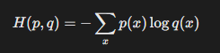

若 *q*(*x*) 与 *p*(*x*) 完全一致，则交叉熵等于熵 *H*(*p*)，否则 *H*(*p*,*q*)>*H*(*p*)。

在训练中 p(x) 一般为真实标签的 **one-hot 分布**（仅正确类别为1，其他为0），因此只用考虑正确类别。因此，LLM 中使用的交叉熵公式如下：

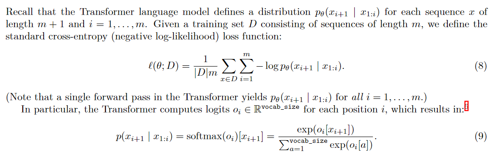

对于 one-hot 分布，熵为0，因此交叉熵的最小值也为0。 在训练语言模型时，假设初始状态为均匀分布，收敛状态预测正确 token 概率为 0.9，则交叉熵在区间 [0.1,10.82] 内。

代码实现如下：

```python
def cross_entropy_loss(inputs, target):
    max_vals = torch.max(inputs, dim=-1, keepdim=True).values
    shifted_inputs = inputs - max_vals
    exp_inputs = torch.exp(shifted_inputs)
    exp_inputs_sum = torch.sum(exp_inputs, dim=-1, keepdim=True)
    log_softmax_inputs = shifted_inputs - torch.log(exp_inputs_sum)
    loss = -log_softmax_inputs[torch.arange(target.shape[0]), target]
    return torch.mean(loss)
```

### AdamW

神经网络最经典的优化算法为随机梯度下降法。[AdamW](https://arxiv.org/abs/1711.05101v3) 在此基础上增加了：

1. 一阶矩 动量 m：可以减小随机batch带来的震荡
2. 二阶矩 自适应学习率 v：不同参数的梯度数值大小不同，通过除二阶矩的开放来使得梯度稳定，避免大梯度爆炸，小梯度消失
3. 第四步对学习率的调整实际上是为了应对一开始 m 和 v 太小的情况
4. weight decay：减去参数，增强泛化性
   1. L2 正则中，正则项梯度会被自适应学习率缩放，导致实际衰减强度与学习率耦合，影响正则化效果。

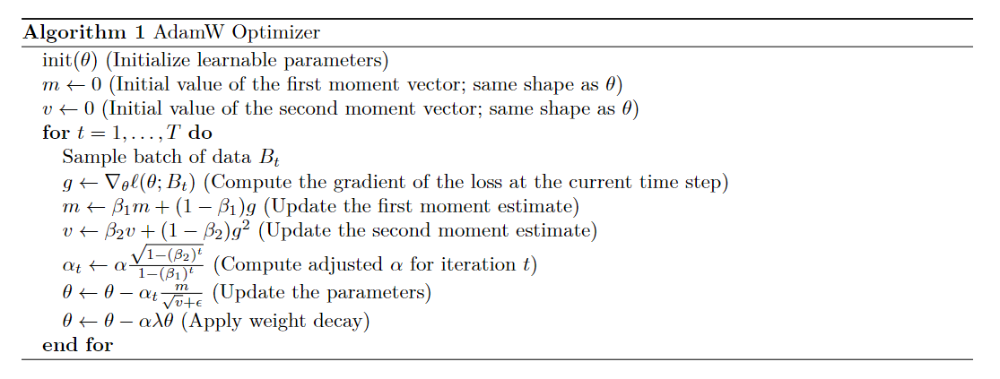

### Learning rate scheduling

学习率调整的核心作用有：

1. 加速初期收敛：训练初期使用较大学习率，快速逼近最优解区域。
2. 避免后期震荡：后期逐步降低学习率，防止在最优解附近震荡。
3. 逃离局部极小值：周期性或突变的调整策略（如重启）可帮助跳出局部最优。

通过**余弦函数**平滑地将学习率从初始值（*η*max）降低到最小值（*η*min），形成一个周期性的退火过程。其特点是**平滑过渡**，避免学习率突变导致的训练不稳定。

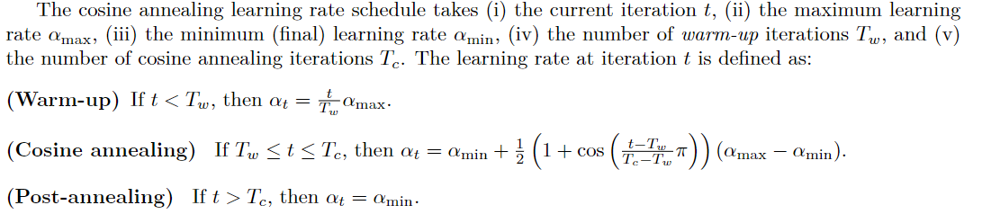

代码实现如下：

```python
def get_lr_cosine_schedule(t: int, alpha_max: float, alpha_min: float, 
                          Tw: int, Tc: int) -> float:
    if t < Tw and Tw > 0:
        return alpha_max * (t / Tw)
    
    if Tw <= t <= Tc:
        ratio = (t - Tw) / (Tc - Tw)  # Progress through cosine phase
        cosine_decay = 0.5 * (1 + math.cos(math.pi * ratio))
        return alpha_min + (alpha_max - alpha_min) * cosine_decay
    
    return alpha_min
```

### Gradient clipping

梯度裁剪用于控制梯度的大小，防止训练过程中因梯度爆炸导致的数值不稳定。它通过限制梯度的最大值或范数，确保参数更新步长合理，从而提升模型训练的稳定性和收敛性。

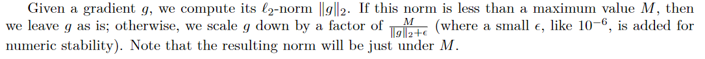

代码实现如下：

```python
def clip_gradient(parameters, max_norm: float, eps: float = 1e-6):
    grads = [p.grad for p in parameters if p.grad is not None]
    
    if not grads:
        return

    device = grads[0].device
    total_norm = torch.norm(
        torch.stack([torch.norm(g.detach(), 2) for g in grads]), 
        2
    ).to(device)

    scaling_factor = max_norm / (total_norm + eps)
    
    if total_norm > max_norm:
        for grad in grads:
            grad.mul_(scaling_factor)
```

### Resource accounting

一个简单的资源估算：

基本想法：考虑 Y = WX，反向传播时需要分别对 W 和 X 求导，因此反向传播计算量约为正向传播的两倍。

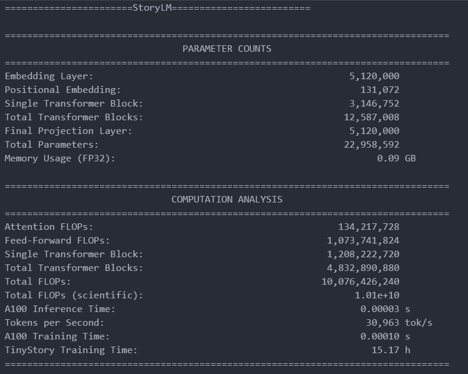

### Train in Practice

把上面所有组件组合在一起后，就可以进行训练了。

实际训练时的参数配置如下：

```json
{
    // 模型超参数
    "vocab_size": 10000,
    "context_length": 256,
    "d_model": 512,
    "num_layers": 4,
    "num_heads": 16,
    "d_ff": 2048,
    "attn_pdrop": 0.1,
    "residual_pdrop": 0.1,
    
    // 优化器超参数
    "learning_rate": 0.001,
    "beta1": 0.9,
    "beta2": 0.95,
    "epsilon": 1e-8,
    "weight_decay": 0.01,
    
    // 训练过程超参
    "batch_size": 64,
    "epochs": 10,
    
    // 其他训练相关参数
    "save_every": 1000,
    "save_path": "checkpoints/",
    "train_data": "valid.npy",
    "valid_data": "valid.npy",
    "result_model": "model/model.pth",
    "log_path": "logs/log.txt"
}
```

实际训练时，在一张 4090 显卡上运行了 1h30min。

训练时出了许多 bug（比如奇奇怪怪的  cuda 报错），checkpoint 非常实用。

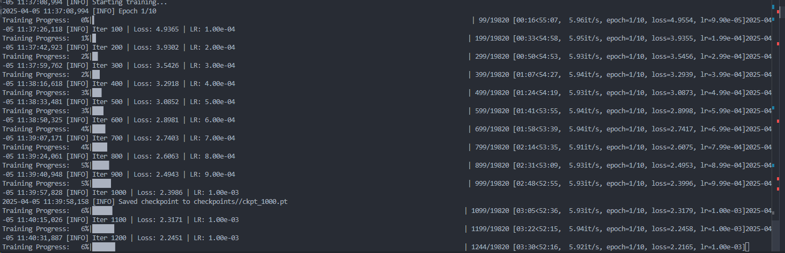

下图是 loss 曲线，可以看到在 10000 个迭代后 loss 曲线就不怎动了。最终 loss 为 0.9105。

> 可能因为每隔 100 个迭代才记录一次学习率，所以从图中看不出周期性
>
> 同时，Tc 可能设置过小，导致后期 loss 降不下去

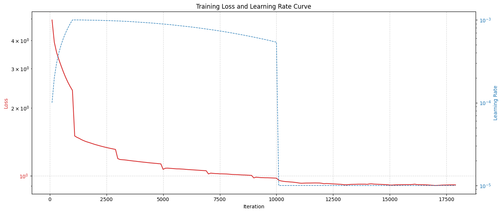

## Run

模型训练好之后，就是推理了！

当输入一个句子时，模型会生成表示下一个Token可能性的logits值。这些logits会除以称为Temperature的超参数——Temperature值越大，模型选择低频词的概率越高。之后我们筛选出概率最高的前k个候选Token（top-k sampling），通过softmax函数将筛选后的logits转换为概率分布，然后依据该概率分布随机选取一个Token作为输出。

之后，我们将新生成的Token追加至输入序列末尾，重新输入模型进行下一轮预测，循环直至出现终止符（如）或达到最大生成长度。

> 文本生成中，也常常使用 [beam search](https://www.wikiwand.com/en/articles/Beam_search) 来选择 Token

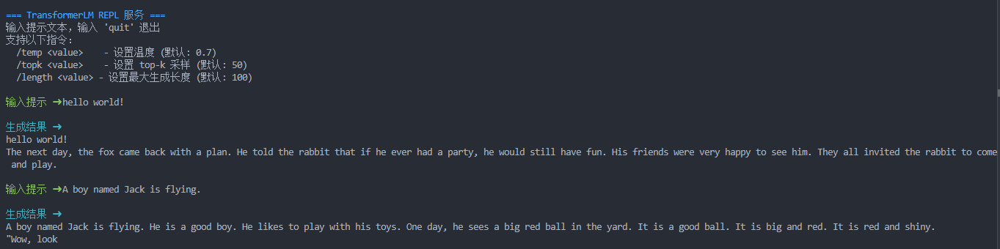

