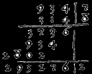
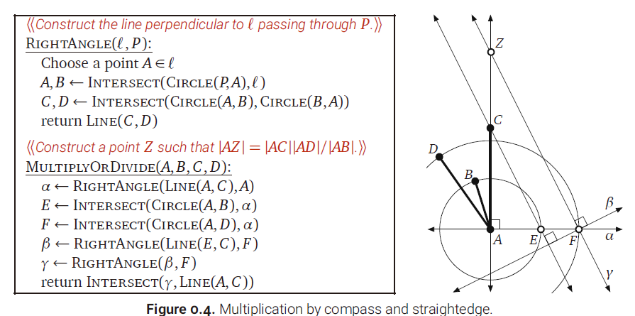
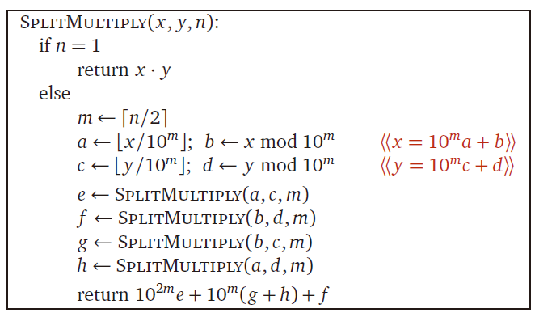
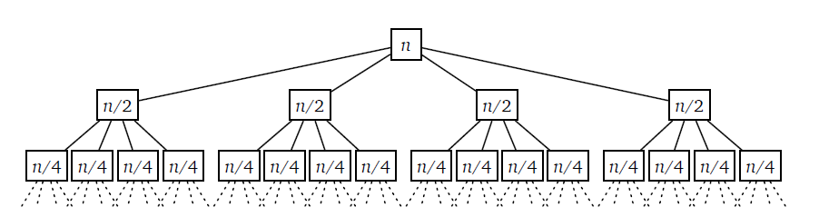
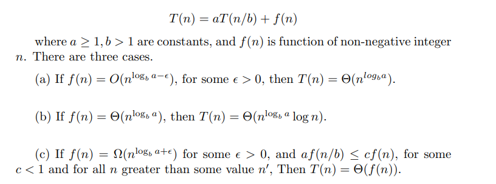
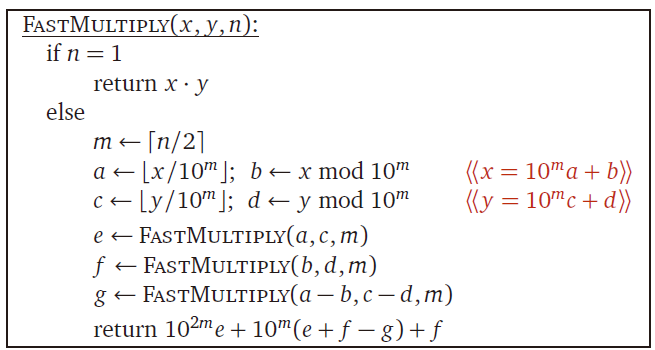

> 凡治众如治寡，分数是也；斗众如斗寡，形名是也。

<!--more-->

本篇博客内容大多都来自[Jeff](https://jeffe.cs.illinois.edu/)的算法书籍，因书籍内容充实和有趣，读之后又怕忘记，因此摘抄复述自己感觉有趣内容，并适时加以扩展。

# Intro

在算术中，乘法是最基本的运算。数学往往只关心抽象的一般的东西，它只把数字看作数字本身，只把乘法看作为一种定义在数上的满足某种特定性质的运算，但是为了让数字能真正为我们所用，我们还必须定义数字实际上的表示方法，以及在一种表示方法下对数字进行运算的方法(比如乘法)——按照这种方法，任意给定两个数，我们都能得出其运算结果(乘积)。这样一种确定性的方法就可以称作一种算法。

通俗意义上的算法即是指一系列明晰确定的指令(步骤)的序列，它描述了一个问题的可行解决方案。注意到组成算法的是一系列明晰确定的指令，我们把这些指令叫做原子指令，所谓原子就是指这些指令是最简单的，不可再分的指令了。如果要使算法是真正可行的，我们还必须确保原子指令是可行的。如果有一个算法，描述了如何成为富翁。而这个算法的一个原子指令是“先定一个小目标，我先挣它一个亿！”，那么这个算法对于我来说是显然是不可行的了😂。

首先，如果数的表示方法为十进制整数，而个位数相乘或者相加都为原子指令的话，竖式计算法当然就是一种最好不过的算法了。

其次，如果把数字定位为线段的长度，原子指令定为基本的尺规作图步骤的话，一种乘法的算法就是如下这样。

当然，我们也需要有一些评价这些算法的指标以便在解决同一问题的不同算法间取舍。最重要的指标当然是算法正确性了，另外，算法执行的快慢也是一个很重要的指标，它可以用一个算法从开始到结束所执行的原子指令条数来衡量。由于计算指令条数的精确数目较为繁琐且意义不大，时间复杂度也就随之而出了。

在计算n位数×n位数时，在使用十进制数字表示和竖式算法时，时间复杂度为$O(n^2)$，因为第一个数的每一个数字都要和第二个数的每一个数字相乘；使用几何模型和上图所述算法时，由于只需要有限个步骤，算法时间复杂度就是$O(1)$了。

考虑到无论我们实际日常使用还是计算机表示，使用X进制表示法都是最常见的，把个位数的×和＋都作为原子指令也是最自然的，我们的研究对象也就主要集中在这种计算模型上了。那么问题来了，计算乘法的算法多种多样，有没有一种算法能以低于$O(n^2)$的时间复杂度来计算乘法呢？

# SplitMultiply

分而治之的思想在算法上的应用往往能得很好的效果。比如说利用了分治法的Quick-Sort, Merge-Sort都能得到很好的时间复杂度。相应的，也许分治的思想也能在乘法中起到作用。

很显然，$(10^ma + b)(10^mc + d) = 10^{2m}ac + 10^m(bc + ad) + bd$，按照这个分解，就有了如下的分治算法：

这个算法的正确性显而易见，但是要计算这样的递归算法的时间复杂度就较为困难了。不过，其用时的递推式却很容易写出来，即$T(n)=4T(n/2)+O(n)$，而要根据这个递推式求出$T(n)$的渐进式，递归树法能给我们很多Insight。

将全部项求和，很容易得出时间复杂度任然为$O(n^2)$。

但是，为什么Quick-Sort, Merge-Sort都可以成功降低复杂度呢？这可以从二者用时的递推式中看出了:$T(n)=2T(n/2)+O(n)$。

再考虑递归树中的耗时大概分为两大部分，一部分是每次递归时的耗时，一部分是所有叶节点对应的最小子情况的耗时。假设递推式为$T(n)=aT(n/b)+f(n)$，不妨设当$n$为1时到达子节点，树高为H，叶节点数为L，则有$n/b^H=1 \implies H=log_bn,L=b^H=a^{log_bn}=n^{log_ba}$,因此，叶节点对应的项的代价为为$\Theta(n^{log_ba})$,而内部节点对应的代价为$\Sigma_{j=0}^{log_bn-1}a^jf(n/b^j)$，因此，整个递归过程的用时就由这两项决定。由这两项的相对大小就可以得到整个过程的渐进复杂度。在对这两项进行分析之后，就得到了[主定理](https://en.wikipedia.org/wiki/Master_theorem_(analysis_of_algorithms))，之后就可以以此为出发点分析算法的时间复杂度了。

SplitMultiply算法符合情况一，也就是由于SplitMultiply算法的递归过程中每层节点扩展得太快，导致叶节点完全占据了主导地位，因此复杂度完全由叶节点决定；而两个分治的排序算法都符合情况二，即每层节点代价的总和差不多相同，因此最终时间复杂度为$\Theta(nlogn)$。

# FastMultiply

SplitMultiply的失败之处在于每层节点扩展得太快，即$log_ba$太大，因此有没有一种适用于乘法的分治算法使得$log_ba$较小呢？事实上，Karatsuba就把a从4降到了3，从而使得乘法的时间复杂度由$n^2$降至$n^{log_23}=n^{1.58496……}$。

Karatsuba的想法主要来源于他发现，上面的分解式中$bc+ad$是一个整体，如能一次就把这个整体算出来，就能只调用三个递归子过程。考虑到$ac+ab-(a-c)(c-d)=bc+ad$，我们只需要额外计算一个$(a-c)(c-d)$即可获得中间的$bc+ad$的值。（注意到$a \times 10^m$的复杂度实际上为$O(n)$）

具体算法如下：

Karatsuba在发现这个算法时还是一个23岁的学生。1950年代，苏联数学家Kolmogorov举办了一个研讨会，提出“任何n*n的乘法算法都不可能在$n^2$的时间复杂度以下”，可是在一周之后，Karatsuba就发现了这个算法。

