在后端实习面试中，有 数据库，Java，网络，OS 四大考点，其中又以数据库考察最为频繁。数据库问题中，除了少部分范式相关理论，基本为 [MySQL](https://db-engines.com/en/ranking) 问题。因此，在这里摘录相关知识点，做一个总结，既是为秋招做准备，也是总结找实习过程中的所学知识。

<!--more-->

[b 站视频解析](https://www.bilibili.com/video/BV1mg411s7Ej/?spm_id_from=333.337.search-card.all.click&vd_source=226da368954a7c68d6b7e4bbdc91b2cd)

# 架构

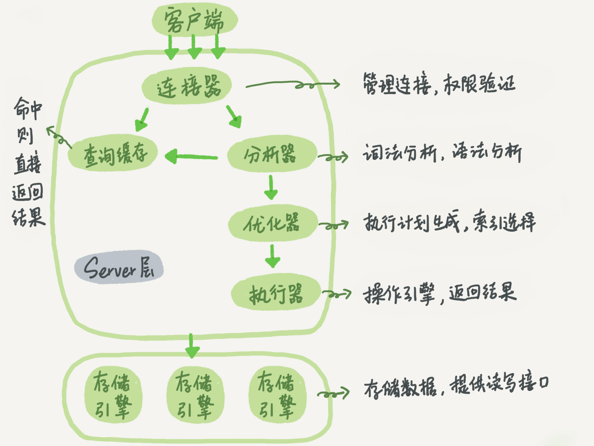

MySQL 整体可分为 Server 层 和 存储引擎 层。Server 层处理客户连接，接收 SQL 语句，生成执行计划，并调用存储引擎 API 来获取 / 写入具体数据。每一个客户端连接都由一个线程来负责处理。每个 table 都可以设置不同的存储引擎。[具体流程](https://tangocc.github.io/2018/10/11/mysql-sourcecode/)

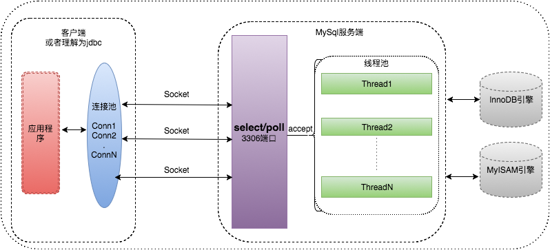

存储引擎自定义实现数据的物理，逻辑组织以及索引，事务等特性。（因此面试考察的问题几乎都属于存储引擎层）抽象存储引擎层 api 是通过抽象类 [handler](https://github.com/MariaDB/server/blob/11.4/sql/handler.h#L3200) 来实现。[a minimal sorage engine in c++](https://notes.eatonphil.com/2024-01-09-minimal-in-memory-storage-engine-for-mysql.html)

> The current limitations of the storage API are not intrinsic aspects of MySQL/MariaDB or Postgres's design. For both project there used to be no pluggable storage at all. We can imagine a future patch to either project that allows support for batched row reads and writes that together could make column-wise storage and vectorized execution more feasible.

MySQL 采用插件式存储引擎，我们可以根据使用场景 [选择合适的](https://dev.mysql.com/doc/refman/8.0/en/storage-engines.html)。最常用的也是默认的存储引擎为 InnoDB，它是唯一满足 ACID 特性事务的存储引擎。

> Maybe you want an in-memory storage layer so that you can quickly run integration tests. Maybe you want to switch between B-Trees (read-optimized) and LSM Trees (write-optimized) and unordered heaps (write-optimized) depending on your workload. Or maybe you just want to try a third-party storage library (e.g. [RocksDB](https://rocksdb.org/) or [Sled](https://sled.rs/) or [TiKV](https://tikv.org/)).

# 索引

[B-tree 资源](https://eatonphil.com/btrees.html)

**在 InnoDB 中，表都是根据主键顺序以索引的形式存放的，这种存储方式的表称为索引组织表 **。又 InnoDB 使用了 **B+ 树索引模型 **，所以数据都是存储在 B+ 树中的。每一个索引在 InnoDB 里面对应一棵 B+ 树。

聚簇索引是主键所在的索引，数据也存在其中。

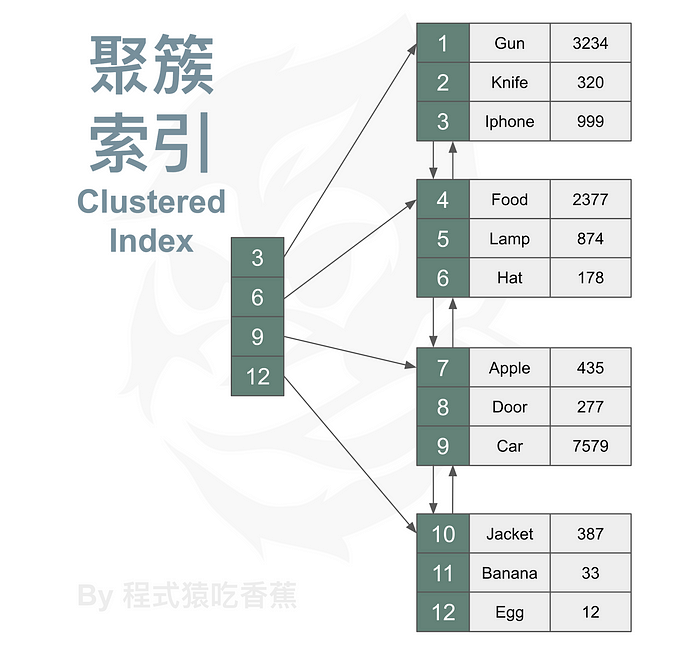

二级索引是初次之外的索引，查询后得到主键，其他信息需要到主索引中 “**回表查询**”。

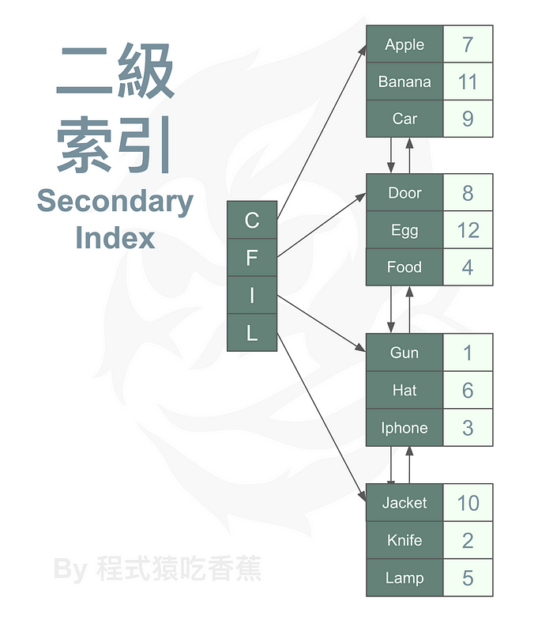

除此之外，也可以对多个键进行**联合索引**。联合索引的建立应该遵循最左前缀原则。

而如果我们要查询的数据已经在索引中，避免了回表查询。这个索引就叫做**覆盖索引**。

# 事务

事务的执行流程：

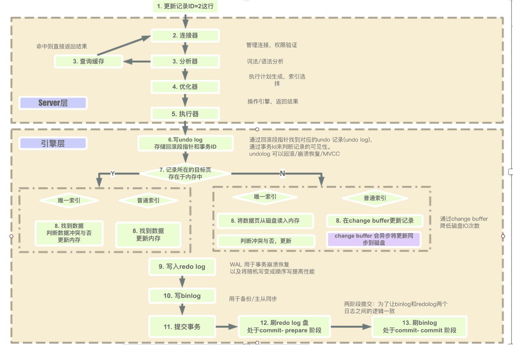

事务指满足 ACID 特性的一组操作。

一致性：数据库处于正确的状态

原子性：或者成功，或者失败，没有中间状态

隔离性：并发事务相互不影响

持久性：断电内存数据丢失后可恢复

## 实现原子性 ->  [undo log](https://catkang.github.io/2021/10/30/mysql-undo.html)

每一条 SQL 通过执行器后，会在  undo log segment 中申请一个 undo log  页。然后根据 SQL 信息构造  undo log 内容，并写入磁盘，保证真正操作之前 undo log 完整。

> MySQL 采用 SEGMENT -> PAGE -> 具体记录 来管理内存

每当 InnoDB 中需要修改某个 Record 时，都会将其历史版本写入一个 Undo Log 中，对应的 Undo Record 是 Update 类型。当插入新的 Record 时，还没有一个历史版本，但为了方便事务回滚时做逆向（Delete）操作，还是会写入一个 Insert 类型的 Undo Record。

Insert Undo Record 仅仅是为了可能的事务回滚准备的，并不在 MVCC 功能中承担作用。因此只需要记录对应 Record 的 Key，供回滚时查找 Record 位置即可。

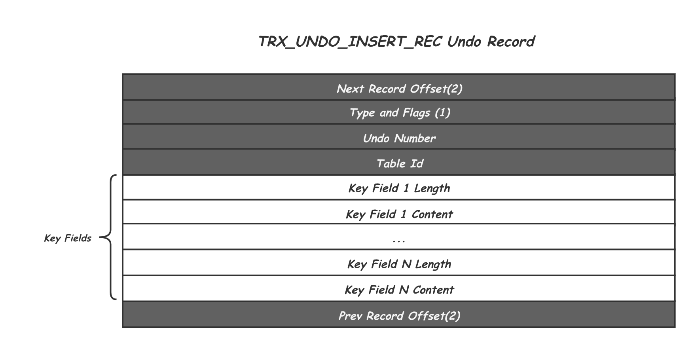

其中 Undo Number 是 Undo 的一个递增编号，Table ID 用来表示是哪张表的修改。下面一组 Key Fields 的长度不定，因为对应表的主键可能由多个 field 组成，这里需要记录 Record 完整的主键信息，回滚的时候可以通过这个信息在索引中定位到对应的 Record。除此之外，在 Undo Record 的头尾还各留了两个字节用户记录其前序和后继 Undo Record 的位置。

由于 MVCC 需要保留 Record 的多个历史版本，当某个 Record 的历史版本还在被使用时，这个 Record 是不能被真正的删除的。因此，当需要删除时，其实只是修改对应 Record 的 Delete Mark 标记。对应的，如果这时这个 Record 又重新插入，其实也只是修改一下 Delete Mark 标记，也就是将这两种情况的 delete 和 insert 转变成了 update 操作。再加上常规的 Record 修改，因此这里的 Update Undo Record 会对应三种 Type：TRX_UNDO_UPD_EXIST_REC、TRX_UNDO_DEL_MARK_REC 和 TRX_UNDO_UPD_DEL_REC。他们的存储内容也类似：

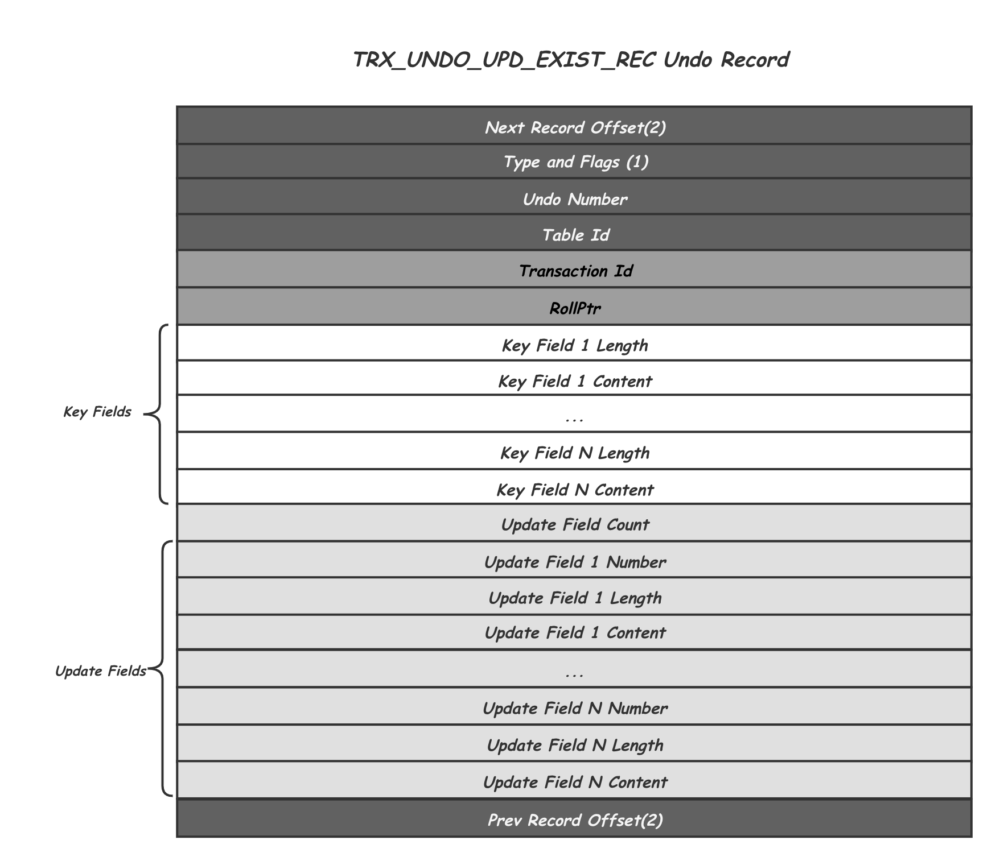

除了跟 Insert Undo Record 相同的头尾信息，以及主键 Key Fileds 之外，Update Undo Record 增加了：

- Transaction Id 记录了产生这个历史版本事务 Id，用作后续 MVCC 中的版本可见性判断
- Rollptr 指向的是该记录的上一个版本的位置，包括 space number，page number 和 page 内的 offset。沿着 Rollptr 可以找到一个 Record 的所有历史版本。
- Update Fields 中记录的就是当前这个 Record 版本相对于其之后的一次修改的 Delta 信息，包括所有被修改的 Field 的编号，长度和历史值。

每个事务其实会修改一组的 Record，对应的也就会产生一组 Undo Record，这些 Undo Record 收尾相连就组成了这个事务的 **Undo Log**。除了一个个的 Undo Record 之外，还在开头增加了一个 Undo Log Header 来记录一些必要的控制信息，因此，一个 Undo Log 的结构如下所示：

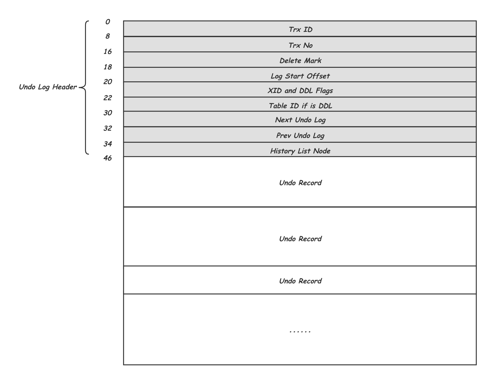

索引中的同一个 Record 被不同事务修改，会产生不同的历史版本，这些历史版本又通过 **Rollptr** 穿成一个链表，供 MVCC 使用。如下图所示：

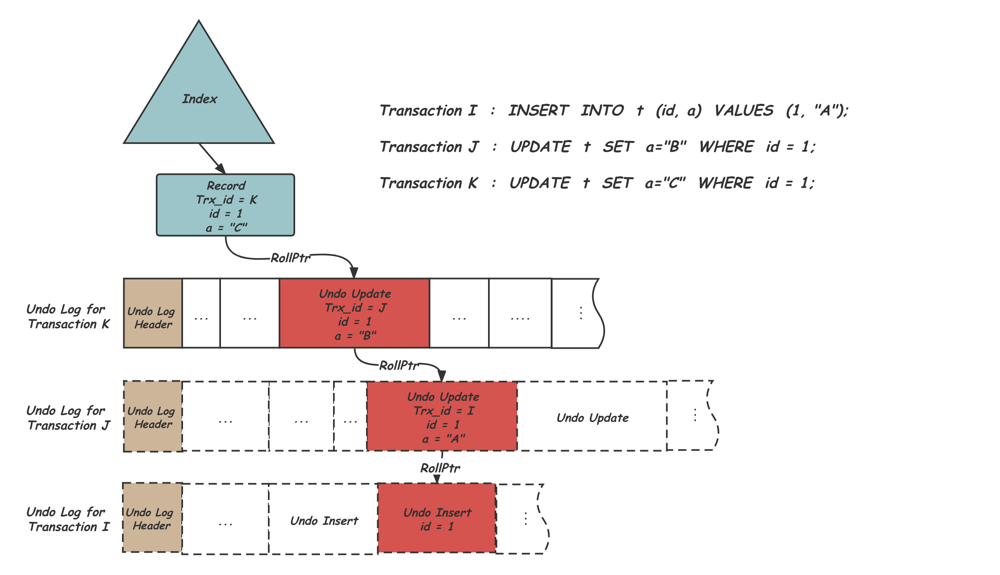

insert undo log 在事务结束后即可回收，但 update undo log 需要支持 MVCC，不能直接删除。当某个历史版本已经确认不会被任何现有的和未来的事务看到的时候，就应该被清理掉。

## 实现隔离性 -> MVCC 和锁

如果并发事务间不隔离就会产生以下问题：

1. 脏读：A 事务读取 B 事务未提交的数据
2. 不可重复读：A 事务两次读取到不同的数据（B 事务修改且提交）
3. 幻读：A 事务两次读取到数量不同的行数据（B 事务删除 / 增加行）

InnoDB 中实现了四大隔离级别：

|     隔离级别     | 脏读 | 不可重复读 | 幻读 |
| :--------------: | :--: | :--------: | :--: |
| READ-UNCOMMITTED |  √   |     √      |  √   |
|  READ-COMMITTED  |  ×   |     √      |  √   |
| REPEATABLE-READ  |  ×   |     ×      |  √   |
|   SERIALIZABLE   |  ×   |     ×      |  ×   |

Innodb 通过锁机制和 MVCC 来实现各种隔离级别，其中锁又分为：

1. LOCK_S  共享锁
2. LOCK_X 独占锁
3. LOCK_IS 共享意向锁（意向锁：在表上做一个标记）
4. LOCK_IX 独占意向锁
5. LOCK_AUTO_INC 自增锁

按照粒度又分为 LOCK_TABLE 表锁，和 LOCK_REC 行锁。

行锁又分为：

1. LOCK_REC_NOT_GAP 精准行锁，锁住某一行
2. LOCK_GAP 锁住某两行间隙，防止插入
3. LOCK_ORDINARY  next-key 锁 = LOCK_GAP  + LOCK_REC_NOT_GAP 
4. LOCK_INSERT_INTENTION 插入意向锁，共享的 gap 锁

如果要加多个锁，会强制使用 **两段锁协议** 以保证可串行化。

> 通过强制锁的申请和释放顺序，两段锁协议确保事务间的冲突操作（如读写、写写）遵循固定顺序，从而避免因操作交叉导致的数据不一致。例如，若事务 T1 和 T2 均遵守两段锁协议，它们的操作顺序会被锁定为 “T1 全加锁→T1 释放锁→T2 加锁”，等效于串行执行。

MVCC 具体通过 undo log 和 read view 实现。undo log 存储了所有变更。一个事务的 read view 记录了当前活跃事务集合，最小事务 id，下一个事务 id，当前事务 id。读取时，沿着版本链，找到合适的版本。

对于读未提交级别：

1. 读取时不做任何加锁处理，直接访问内存中的最新数据页版本。
2. 更新时加 **独占行锁**，事务结束时释放。（其他事务不可以修改，但可读取）

对于读已体提交：

1. 每次查询构造一个新的 readview，解决脏读
2. 更新时加 **独占行锁**，事务结束时释放。

对于可重复读：

1. 使用第一次查询时生成的 readview，解决脏读和不可重复读
2. 更新数据时加 next-key 锁，解决了部分幻读问题

对于串行读：

1. 读取时使用共享表锁
2. 更新时使用独占表锁

## 实现持久性 -> redo log，binlog

redo log 是一种 WAL（Write-Ahead Logging）。当有一条记录需要更新时，InnoDB 引擎就会先把记录写到 redo log 里面，并更新内存，这个时候更新就算完成了。同时，InnoDB 引擎会在适当的时候，将这个操作记录更新到磁盘里面。（注意 undo 页可能一直在 buffer pool 中，从不实际写入磁盘）

有了 redo log，InnoDB 就可以保证即使数据库发生异常重启，之前提交的记录都不会丢失，这个能力称为 **crash-safe**。

那么我们需要什么样的 REDO 呢？首先，REDO 的维护增加了一份写盘数据，同时为了保证数据正确，事务只有在他的 REDO 全部落盘才能返回用户成功，REDO 的写盘时间会直接影响系统吞吐，显而易见，**REDO 的数据量要尽量少 **。其次，系统崩溃总是发生在始料未及的时候，当重启重放 REDO 时，系统并不知道哪些 REDO 对应的 Page 已经落盘，因此 REDO 的重放必须可重入，即 **REDO 操作要保证幂等 **。最后，为了便于通过并发重放的方式加快重启恢复速度，REDO 应该是 ** 基于 Page** 的，即一个 REDO 只涉及一个 Page 的修改。

数据量小是 **Logical Logging** 的优点，而幂等以及基于 Page 正是 **Physical Logging** 的优点，因此 InnoDB 采取了一种称为 **Physiological Logging** 的方式，来兼得二者的优势。所谓 Physiological Logging，就是以 Page 为单位，但在 Page 内以逻辑的方式记录。

举个例子，MLOG_REC_UPDATE_IN_PLACE 类型的 REDO 中记录了对 Page 中一个 Record 的修改，方法如下：

> （Page ID，Record Offset，(Filed 1, Value 1) … (Filed i, Value i) … )

其中，PageID 指定要操作的 Page 页，Record Offset 记录了 Record 在 Page 内的偏移位置，后面的 Field 数组，记录了需要修改的 Field 以及修改后的 Value。

MySQL 的 InnoDB 页大小为 16KB，而操作系统（如 Linux）的页大小为 4KB。InnoDB 将一个 16KB 的页写入磁盘时，需要拆分为 4 个操作系统页（4KB×4）。若在写入过程中发生崩溃（如断电），可能出现仅部分操作系统页成功写入的情况，导致 InnoDB 页数据损坏。这种损坏无法通过 Redo Log 恢复，因为 **Redo Log 记录的是操作而非完整页数据 **。

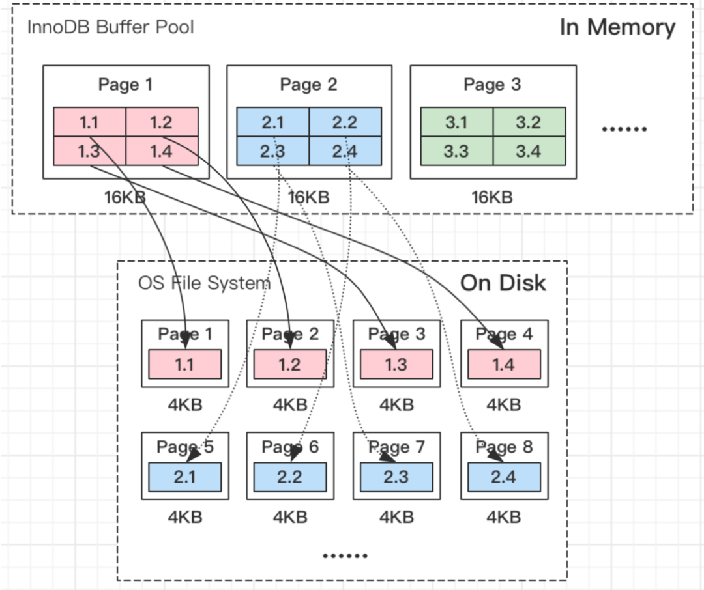

InnoDB 中采用了 **Double Write Buffer** 的方式来通过写两次的方式保证恢复的时候找到一个正确的 Page 状态。它的作用是，在把页写到数据文件之前，InnoDB 先把它们写到一个叫 Double Write Buffer（双写缓冲区）的共享表空间内，在写 Double Write Buffer 完成后，InnoDB 才会把页写到数据文件的适当的位置。如果在写页的过程中发生意外崩溃，InnoDB 在稍后的恢复过程中在 Double Write Buffer 中找到完好的 page 副本用于恢复。

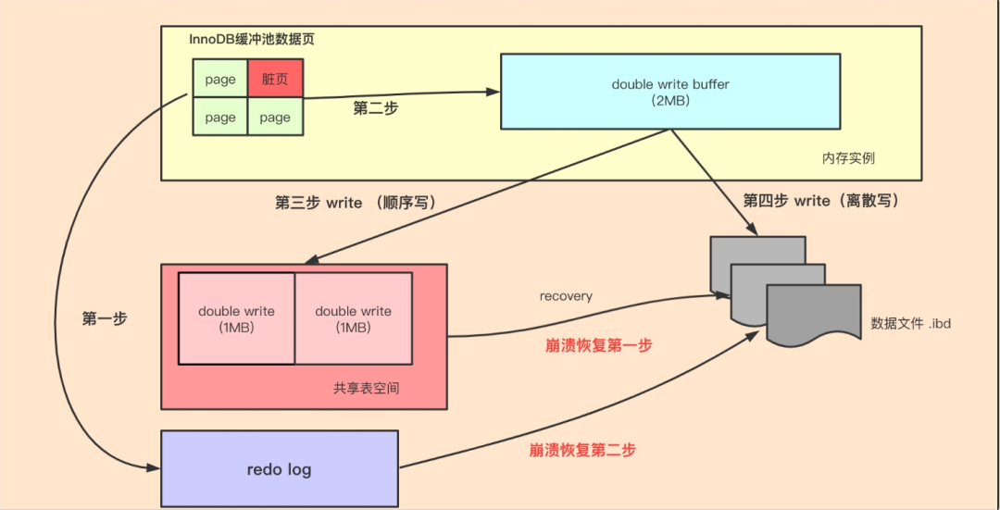

Double Write Buffer 能够保证找到一个正确的 Page 状态，我们还需要知道这个状态对应 REDO 上的哪个记录，来避免对 Page 的重复修改。为此，InnoDB 给每个 REDO 记录一个全局唯一递增的标号 **LSN (Log Sequence Number)**。Page 在修改时，会将对应的 REDO 记录的 LSN 记录在 Page 上（FIL_PAGE_LSN 字段），这样恢复重放 REDO 时，就可以来判断跳过已经应用的 REDO，从而实现重放的幂等。

---

MySQL 中使用 binlog 做 **主从库间的备份**。

最开始 MySQL 里并没有 InnoDB 引擎。MySQL 自带的引擎是 MyISAM，但是 MyISAM 没有 crash-safe 的能力，binlog 日志只能用于归档。而 InnoDB 是另一个公司以插件形式引入 MySQL 的，既然只依靠 binlog 是没有 crash-safe 能力的，所以 InnoDB 使用另外一套日志系统 —— 也就是 redo log 来实现 crash-safe 能力。

这两种日志有以下三点不同。
1. redo log 是 InnoDB 引擎特有的；binlog 是 MySQL 的 Server 层实现的，所有引擎都可以使用。
2. redo log 是物理日志，记录的是 “在某个数据页上做了什么修改”；binlog 是逻辑日志，记录的是这个语句的原始逻辑，比如 “给 ID=2 这一行的 c 字段加 1”。
3. redo log 是循环写的，空间固定会用完；binlog 是可以追加写入的。“追加写” 是指 binlog 文件写到一定大小后会切换到下一个，并不会覆盖以前的日志。

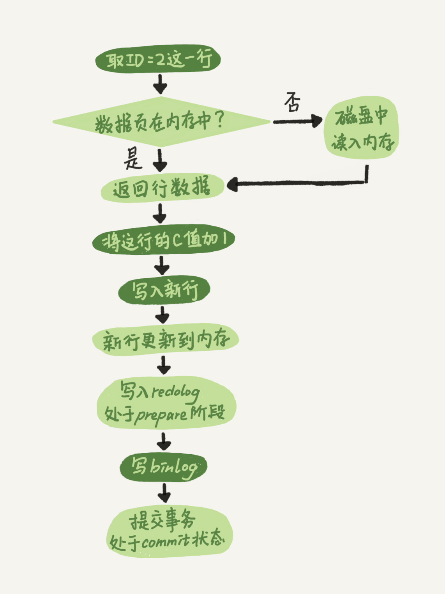

MySQL 采用**两阶段提交**(2PC) 机制，是为了解决 redo log（重做日志） 和 binlog（归档日志） 之间的逻辑一致性问题，确保事务的原子性和持久性。