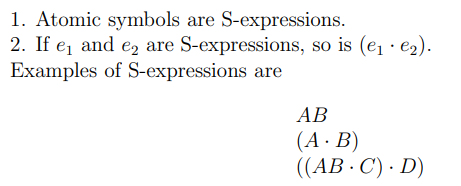
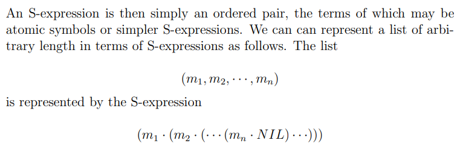
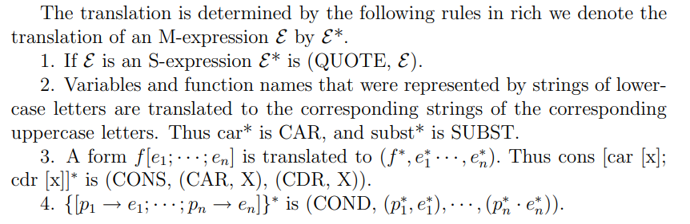
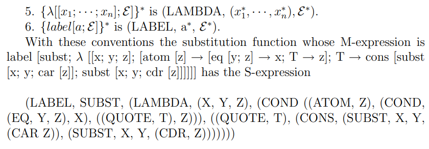

> Programming languages should be designed not by piling feature on top of feature, but by removing the weaknesses and restrictions that make additional features appear necessary  

<!--more-->

之前在 Twitter 上听 [Robert Nystrom](https://twitter.com/intent/user?screen_name=munificentbob) 的一个演说时，有观众问他“如何看待 ChatGPT，Copilot 对于编程的影响”。Robert 回道：他认为编程的乐趣在于“make something”，而 Copilot 这类工具却很有可能把 programmer 变成代码审核员，从而丧失了“make something”的乐趣。可是就算在前 ChatGPT 时代，我又真正体会到过“make something”的乐趣吗？之前我的编程实践总是一些课程作业，这些作业的 idea 或是框架总是由他人提出，目的也往往是通过 OJ。这样的编程实践给人带来的“make something”之感自然就大打折扣了。于是在可能发生的“AI 革命”的前夜，我决定自己动手写一个兼容 R7RS 的 Scheme 解释器，真正“make something”。

在大一时曾读过部分 SICP，对 Scheme 有一点点认知。但对于其很多高级特性还不是很熟悉，尤其是 continuation 和 macro。于是在动写解释器前，打算先熟悉一下 Scheme 的特性。

# S-Expression

1960年，John McCarthy 在函数式编程的开山之作 [Recursive Functions of Symbolic Expressions and Their Computation by Machine](http://www-formal.stanford.edu/jmc/recursive.pdf) 中提出了 LSIP 语言，这也是 Scheme 的前身。LISP 语言最初也是为了支持人工智能系统 Advice Taker 而创造的(可惜 Advice Taker 代表的符号主义 AI 研究方法在当前的 AI 浪潮中似乎不见了身影)，其目的在于提供一种操作 expression 的功能以使得 Advice Taker 能在其上推理。

在 LISP System 中，有 S-Expressions 和 S-Functions(对应 Scheme 中的过程/procedure) 两个概念。S-Expressions 即是 Symbolic Expression，和数学意义上的 expression (表达式)意义相同。S-expressions 本身仅仅是一种数据结构，没有任何求值的含义。
S-Expression 的定义如下：



(以及list的定义如下)



在 S-Expression 之上，我们又可以定义对其进行操作的 S-function (S-function事实上为 partial function，因为有可能无限循环)

>  atom. atom[x] has the value of T or F according to whether x is an atomic symbol. 
>
> `atom [X] = T atom [(X · A)] = F`
>
> car. car[x] is defined if and only if x is not atomic. car [(e1 · e2)] = e1. Thus car [X] is undefined.
>
> `car [(X · A)] = X car [((X · A) · Y )] = (X · A)`
>

当然S-function也可以递归：

>  ff[x]. The value of ff[x] is the first atomic symbol of the S-Expression x with the 	parentheses ignored. 
>
> Thus `ff[((A · B) · C)] = A`

向上面的式子叫做 M-expressions (meta-expressions)。(注意到 M-expression 之上就有求值的语义了)

有趣的是，我们可以通过 S-Expressions 来表示 S-Functions，同理可以把任意一个 M-expression 用 S-Expression 表达：




(这样就有平时用的 Scheme 的感觉了，，)

然而单是这个转换本身没有什么作用，我们需要有一个函数 eval 来对转换后的 S-Expression 进行求值，其结果相当于对应的 M-Expression 的求值结果。我们在写 LSIP 程序时其实就是在写 S-Expression，但表示的却是 M-Expression。解释器运行程序就相当于把你写好的 S-Expression 丢给 eval 函数并返回结果。
S-Expression 这种程序的表示方式自然也被 Scheme 所继承，不过在 Scheme 中这些东西都是小写。而第一条转换规则中的 Atom QUOTE 可以简写为'。
除了 S-Expression，Scheme 还从 LISP 中继承了 GC,动态类型。高阶函数等特征。

> Fun Facts:
> [John McCarthy](https://en.wikipedia.org/wiki/John_McCarthy_(computer_scientist)) 父亲为爱尔兰移民，母亲为立陶宛犹太人移民，二人都思想开放，加入了美国共产党(Communist Party USA)。John 出身生于1927年，少时通过阅读俄文译作 _100,000 Whys_ (难道中文版的《十万个为什么》也来自苏联？)燃起了对科学的兴趣。John后来也精通俄语，与多苏联科学家相识。但当他在 1968 年正真去苏联旅行之后很快就失望了，转变为共和党支持者。


# Continuation

Scheme 于1970年代在 MIT AI Lab 被 [Guy L. Steele](https://en.wikipedia.org/wiki/Guy_L._Steele "Guy L. Steele") 和 [Gerald Jay Sussman](https://en.wikipedia.org/wiki/Gerald_Jay_Sussman "Gerald Jay Sussman")发明(又是AI？)。与父亲 LISP 不同, Scheme 实现了尾递归优化，并引入了宏和 first class [continuations](https://en.wikipedia.org/wiki/Continuation "Continuation")，本节主要介绍 continuation，下一节介绍宏(Macro)。

上一节说了 M-Expression 有求值语义，eval 函数也能求值，但并未说明到底怎样求值。具体来说，eval 接收到一个 S-Expression 后，对 S-Expression 的所有子Expression(接收到的 S-Expression 应为一个list，子 Expression 指的是 list 中的各个子项)逐个调用eval函数。第一个子 Expression 应为一个过程，剩余的 expression 为这个过程的参数，然后eval会调用apply将参数作用到过程上并返回结果。对于 Scheme 语言中定义的基本过程，apply 会直接计算并返回结果，对于复合过程，apply 会将函数形参替换为实际值，再调用 eval 对函数体求值并返回。


可以看到，对一个 S-Expression 求值的过程可以看作一次次的对 eval 的调用。而每个 eval 调用结束之后都有下面还要进行的求值，这个后面还要进行的求值就叫做当前求值的 Continuation(延续)。

Scheme 中的 Continuation 是一个很抽象的概念，在其它编程语言中往往缺少对于概念。但在C语言中，我们可以通过机器状态来理解 Continuation。在C语言中，假如要调用一个函数 f，会在栈上 push f 的帧，f调用结束之后会将返回值 push 到栈上，再接着做后续计算。如果再将返回值 push 到栈上的一瞬间，我们对整个进程做一个快照，这个快照说明了在 f 返回后应该要做的计算，它其实就是 f 的 Continuation。在C语言中，我们可以通过`int setjmp(jmp_buf env)`来捕获在调用setjmp时的 Continuation 并保存在 env 中，而在未来调用`void longjmp(jmp_buf env, int val)` 会继续进行 setjmp 时保存的 Continuation，并把 val 作为 setjmp 的返回值。看起来就像进行了一次“时空穿越”。

C语言中 setjmp 和 longjmp 的实现很好理解——setjmp 保存当前的 pc 指针以及寄存器的状态，longjmp时复原就行——当然这样也就引出了一个问题：c语言中的 setjmp 并不能真正保存 Continuation，因为 setjmp 不可能将栈上的值也保存了。但 Scheme 中的 Continuation 却是真正的 Continuation

Scheme 是通过 call/cc 这一过程起到和C语言中 setjmp 类似却更完备的功能的。call/cc 接收一个一元 lambda 函数，对其求值时相当于将当前的 Continuation传 入该一元 lambda 函数后对该函数体求值。如果一元 lambda 函数正常返回，则 call/cc 过程的返回值就是一元 lambda 函数的返回值。如过在任何地方调用了 Continuation(Continuation 也是一个一元过程)，当前的所要进行的计算就会变成 Continuation 所记录的计算，就好像 call/cc 过程刚刚返回一样，而此时 call/cc 的返回值为调用 Continuation 时传入的参数：

```scheme
(call/cc  
  (lambda (k)  
    (* 5 4))) => 20  
  
(call/cc  
  (lambda (k)  
    (* 5 (k 4)))) => 4  
  
(+ 2  
   (call/cc  
     (lambda (k)  
       (* 5 (k 4))))) => 6
```

借助 call/cc，我们可以实现协程(coroutine)：

```scheme

(define lwp-list '())
(define lwp
  (lambda (thunk)
    (set! lwp-list (append lwp-list (list thunk)))))


(define start
  (lambda ()
    (let ((p (car lwp-list)))
      (set! lwp-list (cdr lwp-list))
      (p))))

  
(define pause
  (lambda ()
    (call/cc
      (lambda (k)
        (lwp (lambda () (k #f)))
        (start)))))


(define quit
  (lambda ()
    (if (null? lwp-list)
        #f
        (start))))

  
(lwp (lambda () (let f () (pause) (display "h") (f))))
(lwp (lambda () (quit)))
(lwp (lambda () (let f () (pause) (display "e") (f))))
(lwp (lambda () (let f () (pause) (display "y") (f))))
(lwp (lambda () (let f () (pause) (display "!") (f))))
(lwp (lambda () (let f () (pause) (newline) (f))))
(start)

=> hey!
   hey!
   hey!

```

如果利用 Macro，在每次调用 lambda 函数时插入“中断”指令，我们也可以模拟线程(由于没有迭代，每个 lambda 函数体的执行都是O(1)的时间复杂度，因此每次进入函数体时中断也能达到类似“定时中断”的效果)：

```scheme
(define clock 0)
(define handler #f)

(define start-timer
  (lambda (ticks new-handler)
    (set! handler new-handler)
    (set! clock ticks)))

(define stop-timer
  (lambda ()
    (let ((time-left clock))
      (set! clock 0)
      time-left)))

  

(define decrement-timer
  (lambda ()
    (when (> clock 0)
      (set! clock (- clock 1))
      (when (= clock 0) (handler)))))
  

(define-syntax timed-lambda
  (syntax-rules ()
    ((_ formals exp1 exp2 ...)
     (lambda formals (decrement-timer) exp1 exp2 ...))))

  
(define make-engine
  (let ((do-complete #f) (do-expire #f))
    (define timer-handler
      (lambda ()
        (start-timer (call/cc do-expire) timer-handler)))
    (define new-engine
      (lambda (resume)
        (lambda (ticks complete expire)
          ((call/cc
            (lambda (escape)
              (set! do-complete
                   (lambda (ticks value)
                     (escape (lambda () (complete ticks value)))))
              (set! do-expire
                   (lambda (resume)
                     (escape (lambda ()
                               (expire (new-engine resume))))))
              (resume ticks)))))))
    (lambda (proc)
      (new-engine
       (lambda (ticks)
         (start-timer ticks timer-handler)
         (let ((value (proc)))
           (let ((ticks (stop-timer)))
             (do-complete ticks value))))))))


(define fibonacci
  (timed-lambda (n)
    (if (< n 2)
        n
        (+ (fibonacci (- n 1))
           (fibonacci (- n 2))))))

(define eng
  (make-engine
    (lambda ()
      (fibonacci 10))))


(eng 1
  list
  (lambda (new-eng)
    (set! eng new-eng)
    "expired"))
```


# Macro

C语言的程序需要经过预编译进行宏展开之后才生成真正待编译的程序，同理 Scheme 程序也要经过 syntax expander 展开之后得到真正待解释的 S-Expression。但相比C语言单纯做字符串替换的宏，Scheme 宏有以下两个特点：

1. Scheme 中的宏是卫生宏（Hygienic Macro，宏扩展的代码和程序中的代码是相互独立的，宏扩展不会引入程序中未定义的变量或函数，也不会改变程序中已有的标识符的含义。

2. Scheme 中的宏做的是 pattern-based transformations。因为Scheme程序本身用 S-Expression 表达，所以非常容易做 pattern match 之后 transformation。

具体而言，Scheme 通过 define-syntax 等方法将定义一系列 transformer，并指定一个 keyword，之后只要遇到该 keyword，就会尝试 pattern match 并作变换，例子如下：

```scheme
(define-syntax cond  
  (syntax-rules (else)  
    ((_ (else e1 e2 ...)) (begin e1 e2 ...))  
    ((_ (e0 e1 e2 ...)) (if e0 (begin e1 e2 ...)))  
    ((_ (e0 e1 e2 ...) c1 c2 ...)  
     (if e0 (begin e1 e2 ...) (cond c1 c2 ...)))))
```

上述例子中，cond 为 keyword，else 为 literal，表示程序中本来就有的 identifieer，不会在后续pattern match 中被认为是 pattern variable。当遇到一个 keyword 时，就会调用上述宏定义的 transformer，并一个 pattern 一个 pattern 试着匹配，如果匹配成功则进行变换。
如
```scheme

(cond (e0 e1 e2 e3) (else e4 e5 e6))
=> (if e0 (begin e1 e2 e3) (cond e4 e5 e6))
=> (if e0 (begin e1 e2 e3) (if e4 (begin e5 e6)))

```


# Summary

本文简单梳理了一下 Scheme 中我不太了解的几个特性——当然也仅仅是了解了一下，且背后牵扯到的PL/逻辑学理论甚至是精巧的实现都是没有本文涉及的。

如果后面能够实现 continuation 以及 pattern match，也可谓是壮举了。
