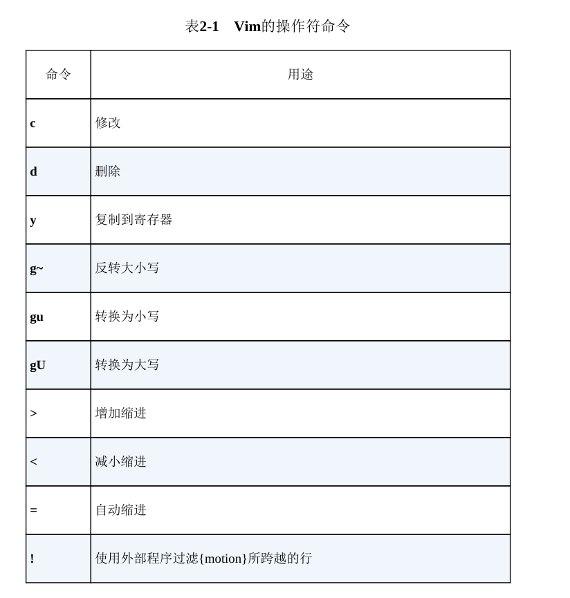

1. 减少移动数目
2. 避免重复

**执行、重复、回退**

基本模式：[count] operate [count] moition/tex_object

行模式：operate operate 

macro：.


ctrl + u/w/...


可视模式：先选择范围 再 operate

# 技巧


多行行尾编辑（比如加封号）

1. v模式选中再shift A
2. 第一行修改，再按.重复

快速跳转

1. f
2. , ;

替换：

1. s
2. & u

跳转相同单词：*

删除当前单词 daw  aw 文本对象


.范式：一次键执行 一次键移动 -> 移动加.

许多普通模式命令可以在执行时指定执行的次数，这样它们就可以
被执行多次。


在Vim中，我们自己可以控制撤销命令的粒度。从进入插入模式开
始，直到返回普通模式为止，在此期间输入或删除的任何内容都被当成
一次修改。因此，只要控制好对 <Esc> 键的使用，就可使撤销命令作
用于单词、句子或段落。


很多普通模式命令都可以带一个次数前缀，这样Vim就会尝试把该
命令执行指定的次数，而不是只执行一次


### 一、普通模式（Normal Mode）

1. 

   数值递减操作

   

   功能

   ：当光标位于数字上时，

   ```
   Ctrl+X
   ```

   会将当前数字

   减少

   指定数值（默认减少1）

   **6**

   。

   

   示例

   ：

   - 光标在数字`5`上，按`5 Ctrl+X`会将其修改为`0`（即`5-5=0`）。

   - 连续按`Ctrl+X`可逐次递减（如从`3`变为`2`→`1`→`0`）。
     ​**扩展用法**：

   - 配合

     ```
     Ctrl+A
     ```

     （数值递增）使用，可快速调整代码中的常量或计数器

     **6**

     。



