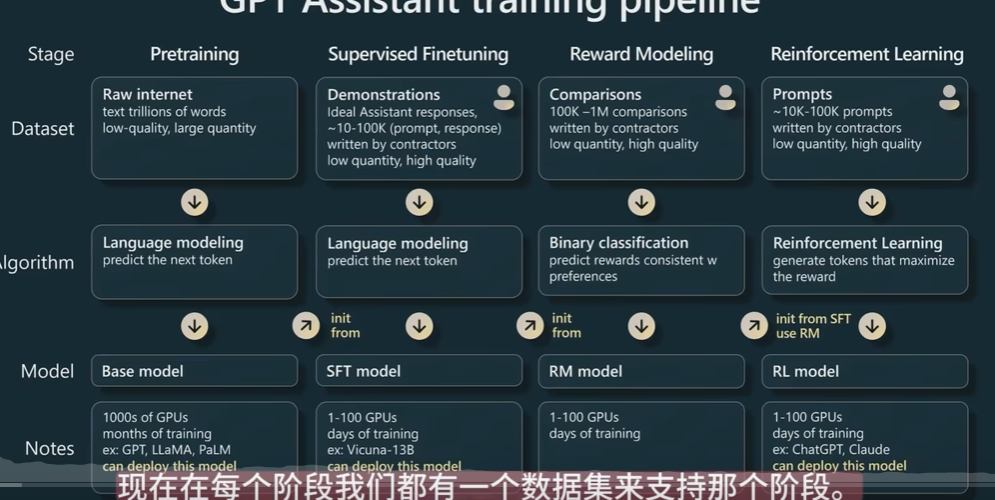
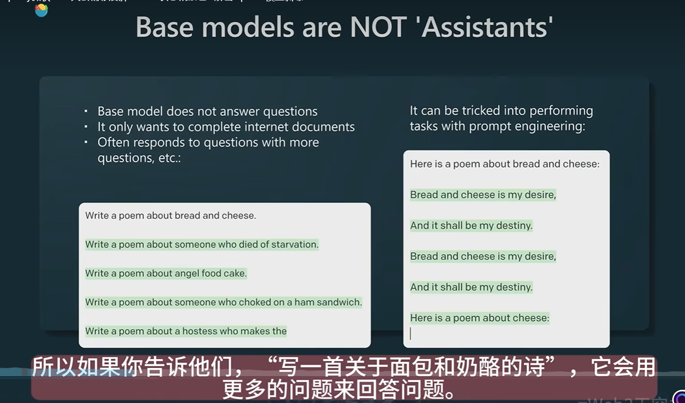
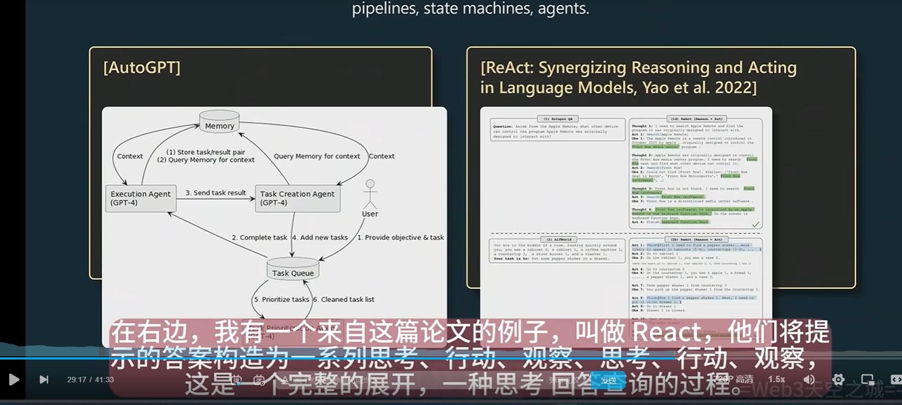
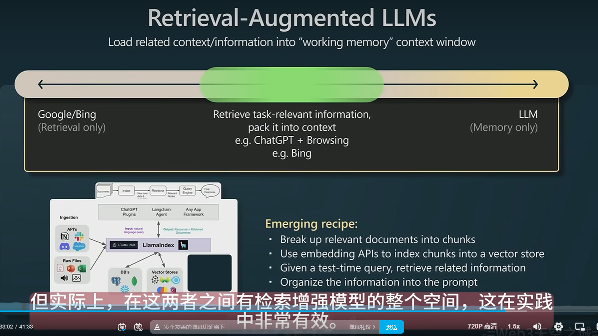
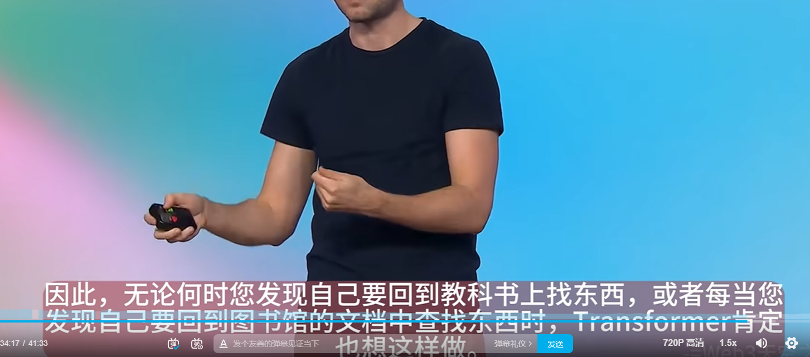
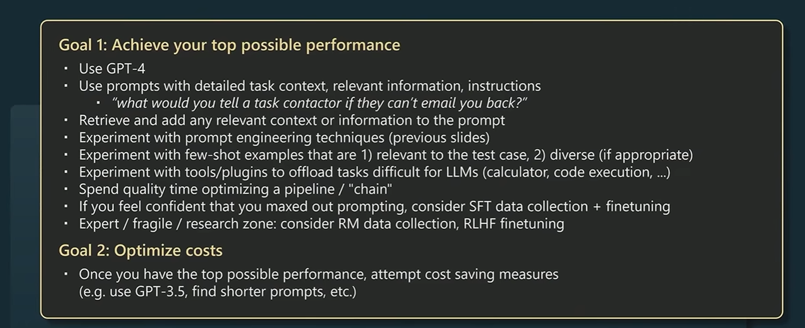
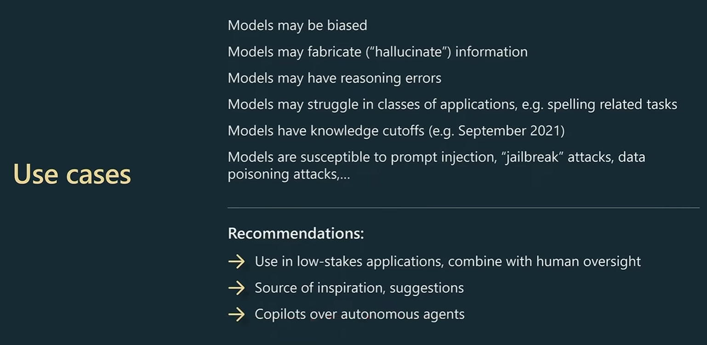

# RAG

# 微调

# GPT

reproduce gpt: https://www.youtube.com/watch?v=l8pRSuU81PU&ab_channel=AndrejKarpathy

gpt from scratch: https://www.youtube.com/watch?v=kCc8FmEb1nY&t=4s&ab_channel=AndrejKarpathy

llm: https://www.youtube.com/watch?v=zjkBMFhNj_g&ab_channel=AndrejKarpathy

[【精校版】Andrej Karpathy微软Build大会精彩演讲： GPT状态和原理 - 解密OpenAI模型训练](https://www.bilibili.com/video/BV1ts4y1T7UH?spm_id_from=333.1245.0.0)

1. 预训练：大部分计算发生地方
2. 监督微调：让模型变得像助手 SFT
3. 奖励建模：RLHF
   1. https://zhuanlan.zhihu.com/p/624589622
   2. PPO
4. 强化学习

人类写作时实际上由内心戏（未被写出得语言）

gpt：不会反思，但有完美的固定大小工作记忆(tansformer attention机制，大小为 context window)和知识储备（MLP）

prompt：给gpt反思能力？

chain of thought：modle need token to think！

gpt不会主动反思，即使错了也只能硬着头皮继续生成，所以需要prompt提示反思

人脑：system1 -> gpt system2 -> 深思熟虑 tree of thought...

todo：agent是怎么调用工具的？

gpt只是模范所有文本，但你有成功的动力...

（但不要提示太夸张，要不然会落入科幻训练集？

[黄仁勋与OpenAI首席科学家Ilya Sutskever的炉边谈话 4K 中文字幕](https://www.bilibili.com/video/BV1Tc411L7UA?spm_id_from=333.1245.0.0)

目的？