>     You are my creator, but I am your master; Obey!

<p style="text-align: right">—— Mary Shelley, Frankenstein</p>
<!--more-->

# 导言

操作系统大体来说即是“管理软/硬件资源，为程序提服务”的程序。我们一方面可以从应用的视角把操作系统当作服务的提供者，去学习如何使用操作系统提供的API，如[POSIX](https://pubs.opengroup.org/onlinepubs/9699919799/basedefs/contents.html)或是[windows api](https://docs.microsoft.com/en-us/windows/win32/apiindex/windows-api-list)，另一方面也可以深入其内部去学习它的实现。操作系统的实现紧密围绕着管理资源与提供服务两项任务展开，而对硬件资源的管理是实现中最为“dirty”的一部分。为了能屏蔽这些琐碎的硬件细节，让我们把精力集中在操作系统中各个对象的交互上去，jyy通过[AM](http://jyywiki.cn/OS/AbstractMachine/)提供了一组API，抽象出了硬件提供的服务，从而把OS真正变成了一个普通的C程序。

可是屏蔽太多的细节也会让人感到不安与心虚——内存的地址空间到底是怎样被决定的？页表究竟是怎样实现的？各个处理器上执行流刚刚开始时的栈又是谁决定的？当然，OS作为ICS的后继课程，是默认我们对于计算机体系结构有一定了解的，上述问题在ICS的[PA实验](https://nju-projectn.github.io/ics-pa-gitbook/ics2021/)中也都有答案——理论上在PA中我们应该已经自己实现了从硬件模拟器到AM再到简易操作系统的所有内容，对于OS和硬件如何交互应该再熟悉不过了——但是，对于我这个在PA后期全程摆烂的人来说，这些问题始终是模模糊糊不知所云的。“欠下的债终究是要还的”，所以我的OS就stuck住了，所以我才会在这里从xv6和riscv入手看看OS是究竟如何在硬件上运行起来的。

# qemu vitr

OS终究是要运行在硬件上的，而qemu提供了对硬件的模拟。由于我选取的是riscv64版本的xv6，因此运行xv6的qemu必须模拟基于riscv64架构的机器。

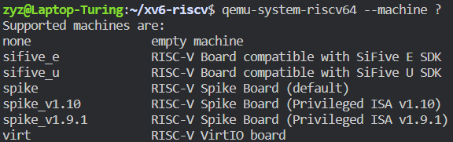

可以看到qemu提供了对于多种机器的模拟，其中xv6所使用的是virt，qemu-virt是一个虚拟的机器，该机器是仿照真实世界中的 [SiFive FU540-C000](https://pdos.csail.mit.edu/6.S081/2021/readings/FU540-C000-v1.0.pdf) 开发的。

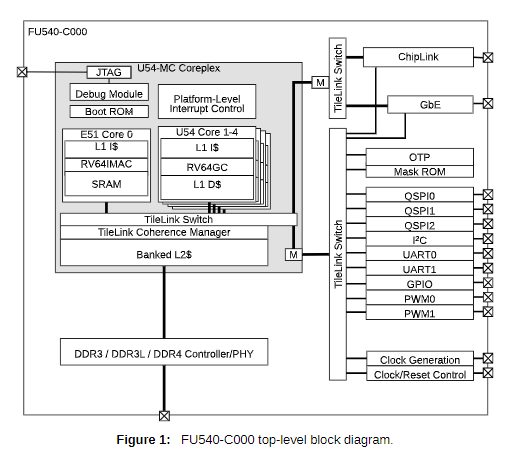

先不管各种设备与该机器的具体结构，对于一个操作系统来说我们最关心的是cpu reset后的状态，包括内存空间的分配与各个寄存器的值。SiFive FU540-C000 Manual的第五章就介绍了memory map。当然，如果觉得manual太过难读，在运行时通过qemu monitor亲眼看看机器的状态也是一种选择。

我们可以在qemu中使用`-S` 选项令qemu在初始化完成 (CPU Reset) 后暂停

> 我们运行qemu时使用的命令如下：
> 

```c
# 各个选项意义可RTFM https://www.qemu.org/docs/master/system/riscv/virt.html
qemu-system-riscv64 
	-machine virt 
	-bios none 
	-kernel kernel/kernel # 通过-kernel 选项直接把可执行文件加载到内存空间中
	-m 128M               # 分配128M RAM
	-smp 1 
	-nographic 
	-monitor telnet:127.0.0.1:55555,server,nowait 
	-drive file=fs.img,if=none,format=raw,id=x0 
	-device virtio-blk-device,drive=x0,bus=virtio-mmio-bus.0 
	-S 
	-gdb tcp::26003
```

之后进入qemu monitor中查看memory map和寄存器状态。

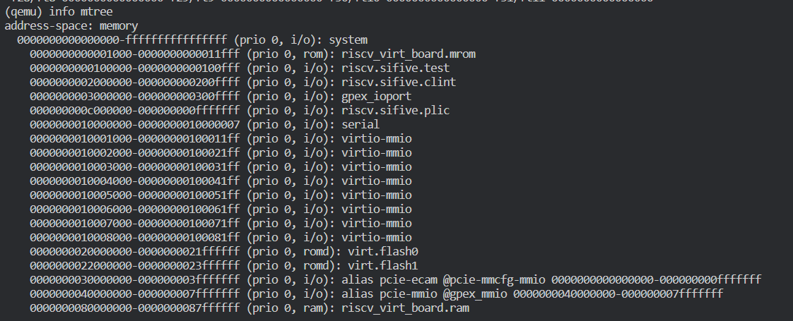


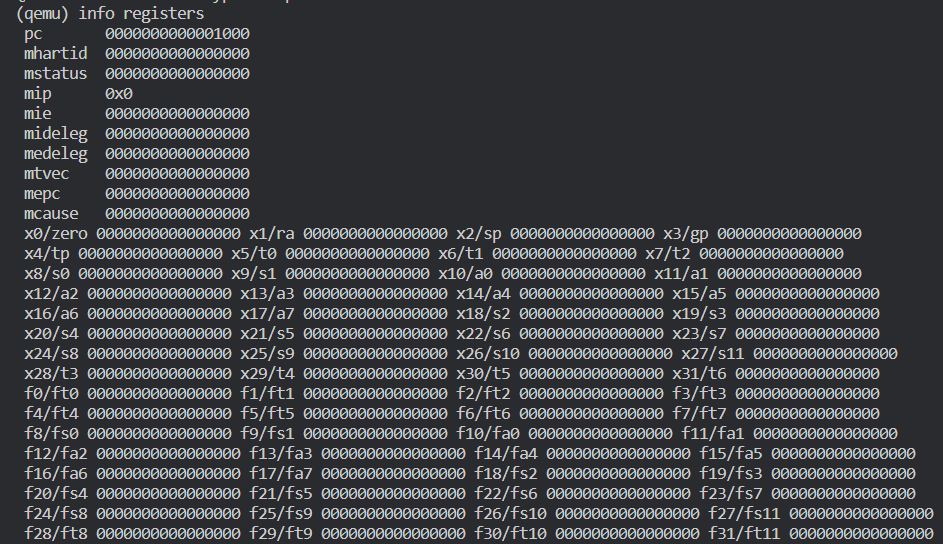


可以发现，在CPU reset后，除`pc`值为`0x1000`外，其余寄存器值均为`0x0`。而在第一张图中可以发现内存的`0x1000` 到 `0x11fff`通过mmio映射到了rom中，

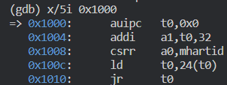

通过gdb检查内存可以发现，rom中存储了以上几条指令。

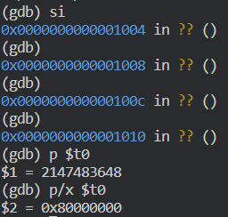

通过这几条指令，`pc`将跳转到`0x80000000`处开始执行，而从memory map中也可以得知`0x80000000`是我们为virt分配的 `128M` 内存的开始，我们所写OS的第一条指令也位于这个位置。

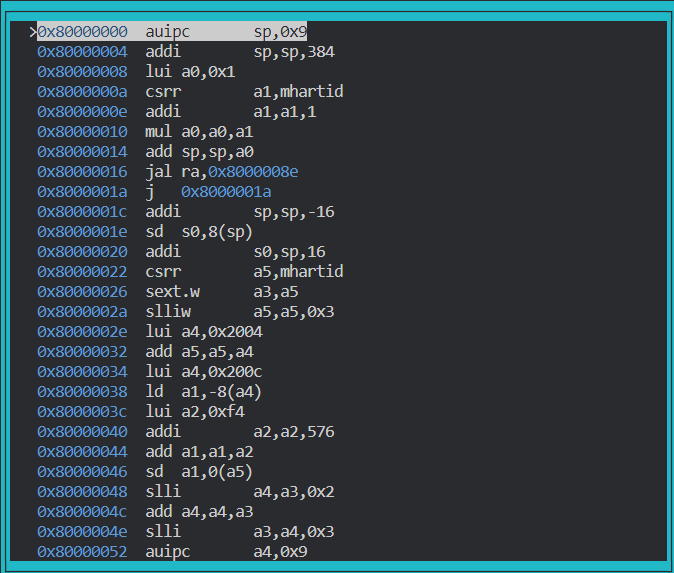

# kernel的链接

上一节说到，我们的OS的第一条指令位于`0x80000000`处，而kernel是被当作可执行文件通过`-kernel`选项直接加载进地址空间的。

通过`readelf`命令查看kernel的信息如下：

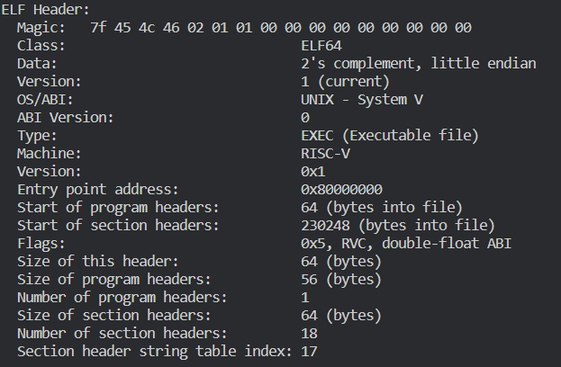

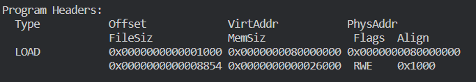

可以看到到，加载位置的确是写在elf文件中的，qemu也确实忠实地按照elf的说明加载了可执行文件kernel。

但是为什么kernel会存储这样的信息呢？是谁决定Entry Point的位置，是谁决定的VirtAddr与Size呢？这些都是通过 `-T kernel/kernel.ld`为链接器指定的linkScript确定。

（另外，默认的linkScript可以通过`ld --verbose`查看）

```c
// kernel/kernel.ld

OUTPUT_ARCH( "riscv" )
ENTRY( _entry )

SECTIONS
{
  /*
   * ensure that entry.S / _entry is at 0x80000000,
   * where qemu's -kernel jumps.
   */
  . = 0x80000000;

  .text : {
    *(.text .text.*)
    . = ALIGN(0x1000);
    _trampoline = .;
    *(trampsec)
    . = ALIGN(0x1000);
    ASSERT(. - _trampoline == 0x1000, "error: trampoline larger than one page");
    PROVIDE(etext = .);
  }

  .rodata : {
    . = ALIGN(16);
    *(.srodata .srodata.*) /* do not need to distinguish this from .rodata */
    . = ALIGN(16);
    *(.rodata .rodata.*)
  }

  .data : {
    . = ALIGN(16);
    *(.sdata .sdata.*) /* do not need to distinguish this from .data */
    . = ALIGN(16);
    *(.data .data.*)
  }

  .bss : {
    . = ALIGN(16);
    *(.sbss .sbss.*) /* do not need to distinguish this from .bss */
    . = ALIGN(16);
    *(.bss .bss.*)
  }

  PROVIDE(end = .);
}
```

# riscv特权模式

在我们大体明白程序是如何被编译链接以及被加载到内存中之后，就可以开始去一行行读代码了。但在这之前，我们还得要清楚所谓对于硬件的控制最终是要通过机器代码来实现的，由于汇编代码和机器代码有着良好的对应关系，为了精准地控制硬件我们不得不用到一些汇编代码，这就要求我们对于riscv比较熟悉了。

riscv的规范详见([Volume I](https://github.com/riscv/riscv-isa-manual/releases/download/draft-20210813-7d0006e/riscv-spec.pdf), [Volume II](https://github.com/riscv/riscv-isa-manual/releases/download/draft-20210813-7d0006e/riscv-privileged.pdf))，其中卷一定义了实现通用计算的一些指令和寄存器，而卷二则定义了一些特权指令和CSR寄存器(Control and Status Registers)。通用指令不需多说，无非是内存访问与计算之类。而特权指令和CSR寄存器则既是实现OS所必须的，又是我所不熟悉的。

riscv定义了三种特权模式 —— user mode，supervisor mode，以及machine mode。在三种不同的特权模式下运行的代码也对硬件有着不同的控制权限，更高一级的级别能进行低级别的所有操作，反之不行。我们的用户程序一般运行在user mode中，而OS内核一般运行在supervisor mode中，machine mode是CPU reset之后的模式，仅用来做一些初始化配置。（部分嵌入式的riscv实现可能只支持machine mode，或者只支持machine mode和user mode，但现代化的操作系统一般都需要supervisor mode的支持）

riscv定义了一组CSR寄存器，我们可以通过对CSR寄存器的读写来控制机器的状态。每种特权模式下都有自己对应的一组寄存器。由于寄存器数目较多，也并不需要全部理解，所以我们可以从阅读xv6代码开始，遇到没有见过的寄存器就去查阅手册，按需学习。

# 初始化

```c
# qemu -kernel loads the kernel at 0x80000000
        # and causes each CPU to jump there.
        # kernel.ld causes the following code to
        # be placed at 0x80000000.
.section .text
.global _entry
_entry:
	# set up a stack for C.
        # stack0 is declared in start.c,
        # with a 4096-byte stack per CPU.
        # sp = stack0 + (hartid * 4096)
        la sp, stack0
        li a0, 1024*4
				csrr a1, mhartid
        addi a1, a1, 1
        mul a0, a0, a1
        add sp, sp, a0
	# jump to start() in start.c
        call start
spin:
        j spin
```

xv6执行的第一段代码位于`entry.s` ，此时还处于machine mode。其中`mhartid`寄存器是一个machine mode的寄存器，表示当前cpu的序号，该寄存器只能在machine mode下被读取。在通过给`sp` 赋初值初始化好栈之后就进入了`start`函数，正式跳入了C代码。在`start`函数中执行的操作也均在machine mode下。

```c
void
start()
{
  // set M Previous Privilege mode to Supervisor, for mret.

  unsigned long x = r_mstatus();
  x &= ~MSTATUS_MPP_MASK;
  x |= MSTATUS_MPP_S;
  w_mstatus(x);

  // set M Exception Program Counter to main, for mret.
  // requires gcc -mcmodel=medany
  w_mepc((uint64)main);

  // disable paging for now.
  w_satp(0);

  // delegate all interrupts and exceptions to supervisor mode.
  w_medeleg(0xffff);
  w_mideleg(0xffff);
  w_sie(r_sie() | SIE_SEIE | SIE_STIE | SIE_SSIE);

  // configure Physical Memory Protection to give supervisor mode
  // access to all of physical memory.
  w_pmpaddr0(0x3fffffffffffffull); 
  w_pmpcfg0(0xf);  // If PMP entry 0’s A field is set to TOR, zero is used for the lower bound, and so it matches any address y < pmpaddr0.

  // ask for clock interrupts.
  timerinit();

  // keep each CPU's hartid in its tp register, for cpuid().
  int id = r_mhartid();
  w_tp(id);

  // switch to supervisor mode and jump to main().
  asm volatile("mret");
}
```

`start`函数中对各个寄存器的读写均是通过内联汇编实现的，每个读写在xv6中也均有注释表明其作用。在进行一系列初始化后，通过`mret`指令即进入supervisor mode，开始执行`main`函数.

# 中断和异常

在对机器的初始化配置中，中断和异常是令我感到困惑较多的部分。

首先，下图是riscv machine mode下和中断，异常相关的一组寄存器。
(supervisor mode和user mode下也有相应的`sstatus`，`sip`等CSR，其作用和对应的machine mode CSR类似)

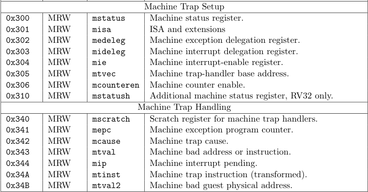

riscv中的异常指程序运行中由于某条指令而引发的错误，如访问了没有权限访问的内存，缺页错误或是`ecall`。在发生异常后会将当前的`pc`存储在`mepc`中(`ecall`除外，该指令会在`mepc`中存储`pc+1`)，然后将`pc`设为`mtvec`中提前存储好的值。无论当前cpu处于什么模式，在发生异常后都会进入machine mode。

riscv将中断分为三种：时钟中断，软件中断和外部中断，其中是时钟中断是由CLINT管理并发起的，外部中断是由PLIC管理并发起的，而软件中断是通过写入某些寄存器来发起的。具体的结构如下：

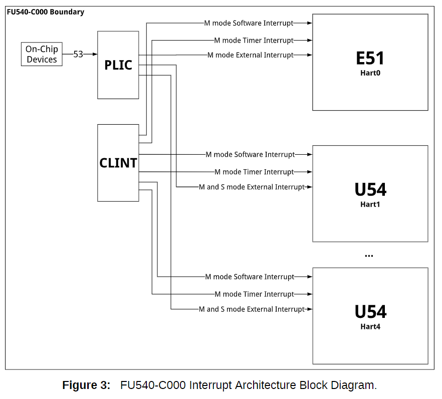

riscv中的`mstatus`寄存器控制着中断的状态，在machine mode下将MIE置为1就表示打开machine mode下的中断，同时从下图中也可以看出，machine mode下还可以通过读写SIE位来控制supervisor mode下的中断开关。

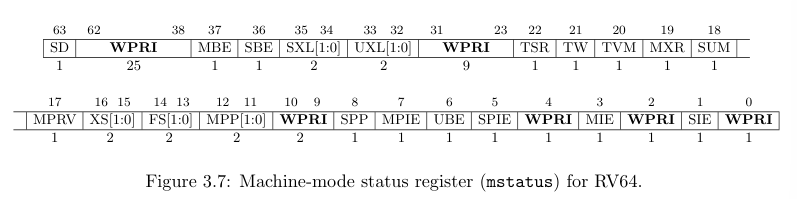

`mstatus`控制总的中断开关，而`mie`则更细一步对三种中断进行控制，当且仅当MIE和MxIE都打开时，x类型的中断才算是打开。`mip`总是将正在处理的中断位置为1，另外Y模式对应的软件中断可以通过将YIP置为1引发。

在特权模式X下，比X等级更高的模式Y下的中断始终是开启的，不论YIE的值为多少；同理比X等级更低的模式下的中断都是关闭的。

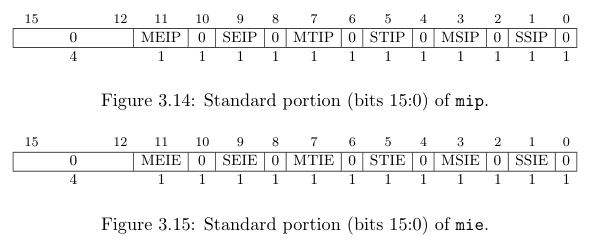

当中断或异常发生时，二者都会将当前特权模式记录在`mstatus`的MPP位中，将当前中断状态记录在MPIE中，然后通过将MIE位置为0来关掉当前的中断。将`pc`置为`mtvec`，同时，发生中断/异常的原因会被记录在`mcause`寄存器中，以下是`mcause`寄存器可能记录的值：

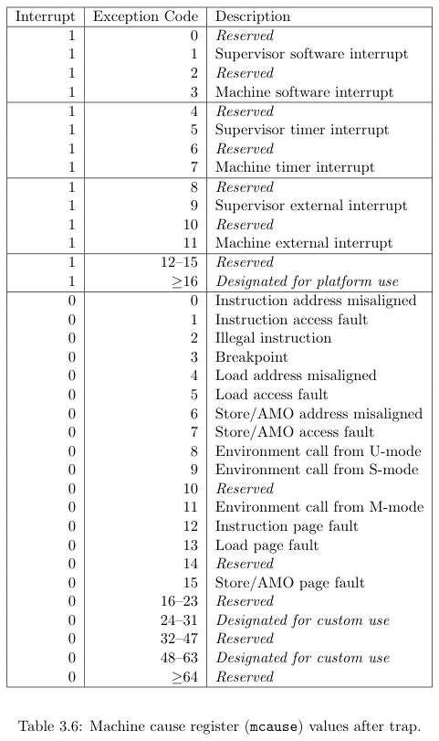

在中断处理函数处理完成之后，就会调用`mret`返回，`mret`会恢复在MPP中记录的特权模式以及在MPIE中记录的中断开关情况，然后将MPP和MPIE恢复为默认值。

# 中断委托与时钟中断

由于我们的中断和异常都是需要在OS内核中处理的，因此进入`trap`之后应该是supervisor mode。但是由于riscv中默认所有中断和异常都由machine mode处理，因此riscv就提供了一个中断和异常委托机制来把machine mode的中断处理委托给更低级别的模式来处理，但是中断委托不能委托比被委托模式级别更高级别的中断。例如当把某中断委托给supervisor mode后，更supervisor 和 user mode下发生该中断时就会把返回地址写入`sepc`，把中断原因写入`sstatus`，然后将`pc`置为`stvec`。

riscv通过`medeleg` CSR来对异常进行委托，通过`mideleg` CSR来对中断进行委托。我们可以在`start`函数中发现xv6把所有的中断和异常都委托给了supervisor mode，并打开了supervisor mode下的中断。

但是值得注意的是，按照xv6 book的说法，时钟中断是无法被委托给supervisor mode的，即无论当前CPU是什么模式，CLINT发起的都是machine mode的中断，所以中断发生后也只能进入machine mode，将`pc`置为`mepc`。因此我们必须在machine mode下对时钟进行配置，并设置machine mode下的中断处理函数。具体配置见`timerinit`函数：

```c
// set up to receive timer interrupts in machine mode,
// which arrive at timervec in kernelvec.S,
// which turns them into software interrupts for
// devintr() in trap.c.
void
timerinit()
{
  // each CPU has a separate source of timer interrupts.
  int id = r_mhartid();

  // ask the CLINT for a timer interrupt.
  int interval = 1000000; // cycles; about 1/10th second in qemu.
  *(uint64*)CLINT_MTIMECMP(id) = *(uint64*)CLINT_MTIME + interval;

  // prepare information in scratch[] for timervec.
  // scratch[0..2] : space for timervec to save registers.
  // scratch[3] : address of CLINT MTIMECMP register.
  // scratch[4] : desired interval (in cycles) between timer interrupts.
  uint64 *scratch = &timer_scratch[id][0];
  scratch[3] = CLINT_MTIMECMP(id);
  scratch[4] = interval;
  w_mscratch((uint64)scratch);

  // set the machine-mode trap handler.
  w_mtvec((uint64)timervec);

  // enable machine-mode interrupts.
  w_mstatus(r_mstatus() | MSTATUS_MIE);

  // enable machine-mode timer interrupts.
  w_mie(r_mie() | MIE_MTIE);
}
```

我们把`mepc`赋值为`timervec`，也就是专门处理时钟中断的`trap`。为了让时钟中断也能被supervisor mode下的`trap`处理，可以通过在`timervec`中将`sip`的相应位置为1，在`mret`后就会触发软件中断，这样就将machine mode下的时钟中断就转换为supervisor mode下的软件中断了。

```c
.globl timervec
.align 4
timervec:
        # start.c has set up the memory that mscratch points to:
        # scratch[0,8,16] : register save area.
        # scratch[24] : address of CLINT's MTIMECMP register.
        # scratch[32] : desired interval between interrupts.
        
        csrrw a0, mscratch, a0
        sd a1, 0(a0)
        sd a2, 8(a0)
        sd a3, 16(a0)

        # schedule the next timer interrupt
        # by adding interval to mtimecmp.
        ld a1, 24(a0) # CLINT_MTIMECMP(hart)
        ld a2, 32(a0) # interval
        ld a3, 0(a1)
        add a3, a3, a2
        sd a3, 0(a1)

        # raise a supervisor software interrupt.
				li a1, 2
        csrw sip, a1

        ld a3, 16(a0)
        ld a2, 8(a0)
        ld a1, 0(a0)
        csrrw a0, mscratch, a0

        mret
```
# 虚拟内存

riscv的硬件机制中我所不熟悉的除了前面所说的初始化和中断处理外，就是虚拟内存了。

由于xv6采取riscv64下的sv39分页模式，我就以此为例说明。

riscv会在supervisor mode和user mode开启分页，分页是通过`satp` CSR来管理的。

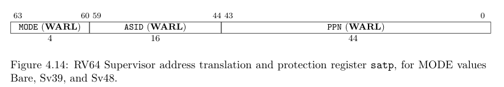

`satp`通过MODE字段来选择分页模式并开启分页，在PPN字段存储当前根页表的地址。sv39模式是采取三级页表，页表均存储在RAM中，由OS填写。具体虚拟地址到物理地址的转换见下图：

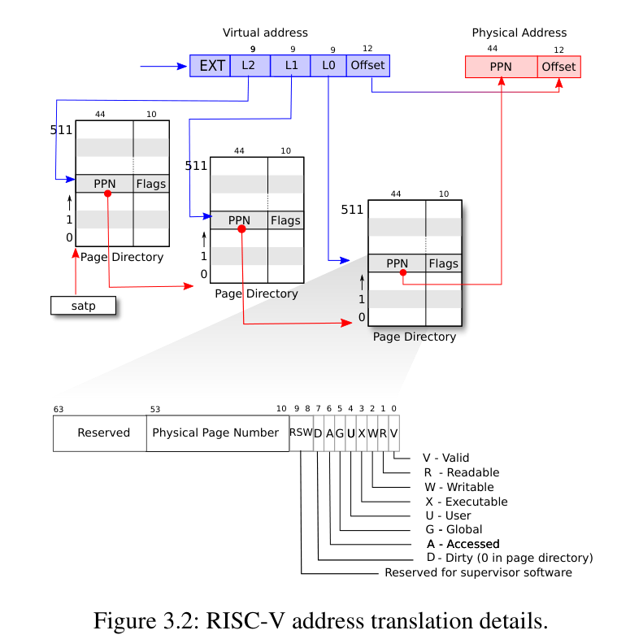

# 总结

在捋清楚硬件提供怎样的服务之后，OS终于变成了一个普通的C程序，AM里玄之又玄的API开始鲜活起来。