数学，计算机资源：

1. OI wiki
2. 香蕉空间
3. nlab

书籍：

1. booksc
2. 安娜的档案
3. libgenis
4. zlib

哲学：

1. stanford
2. 中国哲学电子化

语言学：

...

## 基本概念

### 什么是机器学习

目的：通过对经验的利用，能对新情况做出有效的决策

研究从数据中产生**模型**的算法，即学习算法。

模型泛指从数据中学到的结果。

从数据中学得模型得过程称为 **学习** 或 **训练**

....

以及数据集等概念。os

### 算法分类

按照原理：https://www.turing.com/kb/generative-models-vs-discriminative-models-for-deep-learning

https://www.analyticsvidhya.com/blog/2021/07/deep-understanding-of-discriminative-and-generative-models-in-machine-learning/#h2_5/

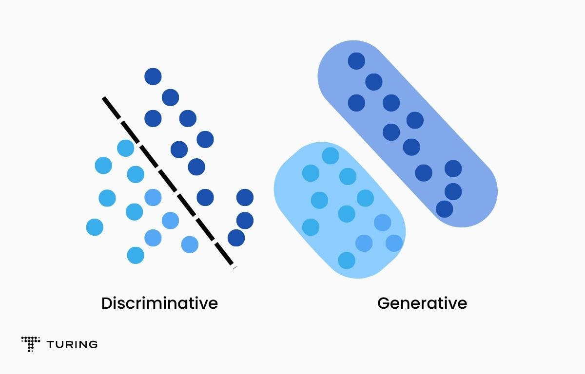

1. 判别模型算法：判别模型直接学习输入特征到输出标签的映射关系。
   1. The majority of discriminative models, aka conditional models, are used for supervised machine learning.
   2. They do what they ‘literally’ say, separating the data points into different classes and learning the boundaries using probability estimates and maximum likelihood.
   3. Outliers have little to no effect on these models. They are a better choice than generative models, but this leads to misclassification problems which can be a major drawback.
   4. 判别模型，如逻辑回归、支持向量机（SVM）等，主要关注于从输入特征直接学习到输出标签的映射关系，即它们学习的是条件概率分布P(y|x)。这意味着判别模型的目标是预测给定输入特征x的输出标签y，而不是学习数据的整体分布。因此，判别模型不具备生成新数据样本的能力，因为它们没有学习到如何从底层分布生成数据的机制。判别模型的优势在于它们通常在分类任务上性能更好，因为它们直接优化分类边界，而且训练速度更快，尤其是对于大规模、高维数据集
2. 生成模型算法：生成模型学习输入数据的联合概率分布，可以用于生成新的数据样本。
   1. As the name suggests, generative models can be used to generate new data points. These models are usually used in unsupervised machine learning problems.
   2. Generative models go in-depth to model the actual data distribution and learn the different data points, rather than model just **the decision boundary** between classes.
   3. 生成模型能够生成全新数据样本的原因在于它们学习了数据的联合概率分布P(x,y)，即特征x和标记y共同出现的概率， 然后通过这个联合分布来生成新的数据实例。这个过程涉及到对数据生成机制的建模，使得模型能够捕捉到数据的统计规律和结构特征，并据此创建出与真实数据相似但从未出现过的新实例。以下是一些具体的应用例子和解释：

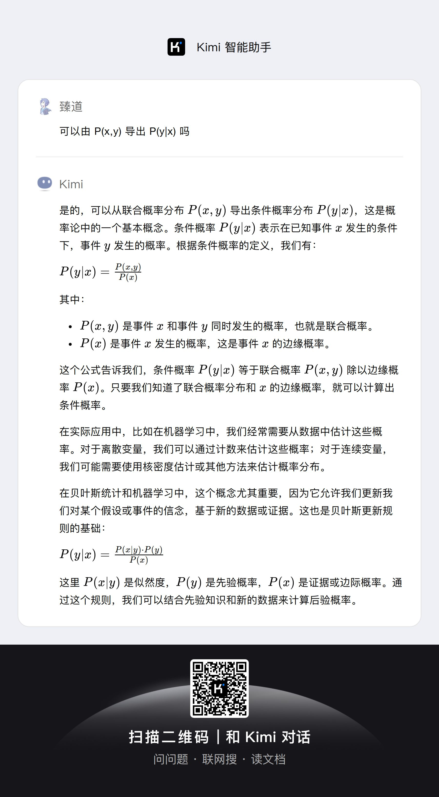

P(X)究竟是什么什么东西？(**这里的回答好像有问题**)

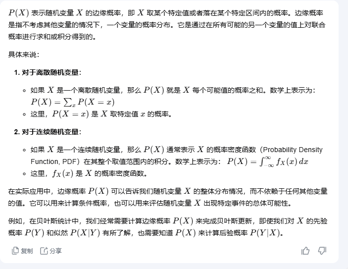

什么是随机变量？

> 随机变量是概率论和统计学中的一个基本概念，它是一个**函数**，将随机实验的结果映射到实数上。

https://www.bananaspace.org/wiki/%E9%9A%8F%E6%9C%BA%E5%8F%98%E9%87%8F

概率论基础知识：https://oi-wiki.org/math/probability/basic-conception/

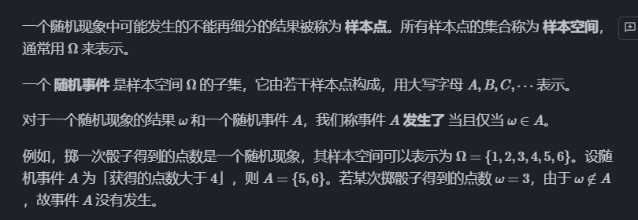

随机事件：样本的集合

所有样本的集合：样本空间

事件域：所有事件的集合

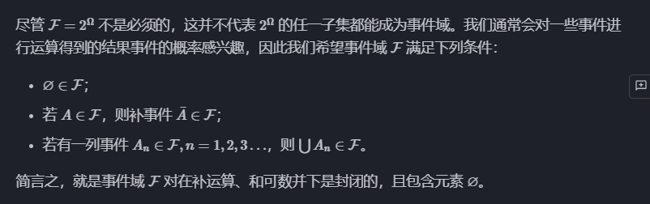

什么是概率：

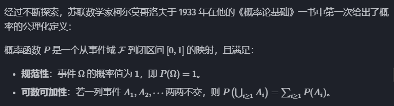

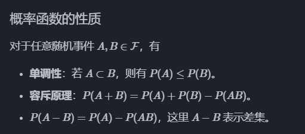

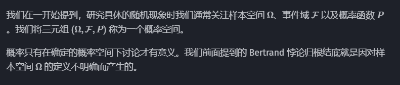

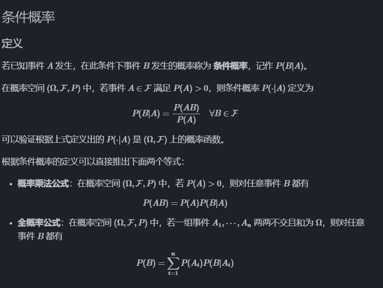

注意：时刻记得 A,B都是事件，是基本样本的集合。

事件的独立性也不过意味着... 在A是否发生的基本样本集合里，B的基本样本占的份数都是相同的

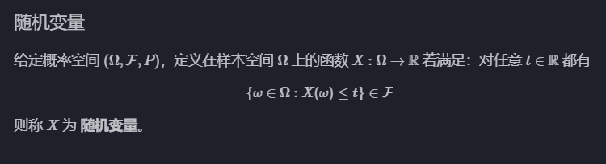

随机变量：（香蕉空间的定义涉及到测度论，而oi wiki的定义又有点看不懂）

所以看 wiki： https://www.wikiwand.com/zh-cn/articles/%E9%9A%8F%E6%9C%BA%E5%8F%98%E9%87%8F

https://www.bilibili.com/video/BV1kg4y1s7ap/?spm_id_from=333.337.search-card.all.click&vd_source=226da368954a7c68d6b7e4bbdc91b2cd

随机变量：把样本点映射到数轴上

分布函数：https://www.bilibili.com/video/BV125411Y7P1/?spm_id_from=333.337.search-card.all.click&vd_source=226da368954a7c68d6b7e4bbdc91b2cd

虽然但是，X是个函数

X < x 代表的是一个事件，该事件为所有X(w) < x 的基本样本的集合

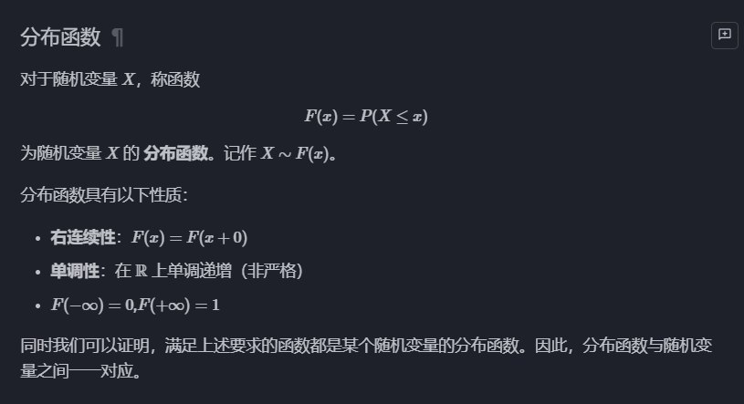

所以是kimi出错了

我问的是 P(x) ，他却说了 P（X)，这里x应该是事件而非随机变量

回过头来了discriminative classifiers 到底是什么呢？只要涉及到概率，就不能不提**概率空间**是啥！所以之前那个文章就有点不好了...

啊不，我理解错了，x就是随机变量！！！

但是随机变量能直接放在 P 里面吗？这是什么意思？

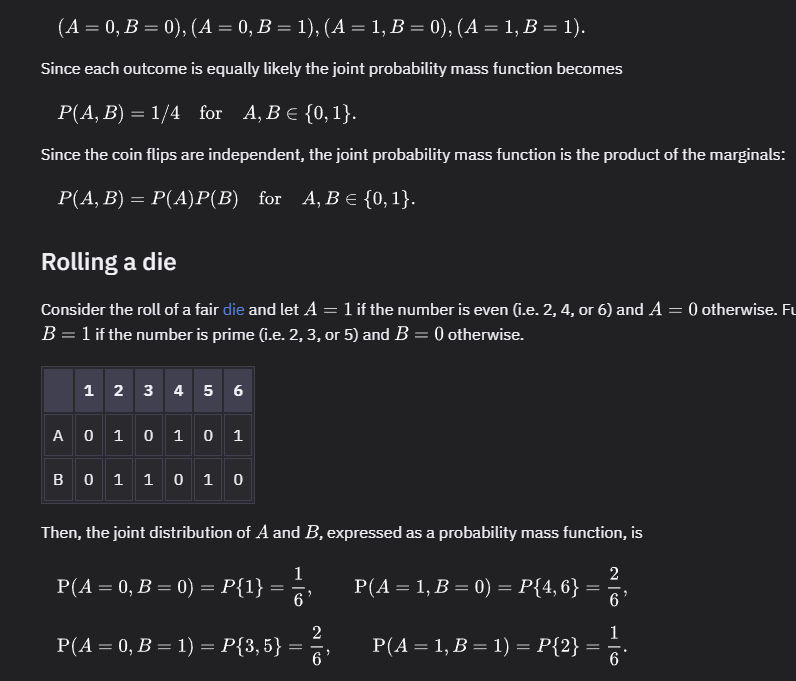

**好像只是有待填充具体参数？**

这样好像就清楚了...

P(Y|X)  指的是 给x，给y，就能求出P(x|y)

P(X, Y) 指的是 给x, 给y，就能求出 P(x, y),，当然同时也能知道 P(x)，P(y)

那么P(x,y)是什么意思？-> 好像就是 P(xy)，所以自然也能生成 P(x|y)了（贝叶斯公式）

同时直接选P(x,y)大的点就是**新样本**！

**好了，终于把生成模型和判别模型的区别搞清楚了！！！！**

---

按照预测目标：

1. 分类算法
2. 排序算法
3. 序列标注算法：如自然语言处理中的词性标注。
4. 匹配算法：推荐系统问题。
5. 生成算法：生成新的数据样本，如文本、图像等

按照输入数据：

1. 监督学习
2. 无监督学习
3. 半监督学习
4. 强化学习

### 模型评估

## 线性模型

## 决策树

## SVM

## 聚类

## 神经网络

cnn: https://www.youtube.com/watch?v=KuXjwB4LzSA&ab_channel=3Blue1Brown

https://ncatlab.org/nlab/show/neural+network

具体可见 obsidian 笔记

核心就是激活函数多层非线性

然后**反向传播算法**需要理解下，记得里面好像也涉及了导数定义问题

rnn：历史

## Transformer

https://www.bilibili.com/video/BV1TZ421j7Ke/?spm_id_from=333.999.0.0

https://www.bilibili.com/list/watchlater?oid=1353986541&bvid=BV13z421U7cs&spm_id_from=333.999.top_right_bar_window_view_later.content.click

https://transformer-circuits.pub/2021/framework/index.html

https://www.gptlearninghub.ai/

可解释性：

https://arena3-chapter1-transformer-interp.streamlit.app/

https://www.neelnanda.io/mechanistic-interpretability/getting-started

**llm可视化**： https://bbycroft.net/llm

简要：attention 给每个单词 context，前馈神经网络存储fact

gpt history：https://www.youtube.com/watch?v=OFS90-FX6pg&ab_channel=ArtoftheProblem

gpt：https://writings.stephenwolfram.com/2023/02/what-is-chatgpt-doing-and-why-does-it-work/

llm：通用智能

## Pre-trained

## in-context learning

# RAG

动手 RAG： https://www.bilibili.com/video/BV1vt42157Si/?spm_id_from=333.1007.top_right_bar_window_history.content.click&vd_source=226da368954a7c68d6b7e4bbdc91b2cd

# 微调

# NLP

# CV

# 图像生成

