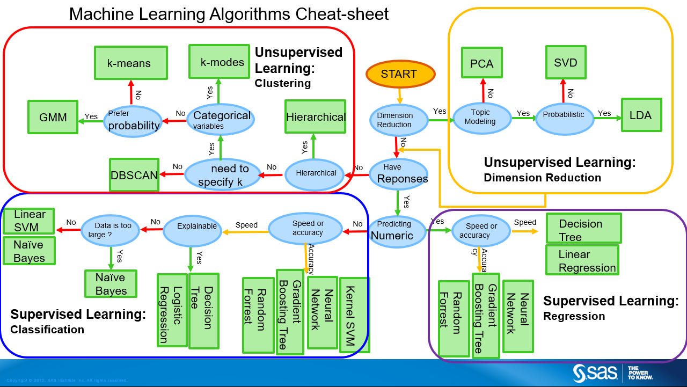
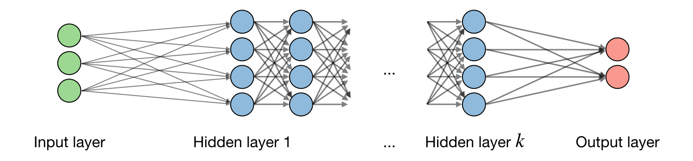

<!--more-->

+ [cheat sheet](https://stanford.edu/~shervine/teaching/)
+ [Machine Learning Glossary](https://ml-cheatsheet.readthedocs.io/en/latest/)

## 基本概念

> 什么是机器学习？

机器学习致力于研究如何通过计算的手段，利用经验来改善系统自身的性能。

经验通常以"**数据**"形式存在，因此机器学习研究的主要内容，是关于在计算机上从数据中产生"**模型**"(model) 的算法，即"**学习算法**" (learning algorithm). 

记录的集合称为一个"**数据集**" (data set) ，其中每条记录是关于一个事件或对象的描述，称为一个"**示例**"(instance) 或"**样本**"(sample). 反映事件或对象在某方面的表现或性质的事项称为"**属性**"(attribute) 或"**特征**"(feature); 属性上的取值称为"**属性值**" (attribute value). 属性张成的空间称为"**属性空间**" (attribute space) 、"**样本空间**" (sample space)或"**输入空间**"。我们也把一个示例称为一个"**特征向量**" (feature vector).属性的数目被称为样本的"**维数**" (dimensionality).

从数据中学得模型的过程称为"**学习**"(learning)或"**训练**" (training),这个过程通过执行某个学习算法来完成.训练过程中使用的数据称为"**训练数据**" (training data) ，其中每个样本称为一个"**训练样本**" (training sample),训练样本组成的集合称为"**训练集**" (training set). 学得模型对应了关于数据的某种潜在的规律，因此亦称"**假设**"
(hypothesis); 这种潜在规律自身，则称为"**真相**"或"**真实**"(ground-truth) ，学习过程就是为了找出或逼近真相.

学得模型后，使用其母行预测的过程称为"**测试**"(testing) ，被预测的样本
称为"**测试样本**" (testing sample).

> 都有哪些机器学习算法？

[一份算法列表](https://s3.amazonaws.com/assets.datacamp.com/email/other/ML+Cheat+Sheet_2.pdf)



除如图所示的监督和非监督学习外，**强化学习**也是一类基本学习算法。

> 什么是深度学习

深度学习（Deep Learning）是机器学习的一个分支，是一种基于人工神经网络的算法模型。它模仿人类大脑处理信息的方式，采用**多层神经网络**从大量数据中提取特征并进行决策。深度学习在监督，非监督，强化学习中均有应用。

## 对学习的理解

我们可以把学习过程看作一个在所有假设 (hypothesis)组成的空间中进行搜索的过程，搜索目标是找到与训练集"匹配"(fit) 的假设，即能够将训练集中的瓜判断正确的假设.假设的表示一旦确定，假设空间及其规模大小就确定了.

可能有多个假设与训练集一致，即存在着一个与训练集一致的"**假设集合**"，我们称之为"版本空间" (version space).

机器学习算法在学习过程中对某种类型假设的偏好，称为"**归纳偏好**" (inductive bias) ,或简称为"偏好".任何一个有效的机器学习算法必有其归纳偏好，否则它将被假设空间中看似在训练集上"等效"的假设所迷惑，而无法产生确定的学习结果.

归纳偏好可看作学习算法自身在一个可能很庞大的假设空间中对假设进行选择的启发式或"价值观"。"奥卡姆剃刀" (Occam's razor)是一种常用的、自然科学研究中最基本的原则，即"若有多个假设与观察一致，则选最简单的那个。

事实上，归纳偏好对应了学习算法本身所做出的关于"什么样的模型更好"的假设.在具体的现实问题中，这个假设是否成立，即算法的归纳偏好是否与问题本身匹配，大多数时候直接决定了算法能否取得好的性能.

> 不同的神经网络架构既体现了不同的假设空间，也体现了不同的归纳偏好
>
> **假设空间**：由架构定义，是模型可以表示的所有可能函数。
>
> > [理论上来说](https://www.wikiwand.com/en/articles/Universal_approximation_theorem)，一层全连接神经网络（具有足够的神经元和非线性激活函数）就能逼近任意连续函数。
>
> **归纳偏好**：由架构及其优化过程（例如损失函数、正则化策略）定义，是模型在有限数据下更倾向选择的函数。

而同时，根据[NFL 定理](https://www.wikiwand.com/en/articles/No_free_lunch_theorem)，**没有任何一种学习算法在所有问题上都优于其他算法**。

直观来说：

- 如果我们对**问题分布**一无所知，那么所有算法在这些问题上成功的概率是等价的。
- 要在特定任务中取得好性能，算法必须**对任务的特定性质做出假设**（即引入归纳偏好）。

## 模型评估和选择

### 经验误差与过拟合

在机器学习中，我们通常用以下指标来衡量模型的性能：

- **错误率（Error Rate）**：分类错误的样本数占样本总数的比例。例如，如果在 $m$ 个样本中有 $\alpha$ 个样本被分类错误，则： $\text{错误率} = \frac{\alpha}{m}$
- **精度（Accuracy）**：分类正确的样本数占样本总数的比例，与错误率互补： $\text{精度} = 1 - \text{错误率}$

更广义地，我们把**学习器的实际预测输出与样本的真实输出之间的差异**称为“误差（Error）”：

- **训练误差（Training Error）**：学习器在训练集上的误差，又称为“经验误差（Empirical Error）”。
- **泛化误差（Generalization Error）**：学习器在新样本上的误差。

我们的目标是构建一个泛化误差尽可能小的学习器。然而，**由于事先无法得知新样本的分布**，我们通常通过最小化经验误差来间接优化泛化误差。

在实践中，我们希望学习器能对新样本做出准确预测，这要求它从训练数据中学到能适用于所有潜在样本的“普遍规律”。但模型的学习能力可能出现两种极端情况：

1. **过拟合（Overfitting）**：
   学习器对训练样本学得过于“精准”，甚至将训练样本中特有的噪声或不普遍的特性当成一般规律。这会导致模型对新样本的泛化性能下降。
2. **欠拟合（Underfitting）**：
   学习器没有充分捕捉训练样本的一般规律，导致模型在训练集和测试集上的表现都不理想。

**常见原因：**

- **过拟合**：学习能力过强，模型复杂度过高。
- **欠拟合**：学习能力不足，模型复杂度过低。

过拟合是机器学习中的一个普遍现象，无法彻底避免，但可以通过以下方法缓解或减小其影响：

- 增加训练数据。
- 使用正则化（如 $L_1$ 或 $L_2$ 正则化）。
- 采用早停（Early Stopping）策略。
- 使用更简单的模型（降低复杂度）。
- 引入交叉验证（Cross-Validation）评估模型性能。

**本质限制**：过拟合无法完全避免，因为机器学习问题通常是 NP 难或更复杂的，而有效的学习算法必然是多项式时间内运行完成。要彻底避免过拟合，经验误差最小化就能找到最优解，而这在理论上等同于 $P=NP$（构造性地证明），目前尚未被证明。

> 许多学习问题（如神经网络权重优化、支持向量机中的核参数选择等）涉及**非凸优化**问题，或需要在一个离散的组合空间中搜索最佳解。这类问题通常被证明为 NP难。

在实际任务中，我们面临许多选择，包括：

- **不同的学习算法**（如决策树、支持向量机、深度学习）。
- **同一算法的不同参数配置**（如正则化强度、学习率、网络结构）。

这引出了**模型选择**（Model Selection）问题： 如何选择一个泛化性能最好的模型？

**理想目标**：直接评估候选模型的泛化误差，选择泛化误差最小的模型。
**现实困境**：泛化误差无法直接获得，训练误差又可能因过拟合而无法准确反映模型性能。

### 评估方法

在机器学习中，模型的性能评估是关键的一环。为了衡量模型的泛化能力（即在新样本上的表现），我们通常通过实验测试来评估泛化误差。以下将介绍几种常用的数据集划分与评估方法，并探讨参数调节的技巧。

在评估模型时，需将原始数据集 $D$（包含 $m$ 个样本）划分为训练集 $S$ 和测试集 $T$，即 $D = S \cup T$ 且 $S \cap T = \emptyset$。训练集用于训练模型，测试集用于评估模型在未见样本上的表现。测试误差（Testing Error）被视为泛化误差的近似，假设测试样本与训练样本是从相同分布中独立同分布抽取的。

#### 1. **留出法（Hold-out Method）**

留出法是最简单的评估方法，将数据集 $D$ 随机划分为训练集和测试集。例如，常用 2/3 至 4/5 的样本作为训练集，其余作为测试集。

**注意事项：**

- 数据划分需尽量保持分布一致性（如分类任务中保持类别比例），可通过**分层采样**（Stratified Sampling）实现。
- 单次划分的评估结果可能不稳定，因此需多次随机划分，取平均值作为最终评估结果。

**权衡：**

- 训练集比例过大：模型更接近使用全数据训练的情况，但测试集过小可能导致结果不稳定。
- 测试集比例过大：测试结果更稳定，但训练集与全数据差距较大，可能影响评估结果的保真性（Fidelity）。

#### 2. **交叉验证法（Cross-validation）**

交叉验证将数据集 $D$ 分为 $k$ 个大小相等的互斥子集：
$D = D_1 \cup D_2 \cup ... \cup D_k$​，且 $D_i \cap D_j = \emptyset \, (i \neq j)$

每次用 $k−1$ 个子集作为训练集，剩余一个子集作为测试集，重复 $k$ 次后取测试结果的均值作为最终评估结果。常见的 $k$ 值为 10，称为**10 折交叉验证**（10-fold Cross-validation）。

**优点：**

- 比留出法更稳定可靠。
- 可随机重复多次交叉验证（如 10 次 10 折交叉验证），进一步减少划分差异的影响。

**特例：留一法（Leave-One-Out Cross-validation, LOO）**

- 令 $k=m$，即每次仅用一个样本作为测试集，其余样本作为训练集。
- LOO 不受随机划分影响，训练集与全数据集非常接近，但计算复杂度较高，尤其在样本量较大时。

> 在理论上，多次留出法的随机划分结果有可能与交叉验证法某次划分完全一致

#### 3. **自助法（Bootstrapping）**

自助法通过**自助采样**（Bootstrap Sampling）生成新的训练集。每次从原始数据集 $D$ 中随机抽取一个样本放入训练集，并将其放回，再次采样，重复 $m$ 次。采样后：

- $D′$ 为训练集，包含 $m$ 个样本，其中部分样本重复出现。
- $D \setminus D'$ 作为测试集，包含约 36.8% 的未被采样样本（概率计算如下）： $P(\text{样本未被采样}) = (1 - \frac{1}{m})^m \approx e^{-1} \approx 36.8\%$ 

**特点：**

- 适用于数据量较小或难以划分的场景。
- 可生成多个训练集，用于集成学习等方法。

**局限：**

- 改变了数据分布，可能引入估计偏差。

------

#### 参数调节与最终模型选择

机器学习模型通常有多个参数需设定，不同参数配置会显著影响模型性能。**调参**（Parameter Tuning）是优化模型性能的重要步骤。

**常见调参方法：**

1. **网格搜索（Grid Search）：**
   - 为每个参数设定取值范围和步长，逐一评估所有参数组合，选择性能最佳者。
   - 计算复杂度较高，但可行性依赖于参数数量和候选值范围。
   - 示例：3 个参数，每个参数有 5 个候选值，需训练 $5^3 = 125$ 个模型。
2. **随机搜索（Random Search）：**
   - 随机采样参数组合，降低计算成本。
3. **验证集（Validation Set）：**
   - 在训练数据中留出一部分作为验证集，用于模型评估和参数调节。
   - 实际测试数据则保留用于最终测试。
   - 常用的比例是训练集占 70%~80%，测试集占 20%~30%。再从训练集划分出验证集，常见比例是：训练集占原始数据的 60%~70%，验证集占 10%~20%。
   - 验证集允许模型在开发过程中尝试不同的算法或参数设置，为模型选择和调参提供依据，而测试集不参与这个过程，以**防止评估偏差**。

## [神经网络](https://ml-cheatsheet.readthedocs.io/en/latest/nn_concepts.html)

### 神经元模型

**神经网络**是由具有适应性的简单单元组成的广泛并行互连的网络，它的组织能够模拟生物神经系统对真实世界物体所作出的交互反应。神经网络中最基本的成分是**神经元** (neuron)模型。


（M-P 神经元）

### 感知机和多层网络

感知机 (Perceptron) 由两层 神经元 组成，感知机能容易地实现逻辑与、或、非运算。


史一般的，常见的神经网络是形如图所示的层级结构，每层神经元与下
层神经元全互连。神经元之间不存在同层连接，也不存在跨层连接。这样 的
神经网络结构通常称为" 多层前馈神经网络 " (multi-layer feedforward neural networks) 



### 反向传播算法

最常用的神经网络训练方法，详见： https://ml-cheatsheet.readthedocs.io/en/latest/backpropagation.html

## 深度学习训练技巧

深度学习训练中的变量：

1. 数据集
2. 模型结构（model bias）
3. 超参数
   1. epoch数目，batch大小等
   2. loss function
   3. 优化算法

解决问题都得从这几个方面入手

### 应对欠拟合问题

优化过程中，神经网络的目标是最小化损失函数。然而，优化过程可能会遇到多种挑战，尤其是在高维空间中。

Adam算法结合了RMSProp和动量方法，是目前最常用的优化算法之一，能够有效提高训练速度，并避免梯度消失问题。最为常用。

#### 1. 局部最优与鞍点

- **局部最优解**：损失函数在某个局部区域内达到最小值，这可能导致优化算法在该点停滞，从而影响模型的训练。
- **鞍点**：在高维空间中，鞍点比局部最优解更多。鞍点的梯度为零，但它既不是最小值也不是最大值，优化算法容易被卡在这种点上。
  - **解决鞍点**：可以通过计算**Hessian矩阵**来判断一个点是否为鞍点。训练过程中使用**动量**和**自适应学习率**等技术可以帮助避免被卡住。

#### 2. 小批量与噪声

- **小批量的优势**：小批量训练时，由于每个批次的样本较少，噪声较大，这种噪声有助于模型跳出局部最小值，避免陷入“峡谷”中。实验证明，小批量训练有助于提高模型的泛化能力，并且在测试集上的表现通常更好。
  - **劣势**：小批量训练需要更多的时间来完成一个epoch，因为每个batch的训练时间较长。
- **大批量的劣势**：大批量训练时，由于噪声较小，模型更容易停留在局部最小值，从而导致训练效果不佳。

#### 3. 自适应学习率

学习率是控制梯度下降步伐的重要超参数。过大的学习率可能导致优化过程不稳定，过小的学习率则可能导致收敛缓慢。

- **自适应学习率**：使用**Adagrad**、**RMSProp**、**Adam**等自适应学习率算法，可以根据每个参数的梯度大小调整步伐，从而提高训练效率和收敛速度。
- **学习率调度**：逐渐降低学习率（如通过**学习率衰减**或**warm-up**策略），能够避免震荡，帮助网络找到更精确的解。

#### 4. 动量（Momentum）

动量方法通过结合当前的梯度和前一时刻的梯度信息，帮助网络在遇到局部最小值时继续向前推进，避免停滞在局部最小值。动量方法模仿物理中小球滚动的现象，在训练过程中具有较强的稳定性。

#### 5. 批归一化（Batch Normalization）

批归一化通过对每层输入进行标准化，消除不同维度间的差异，使得网络训练更加稳定。

- **平坦化误差表面**：批归一化能有效平滑损失函数，减少训练过程中出现不均匀的误差。
- **训练与测试的区别**：在训练时，批归一化使用当前批次的数据进行标准化，而在测试时使用训练期间计算的均值和方差。

#### 6. 激活函数的选择

激活函数对优化过程有着重要影响。不同的激活函数会决定网络的非线性能力，从而影响优化效果。

- **ReLU（Rectified Linear Unit）**：ReLU是目前最常用的激活函数，能够有效避免梯度消失问题，并且计算效率高。
- **Sigmoid和Tanh**：这些激活函数适用于浅层网络，但在深层网络中容易出现梯度消失问题，影响训练效果。

### 应对过拟合问题

过拟合是深度学习训练过程中常见的问题，特别是当模型在训练集上表现很好，但在测试集上性能较差时。为了减少过拟合，可以采用以下方法：

#### 1. 增加数据量

- **数据增强**：通过对现有数据进行旋转、平移、缩放等变换，生成更多的样本，以减少模型对训练数据的依赖，从而提高泛化能力。
- **正则化技术**：如**L2正则化**和**dropout**等，能够有效抑制模型的过拟合。

#### 2. 正则化方法

- **L2正则化**：通过在损失函数中增加惩罚项，迫使模型参数保持较小的值，从而避免模型过于复杂。
- **Dropout**：在训练过程中随机丢弃一定比例的神经元，这样可以避免网络过度依赖某些特定神经元，从而提高泛化能力。

#### 3. 提前停止（Early Stopping）

在训练过程中，通过监控验证集的损失，若验证集损失不再下降或开始上升，则提前停止训练。这样可以避免模型在训练集上过拟合。

#### 4. 更简单的模型结构

- **减小网络规模**：使用较小的网络结构（例如减少网络层数或神经元数量），可以减少模型的复杂度，从而降低过拟合的风险。

### 分类任务中的优化策略

在分类任务中，优化策略需要根据任务的特点进行调整：

#### 1. 分类问题转化为回归问题

有时将分类问题转化为回归问题进行解决，网络输出一个连续值。这种方法可能会引入伪关系，因此更常见的是使用**One-hot向量**作为输出，并结合**Softmax**函数进行标准化。

#### 2. 损失函数的选择

- **交叉熵损失 (Cross-Entropy Loss)**：对于分类任务，尤其是多分类任务，交叉熵损失是更合适的选择，特别是与Softmax结合使用时，能够更好地指导优化过程。

## Pytorch——手写数字识别的例子

[pytorch internals](http://blog.ezyang.com/2019/05/pytorch-internals/)

```python
import torch
import torch.nn as nn
import torch.optim as optim
import torch.nn.functional as F
from torch.utils.data import DataLoader
from torchvision import datasets, transforms
from torch.utils.data import random_split

# 超参数
batch_size = 64
learning_rate = 0.001
epochs = 10
dropout_rate = 0.5

# 1. 数据加载和预处理
transform = transforms.Compose([
    transforms.ToTensor(),
    transforms.Normalize((0.5,), (0.5,))
])

# 加载MNIST数据集
train_dataset = datasets.MNIST(root='./data', train=True, download=True, transform=transform)
test_dataset = datasets.MNIST(root='./data', train=False, download=True, transform=transform)

# 数据分批次处理
train_loader = DataLoader(train_dataset, batch_size=batch_size, shuffle=True)
test_loader = DataLoader(test_dataset, batch_size=batch_size, shuffle=False)

# 2. 定义卷积神经网络 (CNN)
class SimpleCNN(nn.Module):
    def __init__(self):
        super(SimpleCNN, self).__init__()
        
        # 第一卷积层，输入1个通道，输出32个通道
        self.conv1 = nn.Conv2d(1, 32, kernel_size=3, stride=1, padding=1)
        self.bn1 = nn.BatchNorm2d(32)  # 批归一化
        
        # 第二卷积层，输入32个通道，输出64个通道
        self.conv2 = nn.Conv2d(32, 64, kernel_size=3, stride=1, padding=1)
        self.bn2 = nn.BatchNorm2d(64)  # 批归一化
        
        # 第三卷积层，输入64个通道，输出128个通道
        self.conv3 = nn.Conv2d(64, 128, kernel_size=3, stride=1, padding=1)
        self.bn3 = nn.BatchNorm2d(128)  # 批归一化

        # 线性层（全连接层）
        self.fc1 = nn.Linear(128 * 7 * 7, 512)
        self.fc2 = nn.Linear(512, 10)  # 输出10个类别（MNIST是0-9的数字）

        # Dropout层，防止过拟合
        self.dropout = nn.Dropout(p=dropout_rate)

    def forward(self, x):
        # 卷积层 + 激活函数 + 批归一化 + 池化
        x = F.relu(self.bn1(self.conv1(x)))
        x = F.max_pool2d(x, 2)
        
        x = F.relu(self.bn2(self.conv2(x)))
        x = F.max_pool2d(x, 2)
        
        x = F.relu(self.bn3(self.conv3(x)))
        x = F.max_pool2d(x, 2)
        
        # 将特征图展平（Flatten）
        x = x.view(-1, 128 * 7 * 7)
        
        # 全连接层
        x = F.relu(self.fc1(x))
        x = self.dropout(x)  # 在全连接层后应用Dropout
        
        x = self.fc2(x)
        return x

# 3. 模型、损失函数和优化器
model = SimpleCNN()

# Adam优化器，并使用L2正则化（weight decay）
optimizer = optim.Adam(model.parameters(), lr=learning_rate, weight_decay=0.0001)

# 使用交叉熵损失函数（适用于分类任务）
criterion = nn.CrossEntropyLoss()

# 4. 训练过程
def train(model, train_loader, optimizer, criterion, epoch):
    model.train()
    running_loss = 0.0
    correct = 0
    total = 0

    for batch_idx, (data, target) in enumerate(train_loader):
        # 将数据移到GPU（如果可用）
        data, target = data.cuda(), target.cuda()

        # 清除梯度
        optimizer.zero_grad()

        # 向前传播
        output = model(data)

        # 计算损失
        loss = criterion(output, target)
        running_loss += loss.item()

        # 向后传播
        loss.backward()

        # 更新参数
        optimizer.step()

        # 计算准确度
        _, predicted = torch.max(output, 1)
        total += target.size(0)
        correct += (predicted == target).sum().item()

    # 打印每个epoch的损失和准确率
    print(f'Epoch {epoch}, Loss: {running_loss/len(train_loader):.4f}, Accuracy: {100. * correct/total:.2f}%')

# 5. 测试过程
def test(model, test_loader, criterion):
    model.eval()  # 切换为评估模式
    test_loss = 0.0
    correct = 0
    total = 0

    with torch.no_grad():  # 测试时不需要计算梯度
        for data, target in test_loader:
            # 将数据移到GPU（如果可用）
            data, target = data.cuda(), target.cuda()

            # 向前传播
            output = model(data)

            # 计算损失
            loss = criterion(output, target)
            test_loss += loss.item()

            # 计算准确度
            _, predicted = torch.max(output, 1)
            total += target.size(0)
            correct += (predicted == target).sum().item()

    # 打印测试集上的损失和准确率
    print(f'Test Loss: {test_loss/len(test_loader):.4f}, Test Accuracy: {100. * correct/total:.2f}%')

# 6. 训练和测试模型
# 如果有GPU，使用GPU训练
device = torch.device("cuda" if torch.cuda.is_available() else "cpu")
model.to(device)

for epoch in range(1, epochs + 1):
    train(model, train_loader, optimizer, criterion, epoch)
    test(model, test_loader, criterion)

```

[^1]: 周志华. 机器学习[M].
