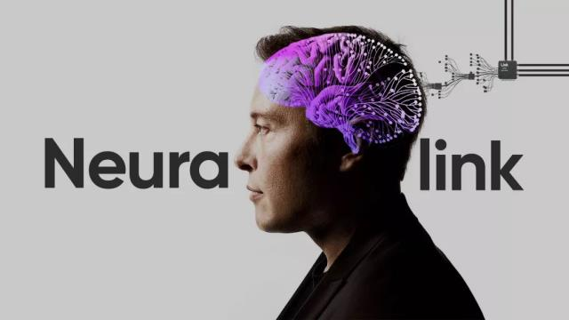
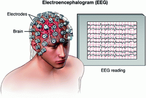
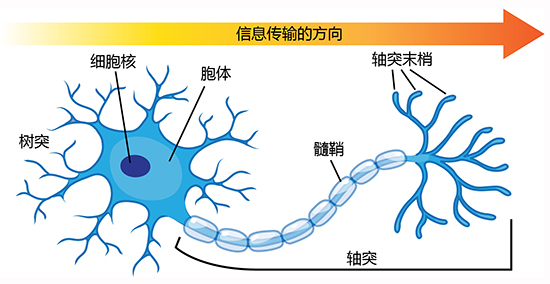
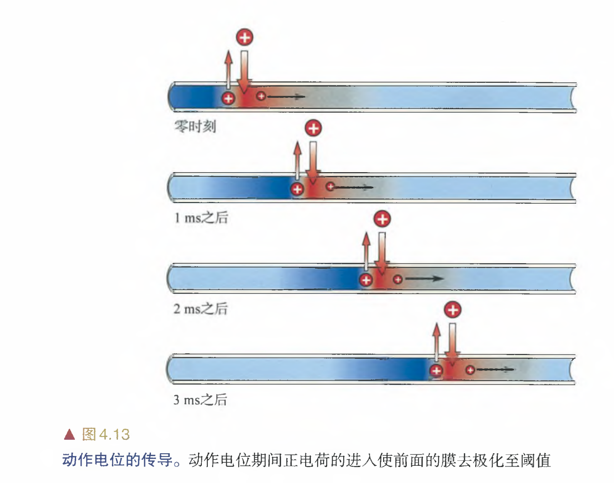
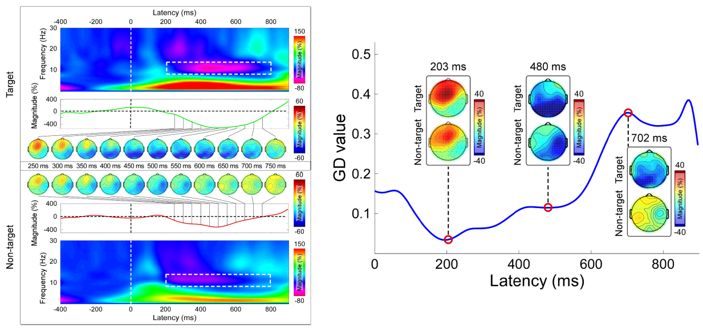

>Der Verstand schöpft seine Gesetze nicht aus der Natur, sondern schreibt sie dieser vor.
>
>知性不从自然界中汲取它的法则，而是给自然界规定这些法则。

<!--more-->

## Intro

理解与创造智能是人类永恒的追求，二者都体现了人类的权力意志——对自己和世界的掌握。理解和创造也是相互促进的。理解智能背后的结构，就能复现智能，从而改变世界；创造智能，就能分析造物产生智能的原因，进一步加深对智能的认识。前者是神经科学的道路，而后者是 AI 的道路。

尽管目前 AI 的发展令人瞠目，但是对 AI 的理解却依然止步黑盒。XAI（Explainable AI）依然缺乏坚实的理论基础。一个孩子有了一把枪，他不知道枪背后的原理，不知道枪的威力，只知道枪很好玩，会发出很大的响声。这样就容易玩火自焚，伤害自己，也难以进一步发展枪械技术。但是如果孩子能长大成人，有了聪明的脑袋，就能够研究清楚枪的原理和用法，妥善用枪了。如果把 AI 比做一把威力巨大的枪，人类就好像孩子一样。

如何让人类“长大成人”，不同人有不同的想法。有人认为应该实行优生学，基因改造，优胜劣汰，但这种思路被纳粹污名化，现在已然成了政治不正确；有人认为只要给人适当的激励，营造良好的社会文化氛围，自然能“亩产万斤”，但社会实验失败的成本也是巨大的；当然我们也可以做一个科技乐观主义者，相信市场竞争能促使科技发展，让生活不断变好。但是竞争最终也要落到每个人头上，需要每个人去思考如何能让社会更好。

脑机接口（BCI）似乎是一条可行的道路，他通过机器来辅助人类，让盲人复明，能意念操控，而且不会造成穷人和富人的物种隔离，也不会导致剧烈的社会动荡，却能切切实实提升人类的能力——就像赛博朋克世界观的义肢那样。

“如无必要，勿增实体”，奥卡姆剃刀原则可能不是自然的规律，只是人能够理解的规律。或许正因为人脑工作记忆的狭小与长期记忆的易于遗忘，难以召回，我们才不得不使用层层抽象包装理论，可解释问题才变得如此复杂。如果脑机接口能够扩展人的脑力，或许人就真的可以成为“超人”，就如同猿猴成为人那样。

前景似乎美好，但是具体如何落地呢？经过调研，我对BCI领域有了如下了解：
1. 技术层面：
	1. BCI主要分为侵入式和非侵入式两种，前者开颅在脑袋里装电极收集信息处理，后者不需要手术。
	2. 基于EEG（脑电图）的BCI是目前最兴盛的非侵入式BCI。
	3. 基本原理：收集信息 -> AI分析 -> 反馈
	4. BCI的发展主要受限于神经科学，目前对我们大脑的理解还是一团乱麻（毕竟逆向代码比写代码难多了）
2. 社会层面：
    - 产业链：
        - **上游**：核心技术供应商如Neuralink（侵入式）、Blackrock（硬件方案）；
        - **中游**：设备商如Emotiv（EEG头戴设备）、Mindmaze（VR康复系统）；
        - **下游**：应用开发商如BrainCo（教育训练）、OpenBCI（开源工具）。
    - 脑机接口的摩尔定律：神经信号记录规模的增长趋势平均每7.4年可同时记录的神经元数量可翻倍
    - 主要市场（约20亿美元）：医疗市场，老龄化
        - 肢体运动障碍、神经发育障碍、精神疾病、意识与认知障碍、感觉缺陷
    - 蓝海市场：记忆增强，意念控制等下一代交互设备

对于一门学科，我觉得有两个划分维度：
1. 现实世界 <-> 符号世界
2. 为什么 <-> 怎么做

|              | 怎么做   | 为什么   |
| ------------ | -------- | -------- |
| **现实世界** | 科学     | 数学     |
| **符号世界** | 软件工程 | 建筑工程 |

显然，BCI是更接近于建筑工程的，一方面我们需要面对现实的纷繁和不确定性，另一方面也要许多工程的方法来把事情做成。面对现实就需要我们深入问题域，理解神经科学的一些基本概念。而工程性就需要我们掌握许多方法，比如AI，信号处理充实自己的武器库。

下面我会分别介绍理解 BCI 中的 EEG 技术所需要理论和工程基础：
1. 理论基础：什么是脑电波？为什么会有脑电波？
2. 工程基础：如何处理和分析脑电波？

## 脑科学基础

EEG 通过在头皮上放置多个电极来记录大脑的电活动。这些电极捕捉到的微弱电压信号，经过放大和处理后，就形成了我们所说的脑电波。这些脑电波的频率和振幅，能精确地反映出大脑的整体功能状态。举例来说，当大脑处于不同的状态时，脑电波的频率也会有所不同：

- **Alpha波（α波）**：频率范围在7到13赫兹（Hz），通常与放松、闭眼、清醒的状态相关。当你感到平静或在进行冥想时，α波的振幅会增强。
- **Beta波（β波）**：频率范围在13到30赫兹（Hz），通常与警觉、集中注意力、思考或焦虑等活跃状态相关。当你解决问题或处于紧张状态时，β波会变得更加明显。

要理解脑电波的起源，我们必须深入到大脑的微观世界——**神经元**。大脑是数以百亿计的神经元构成的复杂网络，它们通过电信号和化学信号来传递信息。

当神经元被激活时，其细胞膜上的离子通道会迅速打开，允许带正电的钠离子（Na+）大量涌入细胞内。这一过程导致细胞内外形成瞬间的电位差（动作电位）。这个电信号会沿着神经元的轴突（负责传出信号的长“电缆”）单向传播。当信号到达轴突末端时，会释放出神经递质，这些化学信使穿越微小的突触间隙，与下一个神经元的树突（负责接收信号的“天线”）结合，从而决定下一个神经元是否被激活。

虽然单个神经元的动作电位是瞬间而强烈的，但脑电图测量到的信号并非来自这些单一的动作电位。相反，EEG主要记录的是大量神经元突触电位的总和。成千上万个神经元在突触处同时接受或发出信号时，它们会产生一个持续时间更长、但幅度较小的电位变化。这些变化在空间上累积叠加，形成一个足以被头皮电极捕捉到的微弱电场。

## 信号处理

我们从头皮上采集到的原始脑电信号，就像是混杂着各种噪音的“电”杂音。要从中提取出有意义的信息，必须依靠一套严谨的信号处理方法。这一过程本质上是从现实世界的连续信号，转换为计算机能够理解和分析的离散数据。

在将信号数字化后，我们得到了一个时间序列。但仅仅停留在时域上观察波形的起伏，就像只听见交响乐的整体响度，却无法分辨出其中小提琴、大提琴和长笛各自的旋律。要真正理解信号的内在构成，我们需要将其从时域转换到频域，而**傅里叶变换（Fourier Transform）**正是实现这一目标的核心工具。

傅里叶变换是一种强大的数学工具，其核心思想是：任何周期信号，都可以分解为一系列不同频率的正弦波和余弦波的叠加。换句话说，它将一个复杂的、随时间变化的信号，分解成其最基本的频率成分。

我们可以将这些不同频率的正弦波和余弦波，看作是构成信号的“基底函数”。这些基底函数在复数域中表示为欧拉公式：$e^{ix} = \cos(x) + i\sin(x)$，这使得傅里叶变换的数学表达更为简洁优雅。

对于一个连续时间信号 f(t)，其傅里叶变换可以定义为：

$$F(\omega) = \int_{-\infty}^{\infty} f(t) e^{-i\omega t} dt$$

其中，F(ω) 代表了在角频率 ω 处信号的复数振幅。这个复数包含了该频率成分的幅度和相位信息。

在实际的数字信号处理中，我们处理的是离散时间信号。因此，我们使用的是傅里叶变换的离散版本——**离散傅里叶变换（DFT）**，它将有限长的离散时间序列转换成离散的频率序列。而**快速傅里叶变换（FFT）**，则是DFT的一种高效计算算法。通过FFT，我们能够迅速得到脑电信号中不同频率成分的强度分布。

经过傅里叶变换，我们不再关注信号随时间的变化，而是得到了一个关于频率的函数——**频谱**。将频率作为横轴，信号在该频率下的能量或功率作为纵轴，我们就能绘制出**频谱图（Power Spectrum）**。

频谱图就像是信号的“指纹”。它直观地展示了信号的能量主要集中在哪些频率段。对于脑电信号来说，频谱图能清晰地揭示出不同脑电波的强度，例如，在放松状态下，我们会看到Alpha波（7-13Hz）的峰值，而在专注思考时，Beta波（13-30Hz）的峰值则会更显著。通过分析频谱图，我们能够将大脑的复杂活动，转化为可量化的频率特征，进而用于后续的模式识别和分类。

当然，傅里叶变换也有其局限性，它只告诉我们信号中包含哪些频率，但无法精确告诉我们这些频率何时出现。为了解决这个问题，更高级的工具如**小波变换**被引入，它能够提供时间和频率的双重信息，特别适用于分析脑电信号这种非平稳、包含短暂爆发事件的信号。

## EEG实战

在前面的章节中，我们已经了解了脑电信号的采集原理和信号处理方法。之后就是探讨如何将这些经过处理的脑电数据，转化为可以被机器学习模型识别的特征，并最终实现分类任务。

整个流程始于特征处理。尽管原始的脑电信号是时域上的电压-时间序列，但更有意义的特征通常隐藏在信号的频率成分中。我们通常会采用频谱图来提取这些特征。具体来说，我们对每一小段脑电信号进行傅里叶变换，得到其在不同频率上的能量分布。将这些频率能量值组合起来，就形成了一个代表大脑状态的特征向量。例如，如果向量中α波的能量很高而β波的能量很低，这可能表明此人处于放松状态。

得到特征向量后，下一步是选择合适的机器学习模型进行分类。这就像是给了模型一张“频谱指纹图”，然后让它判断这张指纹属于哪种大脑状态。CNN和Transfomer是最常使用的架构。CNN可以像处理图像一样提取多通道频谱图中的空间模式，而Transformer则能通过其注意力机制捕捉不同电极和时间点上的长距离依赖关系。

最后，为了进一步提升准确性和鲁棒性，一种常见的策略是使用集成学习（Ensemble Learning）。可以训练多个不同类型的模型，比如一个专注于空间特征的CNN和一个专注于时间依赖的Transformer，然后将它们的预测结果进行融合（如加权平均或投票），从而得到一个更为稳健的最终预测。这种方法就像是召集了一个专家小组来共同决策，最终通过集思广益的方式得出更可靠的结论。
