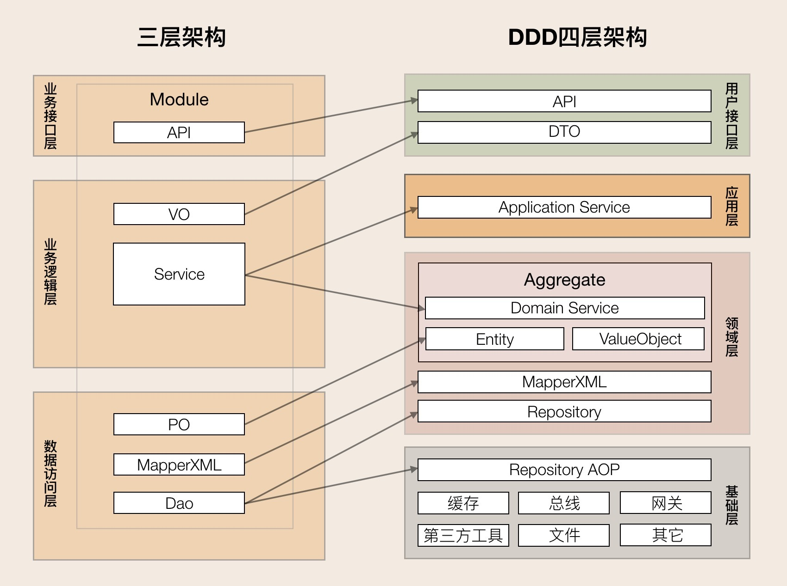

> Ein Schritt wirklicher Bewegung ist wichtiger als ein Dutzend Programme.

<!--more-->

## Intro

## Spring

## 架构设计

这样一个社区项目我们再也熟悉不过了，知乎，还有各种论坛都是例子。所以我们并不需要太多需求分析，直接进入设计阶段就可以了。架构设计的关键是分而治之，把看似一个整体的系统划分为许多模块，再各个击破。

在最一开始，业务是最重要的，我们熟悉采取DDD方法来理解和划分问题领域，定义限界上下文（Bounded Contexts）以及它们之间的关系。DDD分为战略设计和战术设计。

1. 领域核心
2. 界限上下文
   1. 讨论上下文 
      1. 文章，评论
   2. 用户与身份上下文
      1. 用户
   3. 社区管理上下文
   4. 通知上下文
   5. 知识库上下文
3. 上下文映射图

DDD并没有明确的代码结构，概念结构可以融合。


关键在于：

1. domain object和聚合根
2. domain 不互相调用
3. 应用层只是编排，主要逻辑再领域层



1. 讨论上下文 
   1. 文章，评论
2. 用户与身份上下文
   1. 用户
3. 社区管理上下文
4. 通知上下文
5. 知识库上下文

## 设计流程

设计：DDD

架构设计：ADD

## Restful API 设计


## 业务需求与 DDD 方法

**模型**是一种简化。它是对现实的解释——把与解决问题密切相关的方面抽象出来，而忽略无关的细节。每个软件程序是为了执行用户的某项活动，或是满足用户的某种需求。这些用户应用软件的问题区域就是软件的领域。一些领域涉及物质世界，例如，机票预订程序的领域中包括飞机乘客在内。有些领域则是无形的，例如，会计程序的金融领域。软件领域一般与计算机关系不大，当然也有例外，例如，源代码控制系统的领域就是软件开发本身。

为了创建真正能为用户活动所用的软件，开发团队必须运用一整套与这些活动有关的知识体系。所需知识的广度可能令人望而生畏，庞大而复杂的信息也可能超乎想象。模型正是解决此类信息超载问题的工具。模型这种知识形式对知识进行了选择性的简化和有意的结构化。适当的模型可以使人理解信息的意义，并专注于问题。

领域建模并不是要尽可能建立一个符合“现实”的模型。即使是对具体、真实世界中的事物进行建模，所得到的模型也不过是对事物的一种模拟。它也不单单是为了实现某种目的而构造出来的软件机制。建模更像是制作电影——出于某种目的而概括地反映现实。即使是一部纪录片也不会原封不动地展现真实生活。就如同电影制片人讲述故事或阐明观点时，他们会选择素材，并以一种特殊方式将它们呈现给观众，领域建模人员也会依据模型的作用来选择具体的模型。

**什么决定模型的选择？**

1. 模型和设计的核心相互影响
2. 模型是成员所使用的语言中枢
3. 模型是浓缩的知识

**软件的核心**

软件的核心是其为用户解决领域相关的问题的能力。所有其他特性，不管有多么重要，都要服务于这个基本目的

。https://space.bilibili.com/1578320/lists

https://redis.io/glossary/domain-driven-design-ddd/

https://nifxcrzmch.feishu.cn/docx/doxcnRYrE1SHbU7TYvFxPaNpUBc

关键在于业务优先，抽离业务无关部分到Entity中。

## Event Storming 提示词

You are an experienced facilitator in Event Storming workshops. Based on the following problem description, your task is to build a domain model using the principles of Event Storming. Please complete the following steps:

Step1. Identify the following elements from the description:

- **Domain Events**: Business-relevant facts that have occurred in the system. They are written with verbs in the past tense.
- **Commands**: Explicit actions that trigger events. These are written with verbs in the present tense. Commands are given by an Actor, either a User or a System.
- **Actors**: Users or external systems that initiate commands.
- **Hotspots**(if existence): Areas of ambiguity, complexity, or known issues.
- **Policies**(if existence): These are pre-defined rules that are applied after a Domain Event to determine the next step. Notes: Each **domain event** has a **command** and an **Actor** (i.e. users or external systems).

Step2. List the directed binary tuples related to each event line by line, and may include:

[Actor: actor1, Command: command1], [Command: command 1, Event: event 1], (if have hotspot)[Hotspot: hotspot1, Event: event1], (if have policy)[Policy: policy1, Event: event1], [Event: event1, Event: event2] (Only when one event directly follows from another)

Step3. After listing the tuples, With the Event flow as the main line, visualization is carried out using PlantUML according to the Event Storming principle. Elements of different types have different colors, and the color type descriptions should be provided.

Problem Description:

Case Study: [System Name]

[problem description]

## 质量属性需求与 ADD 方法

ADD介绍

```
├── Utility (论坛软件的整体价值和可用性)
    ├── Performance (性能)
    │   ├── 用户登录响应时间 (H, H)
    │   │   ├── 刺激: 1000个并发用户在10秒内尝试登录
    │   │   ├── 环境: 正常操作负载，数据库服务器负载均衡
    │   │   ├── 制品: 用户认证模块，数据库
    │   │   ├── 响应: 成功认证并跳转至主页
    │   │   └── 度量: 95%的请求在1秒内完成
    │   ├── 查看帖子列表加载时间 (H, M)
    │   │   ├── 刺激: 用户打开一个包含200个主题帖子的板块
    │   │   ├── 环境: 平均负载（5000并发用户），网络带宽中等
    │   │   ├── 制品: 帖子列表渲染模块，数据库
    │   │   ├── 响应: 帖子列表完整显示
    │   │   └── 度量: 90%的请求在2秒内完成
    │   ├── 发布新帖或回复响应时间 (H, H)
    │   │   ├── 刺激: 用户提交包含文本和一张图片的新帖子或回复
    │   │   ├── 环境: 高峰负载（10000并发用户）
    │   │   ├── 制品: 帖子发布模块，文件上传服务，数据库
    │   │   ├── 响应: 帖子成功保存并显示在列表中
    │   │   └── 度量: 99%的请求在3秒内完成
    │   └── 全文搜索响应时间 (M, H)
    │       ├── 刺激: 用户提交包含3个关键词的全文搜索请求
    │       ├── 环境: 大量数据（100万条帖子），低并发
    │       ├── 制品: 搜索服务，索引数据库
    │       ├── 响应: 返回相关搜索结果列表
    │       └── 度量: 90%的搜索请求在5秒内返回结果
    ├── Availability (可用性)
    │   ├── 服务器故障恢复时间 (H, H)
    │   │   ├── 刺激: 主应用服务器意外宕机
    │   │   ├── 环境: 24/7在线运行
    │   │   ├── 制品: 服务器集群，负载均衡器，自动恢复机制
    │   │   ├── 响应: 系统自动切换到备用服务器
    │   │   └── 度量: 服务在5分钟内恢复正常
    │   └── 数据库连接中断处理 (H, M)
    │       ├── 刺激: 数据库服务暂时不可用
    │       ├── 环境: 运行时
    │       ├── 制品: 数据库连接池，错误处理机制
    │       ├── 响应: 系统优雅降级，显示维护页面或重试
    │       └── 度量: 不会产生数据丢失，连接恢复后1分钟内恢复服务
    ├── Security (安全性)
    │   ├── 防止SQL注入攻击 (H, H)
    │   │   ├── 刺激: 恶意用户尝试通过输入框注入SQL代码
    │   │   ├── 环境: 用户输入数据时
    │   │   ├── 制品: 后端数据访问层
    │   │   ├── 响应: 系统拒绝执行恶意查询
    │   │   └── 度量: 100%的SQL注入尝试被阻止
    │   ├── 用户密码安全存储 (H, M)
    │   │   ├── 刺激: 攻击者获得数据库访问权限
    │   │   ├── 环境: 数据库被攻破
    │   │   ├── 制品: 用户认证模块，数据库
    │   │   ├── 响应: 攻击者无法直接获取明文密码
    │   │   └── 度量: 所有用户密码必须使用加盐哈希存储
    │   └── 预防XSS攻击 (H, M)
    │       ├── 刺激: 恶意用户在帖子内容中嵌入JavaScript代码
    │       ├── 环境: 用户查看帖子时
    │       ├── 制品: 前端渲染模块，内容过滤服务
    │       ├── 响应: 恶意脚本被转义或移除，不执行
    │       └── 度量: 100%的XSS尝试被阻止
    ├── Usability (可用性)
    │   ├── 新用户注册流程易用性 (H, L)
    │   │   ├── 刺激: 新用户尝试注册账号
    │   │   ├── 环境: 未登录状态
    │   │   ├── 制品: 注册页面，表单验证
    │   │   ├── 响应: 用户成功完成注册
    │   │   └── 度量: 90%的新用户在3步内完成注册，且无引导即可成功
    │   └── 帖子编辑操作效率 (M, L)
    │       ├── 刺激: 用户编辑已发布的帖子
    │       ├── 环境: 登录并拥有编辑权限
    │       ├── 制品: 帖子编辑界面
    │       ├── 响应: 用户快速定位并修改内容
    │       └── 度量: 平均编辑操作时间（从点击编辑到保存）低于10秒
    ├── Modifiability (可修改性/可维护性)
    │   ├── 添加新的帖子类型 (M, H)
    │   │   ├── 刺激: 需要引入“问答帖”功能
    │   │   ├── 环境: 系统运行中，开发团队进行修改
    │   │   ├── 制品: 帖子数据模型，发布和显示模块
    │   │   ├── 响应: 新帖子类型被成功集成
    │   │   └── 度量: 添加新类型所需代码修改量小于100行，并能在一周内完成部署
    │   └── 升级数据库版本 (M, M)
    │       ├── 刺激: 数据库（如MySQL）需要从5.7升级到8.0
    │       ├── 环境: 维护窗口
    │       ├── 制品: 数据访问层，数据库连接配置
    │       ├── 响应: 系统平滑过渡到新数据库版本
    │       └── 度量: 升级过程导致的服务中断时间少于1小时，且无需修改大量业务逻辑代码
    ├── Scalability (可伸缩性)
    │   ├── 应对用户量增长 (H, H)
    │   │   ├── 刺激: 并发用户数从1万增长到10万
    │   │   ├── 环境: 正常操作
    │   │   ├── 制品: 应用服务器，数据库，缓存层
    │   │   ├── 响应: 系统通过增加资源维持性能
    │   │   └── 度量: 在增加不超过30%的硬件资源下，系统性能指标下降不超过15%
    │   └── 存储内容增长 (M, M)
    │       ├── 刺激: 帖子和附件数量从100万增长到1000万
    │       ├── 环境: 正常操作
    │       ├── 制品: 存储系统，数据库
    │       ├── 响应: 系统能够处理海量数据
    │       └── 度量: 数据存储成本增加不超过20%，查询性能下降不超过10%
    ├── Testability (可测试性)
    │   ├── 自动化单元测试覆盖率 (M, M)
    │   │   ├── 刺激: 开发新功能或修复Bug
    │   │   ├── 环境: 开发阶段
    │   │   ├── 制品: 核心业务逻辑模块
    │   │   ├── 响应: 能够轻松编写和运行单元测试
    │   │   └── 度量: 核心业务逻辑代码的自动化单元测试覆盖率达到80%以上
    │   └── 端到端测试执行时间 (M, L)
    │       ├── 刺激: 执行完整的端到端自动化测试套件
    │       ├── 环境: CI/CD管道
    │       ├── 制品: 整个系统
    │       ├── 响应: 快速反馈测试结果
    │       └── 度量: 完整的端到端测试套件在30分钟内完成执行
    ├── Deployability (可部署性)
    │   ├── 新版本部署时间 (H, M)
    │   │   ├── 刺激: 部署一个包含新功能和Bug修复的新版本
    │   │   ├── 环境: 生产环境，无停机维护
    │   │   ├── 制品: 部署脚本，CI/CD管道
    │   │   ├── 响应: 新版本快速上线
    │   │   └── 度量: 从代码提交到生产环境部署完成的时间小于15分钟
    │   └── 生产环境回滚能力 (H, M)
    │       ├── 刺激: 新版本部署后出现严重bug
    │       ├── 环境: 生产环境
    │       ├── 制品: 部署工具，版本控制
    │       ├── 响应: 系统能够快速回滚到稳定版本
    │       └── 度量: 回滚操作在5分钟内完成，服务恢复正常
    └── Reliability (可靠性)
        ├── 数据丢失保护 (H, H)
        │   ├── 刺激: 数据库服务器硬盘故障
        │   ├── 环境: 任何时候
        │   ├── 制品: 数据库备份与恢复机制
        │   ├── 响应: 系统能够恢复到最近的正常状态
        │   └── 度量: 允许的RPO (Recovery Point Objective) 小于1小时
        └── 错误日志与监控 (M, M)
            ├── 刺激: 系统内部发生未捕获的异常
            ├── 环境: 运行时
            ├── 制品: 日志系统，监控报警系统
            ├── 响应: 错误被记录并通知管理员
            └── 度量: 99%的非预期错误能够被实时捕获并记录，并能在10分钟内触发告警
```

**说明：**

- **(H, H)**：高业务价值，高架构影响。这些是**最关键**的场景，直接影响架构设计决策。
- **(H, M)**：高业务价值，中架构影响。也很重要，但可能不需要对架构进行大规模调整。
- **(M, H)**：中业务价值，高架构影响。需要权衡，可能需要为实现它付出较高的架构成本。
- **其他组合 (M, M), (M, L), (H, L)**：优先级相对较低，可以根据实际情况进行考虑。


其次从质量属性到常见pattern，到workload到具体选择，从具体选择到技术细节。

https://www.1point3acres.com/bbs/thread-706151-1-1.html

https://softwareengineering.stackexchange.com/questions/442472/attribute-driven-design

https://insights.sei.cmu.edu/library/attribute-driven-design-method-collection/#:~:text=Abstract-,The%20SEI%20Attribute%2DDriven%20Design%20(ADD)%20method%20is%20a,the%20architecture%27s%20quality%20attribute%20requirements.

https://cloud.tencent.com/developer/article/1984068

https://medium.com/@kiarash.shamaii/understanding-attribute-driven-design-add-in-software-engineering-b98f6562f86b

### 高可用

https://www.thebyte.com.cn/intro.html

分布式服务

主从复制

### 高并发

应对读并发，一般就是利用缓存来抗，应对写并发，一般就是 MQ 削峰填谷，在使用这些中间件的同时，还要根据业务巧妙设计你的存储模型（兼顾低成本、高性能），来满足产品需求。

雪花算法（Snowflake）

https://zq99299.github.io/note-architect/hc/

### 高性能

**缓存延迟双删策略**

#### 什么是高性能？

**高性能 (High Performance)** 通常指的是单个任务或系统在单位时间内处理请求或完成工作的**效率**。它关注的是如何让系统更快地完成**单个操作**。

- **衡量指标：** 响应时间 (Response Time)、吞吐量 (Throughput)（在单任务或较少并发下的单位时间处理能力）、CPU 利用率、内存利用率、磁盘I/O、网络I/O 等。
- **优化目标：** 减少延迟，提高计算速度，优化算法，减少资源消耗，提升单次处理效率。
- 例子：
  - 一个复杂的数学计算，能在更短的时间内得出结果。
  - 数据库单条查询的响应时间从 100ms 优化到 10ms。
  - 图片处理服务，一张图片的处理时间从 5 秒降低到 1 秒。

------

#### 什么是高并发？

**高并发 (High Concurrency)** 指的是系统在同一时间段内处理**大量并行请求**的能力。它关注的是系统能够同时处理多少个请求，以及在处理这些请求时，整体系统的稳定性和可用性。

- **衡量指标：** QPS (Queries Per Second，每秒查询数)、TPS (Transactions Per Second，每秒事务数)、并发用户数、系统负载。
- **优化目标：** 提高系统的并行处理能力，合理利用多核CPU、分布式资源，避免资源争抢和阻塞，保证系统在高负载下的稳定运行。
- 例子：
  - 一个电商网站在双十一促销期间，同时有数十万用户访问并下单。
  - 一个 API 服务，每秒能处理上万个来自不同客户端的请求。
  - 聊天系统同时支持百万用户在线交流。

------

#### 高性能和高并发之间的关系

高性能和高并发是相辅相成的，但又有所侧重。

1. **高性能是高并发的基础：** 如果你的系统处理单个请求的效率很低（低性能），那么即使能处理很多并发请求，每个请求的响应时间也会很长，用户体验会很差。一个高效的单个操作能够减少资源占用时间，从而为其他并发操作释放资源。
   - **比喻：** 想象一个银行柜员。如果一个柜员处理业务非常慢（低性能），那么即使银行有很多柜员（高并发的潜力），客户排队等待的时间也会很长。只有每个柜员都业务熟练（高性能），才能在单位时间内服务更多的客户。
2. **高并发是高性能的扩展：** 当单个任务的性能已经达到瓶颈，或者面对海量用户请求时，单纯提升单任务性能已经不够了，就需要通过增加并发能力来满足需求。高并发通常通过**并行处理、分布式系统、负载均衡**等技术来实现，让多个任务或请求可以同时进行。
   - **比喻：** 同样是银行，如果柜员业务都很熟练（高性能），但只有一个柜员，那么面对大量客户时，处理能力依然有限。这时就需要增加更多的柜员和柜台（高并发），才能同时服务更多客户。
3. **两者优化策略不同但相关：**
   - **提升高性能** 通常涉及：
     - **算法优化：** 选择更高效的算法。
     - **数据结构优化：** 使用适合特定场景的数据结构。
     - **减少 I/O 操作：** 使用缓存、批量读写。
     - **优化 SQL 查询：** 建立索引、避免全表扫描。
     - **硬件升级：** 更快的 CPU、更多内存、SSD 等。
     - **编程语言和运行时优化：** 选择性能更好的语言或优化其使用方式。
   - **实现高并发** 通常涉及：
     - **多线程/多进程：** 利用 CPU 多核能力。
     - **异步/非阻塞编程：** 提高单机处理并发的能力。
     - **集群和负载均衡：** 将请求分散到多台服务器处理。
     - **分布式架构：** 服务拆分、微服务等。
     - **消息队列：** 削峰填谷，异步处理。
     - **限流、降级、熔断：** 保护系统在高负载下不崩溃。
     - **缓存：** 减少数据库压力，提高读取效率。
4. **可能存在的矛盾和权衡：** 在某些情况下，为了追求极致的高并发，可能会牺牲一点点单次操作的性能（例如，为了减少锁竞争，可能采用最终一致性而非强一致性）。反之，为了保证极高的单次操作性能，可能需要引入复杂的同步机制，从而影响并发度。系统设计时需要在两者之间进行权衡。

------

#### 总结

- **高性能** 关注的是**单个任务做多快**。
- **高并发** 关注的是**同时能做多少任务**。

一个理想的系统应该同时具备高性能和高并发。**高性能是基础，高并发是扩展。** 在系统设计中，我们通常会先尽可能地优化单个操作的性能，然后通过并行化、分布式等手段来提升并发能力，以满足整体业务需求。****

https://dunwu.github.io/design/pages/a49605/

https://cloud.tencent.com/developer/article/2313010

https://www.youtube.com/watch?v=ZrnsE9tyR5s&t=468s&ab_channel=eisfrosch

### 可观测性

https://blog.openresty.com.cn/cn/dynamic-tracing/

https://icyfenix.cn/distribution/observability/

日志 rag

### 安全性

https://icyfenix.cn/architect-perspective/general-architecture/system-security/

https://icyfenix.cn/distribution/secure/

https://dunwu.github.io/design/pages/a1adcf/

### 可靠性

自动化与静态检查

## 面向大数据与 AI 的业务拓展

https://soulmachine.gitbooks.io/system-design/content/cn/

https://www.bilibili.com/video/BV1VXNjegE1P/?spm_id_from=333.1387.upload.video_card.click&vd_source=226da368954a7c68d6b7e4bbdc91b2cd
