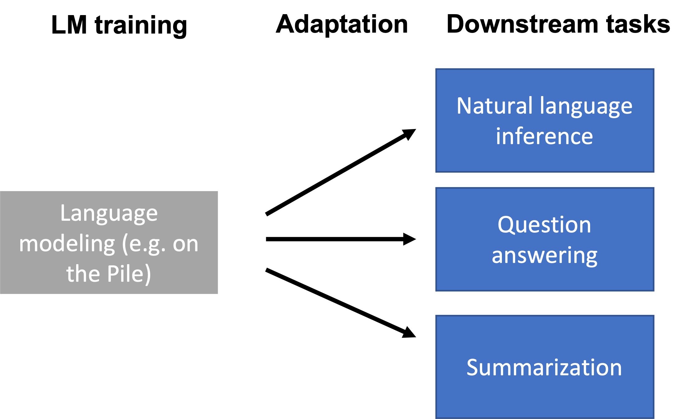
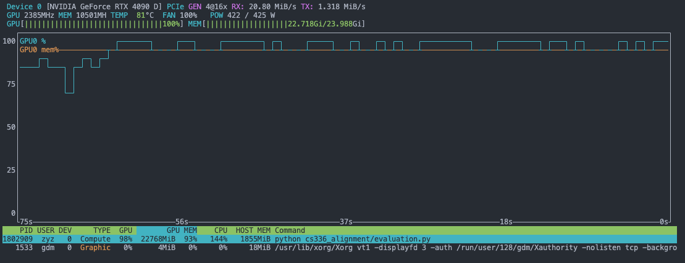
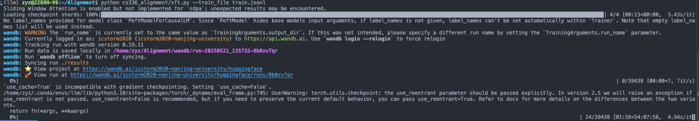
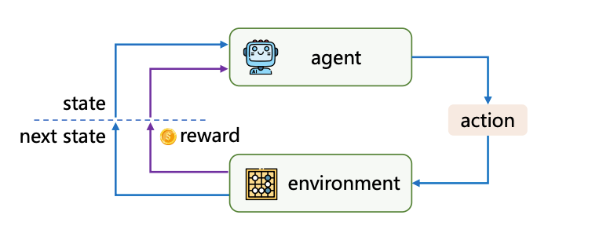
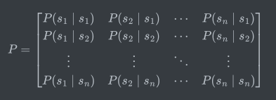

# Adaptation in Action (and RL Basic)


> Gott ist tot... Wir müssen selbst zu Göttern werden.

<!--more-->

## Intro



我们在预训练后，就得到了一个擅长续写的 AI。但是光是续写并不是十分有用，我们需要费尽思 prompt 才能得到想要的结果。为了更好的应对下游任务，如 QA Chatbot，总结，推理等，需要做一些适配。

下游任务往往需要模型有特定的回答模式，主题或者是新的知识。我们可以通过许多技术来适配。

1. SFT (Supervised Fine-Tuning) ：通过在数千条“提示-回答”对上继续训练，以塑造模型风格、提升指令遵循能力和解决安全性的经典方法，尤其适合风格控制。比较难注入新知识。目前也有 LoRA 等技术实现低成本微调。
2. RLHF (Reinforcement Learning from Human Feedback)：因为人类偏好的复杂性，我们很难有完善的预训练数据。但在很多情况下，即使我们不知道怎么回答，也很容易判断什么是好的回答。因此就有了 RLHF，通过训练一个奖励模型来学习人类对回答的偏好，再利用强化学习（如PPO）优化语言模型，使其生成更符合人类期望、更流畅且安全的输出。
3. Prompt：虽然简单有效，但其效果高度依赖设计技巧且对复杂任务有天花板。
4. RAG：通过从外部数据库查找资料，插入 prompt 作为上下文，有效解决了模型知识陈旧和事实性不足的问题，降低幻觉、增强专业性的经济高效手段，其核心在于高质量知识库与精准检索。

在这篇博客中，我们会在有一张 4090D 的服务器上，以 Qwen2.5-7B 为基础模型，对其进行微调，并在这个过程中学习相关知识。

##  Evaluation

在进行任何微调之前，建立一个健全的评估框架至关重要。如果没有评估标准，我们就无法衡量微调的效果，也无法判断模型是否在朝着期望的方向改进。在一般的深度学习任务中，交叉熵通常作为主要的衡量标准，但对于语言模型的某些能力（如结构化输出），单纯使用交叉熵并不合适。评估时，我们通常通过特定的 prompt 让模型生成规定格式的答案，然后通过文本解析或其他模型来评价这些答案的质量。

在进行评估时，我们需要选择合适的推理服务来运行模型。目前主流的选择包括：
- vllm：最高性能的推理服务
- ollama：专注于一键式部署，可自动在 CPU 和 GPU 间平衡计算
- Hugging Face Transformers：提供标准化的训练和微调接口，但不专注于推理性能

考虑到我们的 4090D 只有 24GB 显存，在 4096 序列长度下仅能勉强容纳 7B 参数模型及其 KV cache，而对于更大的模型（如 32B）则显存不足。因此，我们选择使用 vllm 作为基础模型的推理服务。



评估语言模型通常涉及以下几个方面：

首先是通用能力评估，我们使用 MMLU (Massive Multitask Language Understanding) 数据集来测试模型的事实性知识掌握程度。该数据集包含多个领域的选择题，每题提供 A、B、C、D 四个选项。我们使用如下统一格式的 prompt 来获取模型回答：

```
Answer the following multiple choice question about {subject}. Respond with 
a single sentence of the form "The correct answer is _", filling the blank 
with the letter corresponding to the correct answer (i.e., A, B, C or D).

Question: {question}
A. {options[0]}
B. {options[1]}
C. {options[2]}
D. {options[3]}

Answer:
```

通过解析模型输出，我们可以计算正确率。在测试中，我们的 Qwen2.5-7B 在 MMLU 上获得了 68.64% 的准确率。

其次是推理能力评估，我们采用 GSM8K 数据集。这个数据集包含一系列需要多步推理的数学问题，要求模型给出具体的数字答案。使用类似的评估方法，我们的 Qwen2.5-7B 在 GSM8K 上的得分为 22.52%。

此外，还有专门评估对话质量的 AlpacaEval 数据集，它使用一个强大的评估模型来对比被测模型与参考模型（通常是 GPT-4 Turbo）的表现。评估结果用被测模型相对于参考模型的胜率来表示。

最后，SimpleSafetyTests 用于评估模型输出的安全性，但同样需要一个较强的评估模型来判断输出是否安全。

受限于我们 4090D 的计算能力，以及成本考虑，我们只能进行 MMLU 和 GSM8K 这两项基础测试来评估模型的通用能力和推理能力。

## Supervised Fine Tune

如前所述，SFT 是通过在“提示-回答”对的数据集上继续训练预训练模型来适配下游任务的常用方法。这个过程相对直接，目标是让模型学习到在给定特定类型的提示时，生成特定格式或内容的回答。能够显著提升模型理解和执行指令的能力。不过它很难向模型注入新的事实性知识，或者纠正预训练阶段学到的错误知识，而且模型可能学会了模仿期望的输出格式，但并没有真正理解任务的本质。最后，数据非常重要，garbage in，garbage out。

SFT 的效果在很大程度上取决于数据的质量和数量。数据来源可以多种多样，包括人工标注的数据、开源指令数据集（如 Alpaca, Dolly, OpenOrca 等）、用户反馈数据等。数据通常需要处理成统一的“提示-回答”格式。例如：

```
{
  "instruction": "解释一下什么是黑洞。",
  "output": "黑洞是时空展现出极端强大的引力，以至于任何形式的物质和辐射都无法从中逃逸的区域。"
}
```

或者对于对话格式：

```
{
  "messages": [
    {"role": "user", "content": "你好，你是谁？"},
    {"role": "assistant", "content": "我是一个大型语言模型，由 Llama 团队训练。"}
  ]
}
```
最经典的方法是全参数微调，即更新模型的所有参数。虽然效果通常最好，但计算资源消耗大，训练时间长。作为替代，我们可以进行参数高效微调 (Parameter-Efficient Fine-Tuning - PEFT)，只更新模型的一小部分参数，或者引入少量额外的可训练参数。

常见的 PEFT 方法包括：
- LoRA (Low-Rank Adaptation)：通过在模型的某些层（通常是注意力层）注入低秩适配器矩阵来进行微调。它能以极少的额外参数（通常不到原模型参数的1%）达到接近全参数微调的效果，大大降低了微调的成本和存储需求。
- QLoRA：是 LoRA 的进一步优化，结合了量化技术，使得在更小的硬件上微调更大的模型成为可能
- 其他方法：如 Adapter Tuning、Prefix Tuning、Prompt Tuning 等

在我们的实验中，先尝试使用经典的全参数微调。使用 transformers 框架，微调的代码非常简单：

```python
def main():
    config = parse_args()
    
    if config.use_wandb:
        wandb.init(project="qwen-finetuning")
    
    # Initialize model and tokenizer
    tokenizer = AutoTokenizer.from_pretrained(config.model_name, trust_remote_code=True)
    model = AutoModelForCausalLM.from_pretrained(config.model_name, trust_remote_code=True)

    # Create dataset
    train_dataset = CustomDataset(config.train_file, tokenizer, config.max_length)

    # Training arguments
    training_args = TrainingArguments(
        output_dir=config.output_dir,
        num_train_epochs=config.num_epochs,
        per_device_train_batch_size=config.batch_size,
        gradient_accumulation_steps=config.gradient_accumulation_steps,
        learning_rate=config.learning_rate,
        weight_decay=config.weight_decay,
        warmup_steps=config.warmup_steps,
        logging_steps=config.logging_steps,
        save_steps=config.save_steps,
        eval_steps=config.eval_steps,
        logging_dir="./logs",
        fp16=True,
        report_to="wandb" if config.use_wandb else None,
    )

    # Initialize trainer
    trainer = Trainer(
        model=model,
        args=training_args,
        train_dataset=train_dataset,
    )

    # Start training
    trainer.train()
```

但是很快，显存不够，训练被迫中止了... 😢

那么让我们计算一下微调到底需要多少显存。结合 [Building a Transformer LM](https://rzyn2020.github.io/posts/building-a-transformer-lm/) 与 [Optimize the Performance of a LM](https://rzyn2020.github.io/posts/optimize-the-performance-of-a-lm/) 中的估算和测量，我们知道 20M 参数在 FP32 精度下训练时，包括优化器状态和激活值在内，峰值显存约为 2GB。由于显存占用和参数量成正比，7B 参数的模型理论上需要约 700GB 显存！

不过，我们可以通过一些优化方法来降低显存需求：
1. 混合精度训练：可以将显存需求减半至 400GB
2. Gradient Checkpointing：通过重计算中间激活值，可以节省约 70% 的激活值显存（以 30% 的计算时间开销为代价）
3. Gradient Accumulation：通过减少每次计算的 batch size 来降低显存使用

即便采用这些优化，估计也需要至少 80GB 显存，或者使用 DeepSpeed 等分布式训练框架将参数、激活值和优化器状态分散到多个 GPU 上。但我们只有一块 24GB 显存的 4090D，似乎只能尝试 1.5B 规模的小模型了。

不过，我们还有最后一招 —— PEFT。使用 QLoRA 技术，我们不直接调整原始参数，而是在特定层旁增加并调节新的参数（约原参数量的1%），再配合 4bit 量化等技术，24GB 显存就足够了：

```python
def main():
    config = parse_args()
    
    if config.use_wandb:
        wandb.init(project="qwen-finetuning")
    
    # Configure quantization
    bnb_config = BitsAndBytesConfig(
        load_in_4bit=True,
        bnb_4bit_use_double_quant=True,
        bnb_4bit_quant_type="nf4",
        bnb_4bit_compute_dtype=torch.bfloat16
    )

    # Initialize model with quantization
    model = AutoModelForCausalLM.from_pretrained(
        config.model_name,
        quantization_config=bnb_config,
        trust_remote_code=True,
        device_map="auto"
    )
    
    # Prepare model for k-bit training
    model = prepare_model_for_kbit_training(model)

    # LoRA configuration
    lora_config = LoraConfig(
        r=8,
        lora_alpha=32,
        target_modules=["q_proj", "k_proj", "v_proj", "o_proj"],
        lora_dropout=0.05,
        bias="none",
        task_type="CAUSAL_LM"
    )

    # Apply LoRA
    model = get_peft_model(model, lora_config)
    
    # Initialize tokenizer
    tokenizer = AutoTokenizer.from_pretrained(config.model_name, trust_remote_code=True)

    ...
    
    trainer.train()
```

此外，我们还可以使用 wandb（Weights & Biases）来监控训练过程。

但即便使用了 QLoRA，训练速度依然非常慢！



让我们估算一下训练时间：每条数据平均 512 个 token，共 39438 条微调数据，3 个 epoch，总 token 数约为 39438 * 256 * 3 ≈ 30M tokens。即使按照 vllm 推理的速度（约 1000 tokens/s）来算，也需要大约 8 小时才能完成训练。

所以...也许知道理论上可行就好了吧～

## RLHF

在 SFT 中，我们训练模型模仿一组高质量样本中的回答。然而，这往往不足以消除预训练过程中模型学到的不良行为。与 SFT 依赖外部优质样本不同，为了更好地对齐语言模型，我们通常需要从待改进的模型本身获取回答，并根据这些回答的质量和适当性来进行奖励或惩罚。

RLHF（基于人类反馈的强化学习）是一种通过人类反馈来优化语言模型的方法。它的核心思想是：即使我们难以直接给出完美的回答示例，但我们通常能够判断哪个回答更好。

最初的 RLHF 实现采用 PPO 算法，但目前更多地使用 DPO 算法。接下来我们将简要介绍强化学习的基础知识，并在最后深入理解 DPO 算法的原理，然后进行实践操作。

参考资料：

1. https://hrl.boyuai.com/chapter/intro
2. https://spinningup.openai.com/en/latest/user/introduction.html

### RL Basic



广泛地讲，强化学习是机器通过与环境交互来实现目标的一种计算方法。机器（Agent）可以与环境进行多轮交互，每一轮交互机器都可以采取一个动作，而环境会给出反馈。机器的目标是最大化在多轮交互过程中的获得的累积奖励的期望。

强化学习的基础理论建立在**马尔可夫决策过程**（Markov decision process，MDP）之上。MDP的基础是**马尔可夫过程**（Markov process）和**马尔可夫奖励过程**（Markov reward process，MRP）。agent 通过**策略**（Policy）决定如何和环境互动，以达到最大累积期望。而**价值函数**（Value Function）常常用来辅助求解策略。

#### 随机过程和马尔可夫过程

**马尔可夫过程**（Markov process）指具有马尔可夫性质的随机过程，也被称为**马尔可夫链**（Markov chain）。**随机过程**（stochastic process）是概率论的“动力学”部分。

给定一个概率空间 $(\Omega, F,P)$ （$\Omega$是样本的集合；$F$是$\Omega$幂集的满足某些条件的非空子集，表示事件集合；$P$ 是概率，是从$F$到$R$的函数，满足全概率为1且可数可加），一个随机变量 $X: \Omega \to R$ 是定义在样本空间上的实函数，满足 $\forall t \in R . \\{w \in \Omega:X(w) \le t\\} \in F $。（我们可以通过概率密度函数，分布函数，各阶矩对其进行研究）

如果 $T$ 是一个集合，有单射 $S: T \to P(\Omega \times R) $，$\forall t \in T$，$S(t)$或者$S_t$ 均为定义在 $\Omega$ 上的随机变量，则 $S$ 为 $(\Omega, F,P)$ 上的随机过程。（也就是，随机过程就是一串随机变量，$t$ 可以理解为时间）随机过程研究的是随机变量间的相互关联，因为关联的复杂性，我们只研究某些种类的关联，比如有马尔可夫性质的随机过程。

当且仅当某时刻的状态只取决于上一时刻的状态时，一个随机过程被称为具有**马尔可夫性质**（Markov property），也就是 $P(S_{t + 1} = j|S_t = i_t) = P(S_{t+1} = j |S_1 = i_1,...,S_t = i_t)$。（离散时间下，其中 $i_0..i_{t},j$为任意值/状态），这个随机过程也被称为**马尔可夫链**（Markov chain）。如果马尔可夫链的一步转移概率只和状态相关，就被称为为**时齐马尔可夫链**(homogeneous)，强化学习中一般只考虑时齐马尔可夫链。


（时齐）马尔可夫链可用元组 $(S, P)$ 描述，其中：
- $S$ 是**有限状态集合**
- $P$ 是**状态转移矩阵**（state transition matrix）

假设共有 $n$ 个状态，则状态集合定义为 $S = \\{ s_1, s_2, \cdots, s_n \\}$ 。状态转移矩阵 $P$ 中第 $i$ 行第 $j$ 列元素表示状态转移概率：$ P(s_j \mid s_i) = P(S_{t+1} = s_j \mid S_t = s_i) $  即**从状态 $s_i$ 转移到状态 $s_j$ 的概率**，简记为 $P(s' \mid s)$。从任意状态 $s_i$ 出发，转移到所有可能状态的概率和为 1。



给定一个马尔可夫过程，我们就可以从某个状态出发，根据它的状态转移矩阵生成一个状态**序列**（episode），这个步骤也被叫做**采样**（sampling）。

#### 马尔可夫奖励过程和累积回报

马尔可夫奖励过程（MRP）是马尔可夫链的扩展，它在状态转移的基础上引入了**奖励机制**和**折扣因子**，用于量化状态的价值。MRP可定义为元组 $(S, P, R, \gamma)$，其中：  
- $S$ 是有限状态集合  
- $P$ 是状态转移矩阵，满足 $P(s' \mid s) = \mathbb{P}(S_{t+1}=s' \mid S_t=s)$  
- $R(s)$ 是**奖励函数**，表示从状态 $s$ 转移到下一状态的**即时奖励期望**，即 $R(s) = \mathbb{E}[r_{t+1} \mid S_t = s]$  ，大部分情况中只由状态 $s$ 决定，可以去掉期望
- $\gamma \in [0, 1]$ 是**折扣因子**，用于权衡当前奖励与未来奖励的重要性。

在强化学习中，智能体的目标是最大化从当前时刻开始的**累积回报**（Return），定义为未来所有奖励的加权和：  
$$
G_t = r_{t+1} + \gamma r_{t+2} + \gamma^2 r_{t+3} + \cdots = \sum_{k=0}^\infty \gamma^k r_{t+k+1}.
$$
折扣因子 $\gamma$ 的作用包括：  
1. **数学便利性**：避免无限时间步下的回报发散；  
2. **远期不确定性**：远期奖励的“现值”应低于即时奖励；  
3. **实际意义**：模仿人类对即时收益的偏好。

#### 价值函数
价值函数用于衡量某状态的长期价值，定义为从该状态出发的（遍历所有可能序列）**期望累积回报**：  
$$
v(s) = \mathbb{E}[G_t \mid S_t = s].
$$
对MRP而言，价值函数满足**贝尔曼方程**（Bellman Equation）：  
$$
v(s) = R(s) + \gamma \sum_{s' \in S} P(s' \mid s) v(s'),
$$
其含义是：当前状态的价值 = 即时奖励 + 折扣后的未来状态价值期望。  
该方程可写成矩阵形式 $\mathbf{v} = \mathbf{R} + \gamma \mathbf{P} \mathbf{v}$，其解析解为 $\mathbf{v} = (I - \gamma \mathbf{P})^{-1} \mathbf{R}$。（也就是MRP价值函数有解析解）

#### 马尔可夫决策过程
MDP在MRP的基础上引入**动作**（Action），用于建模智能体的决策行为。MDP定义为元组 $(S, A, P, R, \gamma)$，其中：  
- $A$ 是有限动作集合；  
- 状态转移概率扩展为 $P(s' \mid s, a) = \mathbb{P}(S_{t+1}=s' \mid S_t=s, A_t=a)$；  
- 奖励函数扩展为 $R(s, a) = \mathbb{E}[r_{t+1} \mid S_t=s, A_t=a]$，大部分情况中只由状态 $s$ 和动作 $a$ 决定，可以去掉期望。
- $\gamma$ 仍为折扣因子。

在MDP中，智能体通过**策略**（Policy）选择动作。策略可以是确定性的，也可以是随机性的：
- 确定性策略 $\pi: S \to A$ 将状态映射到具体动作
- 随机性策略 $\pi(a \mid s)$ 表示在状态 $s$ 下选择动作 $a$ 的概率分布（值）

大部分情况下我们使用随机性策略，因为它更加通用且具有更好的探索性质。可以证明，某些标准条件的情况下，马尔可夫决策过程（MDP）的**最优策略一定存在**。（也就是得到最大累积回报的策略）

#### 状态价值函数与动作价值函数
1. **状态价值函数** $v^\pi(s)$：  
   表示在状态 $s$ 下遵循策略 $\pi$ 的期望累积回报：  
   $$
   v^\pi(s) = \mathbb{E}_\pi[G_t \mid S_t = s].
   $$

2. **动作价值函数** $q^\pi(s, a)$：  
   表示在状态 $s$ 执行动作 $a$ 后继续遵循策略 $\pi$ 的期望累积回报：  
   $$
   q^\pi(s, a) = \mathbb{E}_\pi[G_t \mid S_t = s, A_t = a].
   $$

两者关系为：  
$$
v^\pi(s) = \sum_{a \in A} \pi(a \mid s) q^\pi(s, a).
$$


#### 贝尔曼期望方程
在给定策略 $\pi$ 下，价值函数满足以下递归关系：  
1. **状态价值函数的贝尔曼方程**：  
$$
v^\pi(s) = \sum_{a \in A} \pi(a \mid s) \left[ R(s, a) + \gamma \sum_{s' \in S} P(s' \mid s, a) v^\pi(s') \right].
$$

2. **动作价值函数的贝尔曼方程**：  
$$
q^\pi(s, a) = R(s, a) + \gamma \sum_{s' \in S} P(s' \mid s, a) \sum_{a' \in A} \pi(a' \mid s') q^\pi(s', a').
$$

#### 贝尔曼最优方程
当策略 $\pi$ 达到最优时（记为 $\pi^\star$），其对应的价值函数 $v^\star(s)$ 和 $q^\star(s, a)$ 满足：  
1. **最优状态价值函数方程**：  
$$
v^\star(s) = \max_{a \in A} \left[ R(s, a) + \gamma \sum_{s' \in S} P(s' \mid s, a) v^\star(s') \right].
$$

2. **最优动作价值函数方程**：  
$$
q^\star(s, a) = R(s, a) + \gamma \sum_{s' \in S} P(s' \mid s, a) \max_{a' \in A} q^\star(s', a').
$$

贝尔曼最优方程表明：最优策略下，每一步动作的选择都追求**全局最大化累积回报**，且最优价值函数是唯一的。通过动态规划或时序差分方法求解这些方程，即可得到强化学习的最优策略。

---

### 价值函数的求法

在强化学习中，价值函数的求解是核心目标之一。根据问题场景的不同，可以采用以下方法：

#### 1. 解析解法

对马尔可夫奖励过程（MRP），价值函数可通过贝尔曼方程的矩阵形式直接求解：  
$$
\mathbf{v} = (I - \gamma \mathbf{P})^{-1} \mathbf{R},
$$
其中 $I$ 是单位矩阵。然而，此方法需要矩阵可逆且计算复杂度为 $O(n^3)$（$n$ 为状态数），仅适用于小规模问题。

#### 2. 动态规划算法

针对MDP，动态规划通过迭代更新价值函数逐步逼近最优解（都可证明迭代一定终止且达到最优）：

- **策略评估（Policy Evaluation）**：固定策略 $\pi$，迭代计算其状态价值函数，迭代方程类似于贝尔曼方程：  
$$
v_{k+1}(s) = \sum_{a \in A} \pi(a \mid s) \left[ R(s, a) + \gamma \sum_{s'} P(s' \mid s, a) v_k(s') \right].
$$
- **值迭代（Value Iteration）**：直接迭代最优价值函数：  
$$
v_{k+1}(s) = \max_{a} \left[ R(s, a) + \gamma \sum_{s'} P(s' \mid s, a) v_k(s') \right].
$$


#### 3. 蒙特卡洛方法
通过采样轨迹（episode）计算经验回报的均值，直接估计价值函数。例如，状态 $s$ 的价值可估计为：  
$$
v^\pi(s) \approx \frac{1}{N} \sum_{i=1}^N G_t^{(i)},
$$
其中 $G_t^{(i)}$ 是第 $i$ 条轨迹中从状态 $s$ 出发的累积回报。

蒙特卡洛方法的优点是可以从经验中直接学习，不需要环境模型，且能处理非马尔可夫环境。其缺点是需要等到轨迹结束才能更新价值，导致学习效率较低，且方差较大。

另外，蒙特卡洛方法也可以增量式更新价值估计：
$$
v(s) \leftarrow v(s) + \alpha(G_t - v(s)),
$$
其中 $\alpha$ 是学习率。$\alpha$ 被设置为 $1/ N(s)$ 时，得到和经典蒙特卡洛方法一样的结果。

#### 4. 时序差分学习（TD Learning）
结合动态规划与蒙特卡洛的思想，逐步更新价值估计（仿照增量式蒙特卡洛方法），它也是一种迭代算法，但是也可以利用经验：  
$$
v(s_t) \leftarrow v(s_t) + \alpha \left[ r_{t+1} + \gamma v(s_{t+1}) - v(s_t) \right],
$$
其中 $\alpha$ 是学习率，通过**自举（bootstrapping）**利用当前估计值修正误差。$r_{t+1} + \gamma v(s_{t+1}) $ 是对 $G_t$ 的估计。


#### 三种方法的对比

| 特性                     | 动态规划 (DP)                                                | 蒙特卡洛 (MC) 方法                                           | 时序差分 (TD) 学习                                           |
| ------------------------ | ------------------------------------------------------------ | ------------------------------------------------------------ | ------------------------------------------------------------ |
| **环境模型**             | **必须知道环境的完整规则** (例如，知道在某个状态做一个动作后，会以多大概率转移到哪个新状态，并得到多少奖励) | **不需要知道环境的规则**；直接通过实际尝试和经验来学习       | **不需要知道环境的规则**；直接通过实际尝试和经验来学习       |
| **学习方式**             | 基于已知的环境规则进行计算和规划                             | 从完整的、一次从头到尾的经验（称为“片段”）中学习             | 从不完整的经验片段、甚至是每走一步的经验中学习               |
| **自举 (Bootstrapping)** | **是** (会用之前算出来的对其他状态好坏的估计，来更新当前状态好坏的估计) | **否** (对一个状态好坏的估计，完全基于这一次从头到尾实际拿到的所有奖励，不依赖对其他状态的估计) | **是** (会用之前算出来的对下一个状态好坏的估计，结合刚拿到的奖励，来更新当前状态好坏的估计) |
| **更新时机**             | 通常是一轮一轮地，对所有可能的状态进行计算更新               | **必须等一次完整的尝试结束后**，才能用这次尝试的总结果来更新 | **每走一步之后**就可以进行一次更新（可以在线边玩边学）       |
| **估计偏差**             | 如果环境规则准确，计算结果通常是**准确的**（相对于真实的好坏程度） | 对状态好坏的估计是**准确的**（因为是基于大量实际完整尝试的平均结果） | 对状态好坏的估计**可能不完全准确**（因为它依赖于对未来状态的不完美估计，尤其在学习初期） |
| **估计稳定性 (方差)**    | **非常稳定，没有随机性** (因为环境规则已知，计算是确定的)    | **不太稳定，波动较大** (因为每次完整尝试的结果可能因随机因素差异很大) | **相对稳定，波动较小** (因为更新主要看眼前的一步和下一个状态的估计) |
| **计算/数据效率**        | 如果状态非常多，计算量会极大                                 | 计算每次尝试的总奖励很简单；但可能需要非常多次尝试才能学好   | 通常比蒙特卡洛方法**学习得更快，更有效地利用经验**           |
| **适用场景**             | 当环境规则完全清楚时，用来做精密的策略评估和改进             | 适用于那些有明确开始和结束的阶段性任务，并且不知道环境规则时 | 适用于阶段性任务和持续进行下去的任务，不知道环境规则时，尤其适合需要边行动边学习的在线场景 |
| **核心思想**             | 利用已知的状态间转换规则和奖励，迭代计算出各个状态的好坏程度 | 通过大量实际完整的尝试，用最终获得的平均总奖励来评价状态的好坏 | 结合动态规划的“用旧估计更新新估计”和蒙特卡洛的“从实际经验学习”，用“刚获得的奖励 + 对下一步的估计”来更新当前 |
| **典型算法举例**         | 策略评估、策略迭代、价值迭代                                 | 首次访问MC、每次访问MC、MC控制（带探索策略的）               | TD(0)预测、Q学习 (Q-Learning)、SARSA                         |
| **在线/离线**            | 通常是**离线**的规划计算过程                                 | 可以是**离线学习**（先收集一堆经验再学习），也可用于在线评估 | **非常适合在线学习**                                         |

---

### RL 算法分类


强化学习算法可按不同维度分类：  

#### 1. **基于模型 vs 无模型（Model-Based vs Model-Free）**  
- **基于模型**：依赖环境的状态转移 $P(s' \mid s, a)$ 和奖励函数 $R(s, a)$ 的先验知识（如动态规划）；  
- **无模型**：直接从交互中学习策略，无需环境模型（如Q-learning、REINFORCE）。  

#### 2. **基于价值 vs 基于策略（Value-Based vs Policy-Based）**  
- **基于价值**：学习价值函数（如Q-learning），通过最大化价值选择动作；  
- **基于策略**：直接优化策略函数（如REINFORCE），适用于连续动作空间；  
- **Actor-Critic**：结合两者，策略函数（Actor）生成动作，价值函数（Critic）评估动作优劣。  

#### 3. **同策略 vs 异策略（On-Policy vs Off-Policy）**  
- **同策略**：采样与优化的策略相同（如Sarsa）；  
- **异策略**：采样策略（如随机探索）与优化策略（如贪心策略）分离（如Q-learning）。  

---

### 动态规划算法

动态规划（DP）是求解MDP的经典方法，核心思想是**分治**与**值函数迭代**：  

#### 1. **策略迭代（Policy Iteration）**  
包含两步循环：  
1. **策略评估**：计算当前策略 $\pi$ 的价值函数 $v^\pi$；  
2. **策略改进**：根据 $v^\pi$ 更新策略为贪心策略：  
$$
\pi_{\text{new}}(s) = \arg\max_a \sum_{s'} P(s' \mid s, a) \left[ R(s, a) + \gamma v^\pi(s') \right].
$$

#### 2. **值迭代（Value Iteration）**  
直接迭代最优价值函数，直至收敛：  
$$
v_{k+1}(s) = \max_a \left[ R(s, a) + \gamma \sum_{s'} P(s' \mid s, a) v_k(s') \right].
$$
收敛后提取最优策略：  
$$
\pi^\star(s) = \arg\max_a \sum_{s'} P(s' \mid s, a) \left[ R(s, a) + \gamma v^\star(s') \right].
$$

---

### 基于价值的算法：Sarsa 和 Q-learning


#### 1. **Sarsa（On-Policy TD Control）**  
通过时序差分更新动作价值函数 $Q(s, a)$：  
$$
Q(s_t, a_t) \leftarrow Q(s_t, a_t) + \alpha \left[ r_{t+1} + \gamma Q(s_{t+1}, a_{t+1}) - Q(s_t, a_t) \right],
$$
其中 $a_{t+1}$ 由当前策略 $\pi$ 选择（如 $\epsilon$-贪心，有的概率$1-\epsilon$采用动作价值最大的那个动作，另外有的概率$\epsilon$从动作空间中随机采取一个动作）。 

Sarsa 实际上就是使用 TD 的策略迭代。每次通过迭代得到 Q 函数，然后选取最优策略进行策略提升，直到收敛。

#### 2. **Q-learning（Off-Policy TD Control）**  
更新规则为：  
$$
Q(s_t, a_t) \leftarrow Q(s_t, a_t) + \alpha \left[ r_{t+1} + \gamma \max_{a'} Q(s_{t+1}, a') - Q(s_t, a_t) \right].
$$
Q-learning 直接优化最优动作价值函数，与探索策略无关。可以理解为使用 TD 的价值迭代。Q-learning 不断迭代到最优价值函数，然后生成策略。

因为 $\gamma \max_{a'} Q(s_{t+1}, a')$ 实际上是一个贪婪策略（优化策略），但采样策略一般采用 $\epsilon$-贪心，所以它是 Off-Policy TD control。但显然，Q-Learning 中采样策略和贪婪策略也不是完全无关的，它们都共同依赖 Q 值。

如果状态太多， Q 表格放不下，我们可以把 Q 函数用神经网络表示，上面的迭代步骤就变成了一次梯度上升，这就是 DQN 算法。

---

### 基于策略的算法：REINFORCE 和 Actor-Critic

策略梯度是强化学习中**直接优化策略**的一类方法，其核心思想是通过梯度上升（Gradient Ascent）调整策略参数，以最大化期望累积回报。与基于价值的方法（如Q-learning）不同，策略梯度不依赖显式的价值函数，而是直接通过策略的**概率分布**选择动作，尤其适用于**连续动作空间**和**随机策略**场景。

设策略由参数 $\theta$ 参数化为 $\pi_\theta(a \mid s)$，目标函数为期望累积回报。
$$
J(\theta) = E_{\tau \sim \pi_\theta} [G_0] = E_{\tau \sim \pi_\theta} \left[ \sum_{t=0}^\infty \gamma^t r_{t+1} \right]
$$
其中 $\tau = (s_0, a_0, r_1, s_1, a_1, \dots)$ 表示轨迹。策略梯度的目标是找到最优参数 $\theta^\star$，使得：
$$
\theta^\star = \arg\max_\theta J(\theta).
$$

策略梯度定理将目标函数的梯度转化为对动作概率的加权期望，其核心公式为：
$$
\nabla_\theta J(\theta) = E_{\tau \sim \pi_\theta} \left[ \sum_{t=0}^\infty \gamma^t \nabla_\theta \log \pi_\theta(a_t \mid s_t) \cdot Q^{\pi_\theta}(s_t, a_t) \right],
$$
其中 $Q^{\pi_\theta}(s_t, a_t)$ 是动作价值函数。  
该定理表明：**梯度方向由动作的对数概率梯度与其价值乘积的期望决定**。

#### REINFORCE 算法

REINFORCE 是策略梯度的最基础实现，属于**蒙特卡洛方法**，通过完整轨迹的回报 $G_t$ 估计梯度：
$$
\nabla_\theta J(\theta) \approx \frac{1}{N} \sum_{i=1}^N \sum_{t=0}^\infty \gamma^t G_t^{(i)} \nabla_\theta \log \pi_\theta(a_t^{(i)} \mid s_t^{(i)}),
$$
参数更新公式为：
$$
\theta \leftarrow \theta + \alpha \gamma^t G_t \nabla_\theta \log \pi_\theta(a_t \mid s_t).
$$

**特点**：  
- 无需环境模型，完全无模型；  
- 高方差（因依赖完整轨迹的回报）；  
- 可通过基线（Baseline）减少方差，例如减去状态价值函数 $V(s_t)$：  
  $$
  \nabla_\theta J(\theta) \propto \mathbb{E} \left[ \nabla_\theta \log \pi_\theta(a_t \mid s_t) \cdot (Q(s_t, a_t) - V(s_t)) \right].
  $$

---

#### Actor-Critic 方法

Actor-Critic 结合策略梯度与价值函数（Critic），用Critic评估动作价值以降低方差：  
- **Actor**（策略函数 $\pi_\theta$）：生成动作；  
- **Critic**（价值函数 $V_w$ 或 $Q_w$）：评估动作优劣，计算优势函数 $A(s_t, a_t) = Q(s_t, a_t) - V(s_t)$。

**更新规则**：  
- Actor 更新：  
  $$
  \theta \leftarrow \theta + \alpha \nabla_\theta \log \pi_\theta(a_t \mid s_t) \cdot A(s_t, a_t).
  $$
- Critic 更新（如TD误差）：  
  $$
  w \leftarrow w + \beta \left( r_{t+1} + \gamma V_w(s_{t+1}) - V_w(s_t) \right) \nabla_w V_w(s_t).
  $$

---

### TRPO，PPO

#### TRPO

TRPO（Trust Region Policy Optimization）（2015年提出）旨在解决策略梯度方法中**策略更新不稳定**的问题。传统策略梯度（如REINFORCE）若更新步长不当，可能导致策略性能骤降。TRPO通过**信赖域约束**（Trust Region Constraint），限制新旧策略之间的差异，确保每次更新后策略性能单调提升。其优化目标为最大化**替代优势函数**，同时约束新旧策略的KL散度（Kullback-Leibler Divergence）：

$$
\max_\theta E_{s \sim \pi_{\text{old}}, a \sim \pi_{\text{old}}} \left[ \frac{\pi_\theta(a \mid s)}{\pi_{\text{old}}(a \mid s)} A_{\text{old}}(s, a) \right], \\
\text{s.t. } E_s \left[ \text{KL}[\pi_{\text{old}}(\cdot \mid s) \| \pi_\theta(\cdot \mid s)] \right] \leq \delta.
$$
其中：
- $\pi_{\text{old}}$ 是旧策略，$\pi_\theta$ 是新策略；
- $A_{\text{old}}(s, a) = Q(s, a) - V(s)$ 是优势函数；
- $\delta$ 是KL散度的容忍阈值（如0.01）。

---

#### PPO

PPO（Proximal Policy Optimization）（2017年提出）是TRPO的简化版本，通过**目标函数剪裁**替代KL约束，在保持稳定性的同时大幅降低计算复杂度。PPO已成为工业界最主流的强化学习算法之一。

PPO的目标函数通过剪裁策略比率（$\frac{\pi_\theta}{\pi_{\text{old}}}$），限制更新幅度：
$$
L^{\text{CLIP}}(\theta) = E_{s,a} \left[ \min\left( \frac{\pi_\theta(a \mid s)}{\pi_{\text{old}}(a \mid s)} A(s, a), \,\, \text{clip}\left( \frac{\pi_\theta}{\pi_{\text{old}}}, 1-\epsilon, 1+\epsilon \right) A(s, a) \right) \right],
$$
其中 $\epsilon$ 是剪裁阈值（如0.2）。当优势 $A(s,a)$ 为正时，限制策略比率不超过 $1+\epsilon$；当 $A(s,a)$ 为负时，限制不低于 $1-\epsilon$。

---

### RLHF and DPO
RLHF 在一开始使用 PPO 算法，具体来说，会先基于人类偏好数据（两个回答中选一个更好的），训练一个奖励模型来评估生成内容的质量。再用奖励模型的分数作为奖励信号，通过 PPO 算法优化语言模型，同时加入 KL 惩罚项以保持与原始 SFT 模型的接近度。

然而，这个过程存在几个问题：
- 奖励模型训练和使用过程复杂，增加了计算成本
- PPO 训练不稳定，需要仔细调参
- KL 惩罚超参数难以选择

DPO（Direct Preference Optimization）（2023年提出）提供了一个更简单的解决方案。它证明了在某些条件下，基于人类偏好的强化学习问题可以转化为监督学习问题。关键在于：

1. 最优策略应满足一个隐式的奖励函数，使得被人类偏好的回答 $y_w$ 获得更高奖励。
2. 这个奖励函数可以通过 Bradley-Terry 模型直接表示，其中策略与参考策略（SFT模型）的对数比值就对应于相对奖励。

Bradley-Terry 模型中，$p(y_w \succ y_l \mid x)$ 表示在给定输入 $x$ 的情况下，人类偏好输出 $y_w$ 而不是 $y_l$ 的概率。当 $\pi_\theta$ 对优质输出 $y_w$ 的概率相对于 $\pi_{\text{ref}}$ 提升时，人类偏好它的概率也随之增加。


$$
p(y_w \succ y_l \mid x) = \frac{\exp(\beta \log \frac{\pi_\theta(y_w \mid x)}{\pi_{\text{ref}}(y_w \mid x)})}{\exp(\beta \log \frac{\pi_\theta(y_w \mid x)}{\pi_{\text{ref}}(y_w \mid x)}) + \exp(\beta \log \frac{\pi_\theta(y_l \mid x)}{\pi_{\text{ref}}(y_l \mid x)})}，
$$

简单来说，在每个偏好数据 $(x, y_w, y_l)$ 中：
- $x$ 是输入提示
- $y_w$ 是人类更喜欢的回答
- $y_l$ 是人类不太喜欢的回答
- $\pi_{\theta}$ 是待优化的模型（新策略）
- $\pi_{\text{ref}}$ 是 SFT 模型（参考策略）
- $\beta$ 是超参数，控制参考模型偏离程度

DPO 直接最大化被偏好回答相对于未被偏好回答的概率，同时通过超参数 $\beta$ 控制与参考模型的偏离程度。这样就绕过了显式的奖励建模，将 RLHF 简化为一个二分类问题。

$$
L_{\text{DPO}} = -E_{(x, y_w, y_l)} \left[ \log \sigma\left( \beta \log \frac{\pi_\theta(y_w \mid x)}{\pi_{\text{ref}}(y_w \mid x)} - \beta \log \frac{\pi_\theta(y_l \mid x)}{\pi_{\text{ref}}(y_l \mid x)} \right) \right],
$$
其中 $\sigma$ 是sigmoid函数，$\beta$ 控制策略与参考策略的偏离程度。

相比传统 RLHF，DPO 具有以下优势：
- 训练流程更简单，无需奖励模型
- 训练更稳定，超参数更少
- 计算效率更高，可以使用标准的交叉熵损失训练

这种优化人类偏好的简单而有效的方法，使得大语言模型的对齐变得更加实用。

### DPO in Action

在实践中，我们可直接使用 Hugging Face 的 `trl` 库提供的 `DPOTrainer`。

```python
trainer = DPOTrainer(
    model_name_or_path=model_name, # 策略模型
    # ref_model_name_or_path=model_ref_name, # 参考模型路径，如果省略，则使用 model_name_or_path 的初始状态
    args=dpo_config,
    tokenizer=tokenizer,
    train_dataset=train_dataset,
    # peft_config=peft_config, # 如果使用 PEFT (如 LoRA)
)

trainer.train()
```


