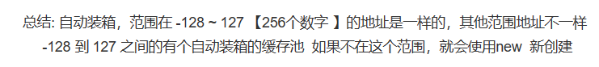

# Autoboxing and IntegerCache in Java


> When you are on the dancefloor, there is nothing to do but dance.

<p style="text-align: right">—— Umberto Eco, *The Mysterious Flame of Queen Loana*</p>
<!--more-->

有一道经典的Java面试题：

```java
Integer i = 100;
Integer j = 100;
System.out.print(i == j); // true or false?
```

由于之前没有准备直接上阵，在碰到这道题时一时不解。但显然这是考察autoboxing(自动装箱)机制，而一般整数转化为Integer对象时肯定是new一个新对象，按理说结果应该为false，但是考虑到在具体实现中可能为了效率考虑会预先缓存一部分整数对象，于是便猜测答案为true。下来网上一查，答案果然为true，但解释却是如下：



这就有点奇怪了——我总觉得缓存多少是具体的编译器或者JVM抑或是相关类库实现的问题，而不该定义在语言规范中，而如果是和具体实现相关的，那么言之凿凿256个数字需要缓存就有点奇怪了。上网查查资料之后，发现256这个数字果然还是Integer类的默认实现中决定的。下面我就综合查找的资料，介绍一下这道题背后可能涉及的知识。

# Reference Type 和 Primitive Type

首先Java类型系统以及JVM中，任何 Value(值) 要么是 reference type(引用类型)，要么是 primitive type(基本类型)。所谓reference type就是指向一个对象的值，总是一条new指令的返回值，往往是自身具有一定状态，并可以改变的(mutable)，在JVM实现中为一个指向具体对象的指针；而 primitive type的值 则只能通过字面量或是预先定义的在primitive type上的操作获得，而操作并不改变值本身，只是产生了一个新的值，即是不可变的(immutable)的，在JVM实现中也对应实现语言的primitive type(可以理解为c++中的Int)。

但是在许多其他面向对象语言中(如Python)，一切皆是对象，一切值皆是引用。这样做比Java好理解许多，具体实现上也易于实现了。但是却带来了效率的低下，这主要有两点原因：

+ 对于整数这样的在编程中最基本且常用的值，如果每次两数相加都返回一个新对象，则是对资源的极大浪费。
  + 你可能会想：为什么不把整数对象做成单例的？也就是一个只有一个1对象，也只有一个2对象，每次 1 + 1 总能得到同一个2 —— 但注意reference type的特征就是mutable，如果这样就做不到mutable了，和用primitive type表示整数也就没有区别了。
+ 在JVM执行时，遇到引用需要先解引用才能获取整数值，然后再相加，之后封装成整数对象并返回引用，与直接将整数表示为实现语言的primitive type相比效率天差地别。

因此，为了效率考虑，则需要把整数，浮点数等归入primitive type。这样做就又产生了一个问题：在JVM中，一个值即可能是用实现语言的primitive type表示，也可能用指针表示，我们如何对二者进行区分呢？幸好Java是静态类型语言，在编译之后每条指令所操作的值的类型也是确定的。比如当执行iadd指令时栈上存的值就一定为两个整数。但在动态语言中就不一定了，我们必须要先检查类型是否匹配，然后进行操作。此时为了标明一个值究竟是primitive type还是reference type，我们必须把值的高位留出来作为类型tag以示区分。

```c
// 动态语言虚拟机中的一个值往往是这个样子的
struct Value_t {
  Type type;
  union {
    double number;
    bool boolean;
    HeapObject* object;
  } data;
};
```

# Generic

既然有了primitive type的整数，似乎再也不需要作为对象的整数了？看起来似乎是这样，但是Java却依然提供了Integer类表示作为对象的整数——这主要还是因为为了支持泛型的存在。

Java的泛型是通过[类型擦除](https://docs.oracle.com/javase/tutorial/java/generics/erasure.html)实现的，也就是泛型信息只在编译期可见，而在运行期(也就是JVM)不可见。无论你是写成`List<String>` 还是 `List<A>` ，它们在编译后都会变成同一个List，而这个List存储的是Object对象。

```java
// 泛型类：
public class Box<T> {
    private T t;
    public void set(T t) { this.t = t; }
    public T get() { return t; }
}

// 上面的泛型类在编译成字节码后

public class org/example/Box {
    
  private Ljava/lang/Object; t

  public <init>()V
	...

  public set(Ljava/lang/Object;)V
	...

  public get()Ljava/lang/Object;
	...
}
```

因为实际上用Object存储，所以每次get都是做了一次强制类型转换，Java编译器会生成CHECKCAST指令来保证类型转换时的正确性。

```java
// java代码
System.out.println(stringBox.get());

// 编译后的字节码
INVOKEVIRTUAL org/example/Box.get ()Ljava/lang/Object;
CHECKCAST java/lang/String
INVOKEVIRTUAL java/io/PrintStream.println (Ljava/lang/String;)V
```

但是如果泛型已经由编译器保证没有类型错误，为什么又要加CHECKCAST指令来运行时再次检查呢？考虑如下泛型程序，在可以通过编译，但在运行时CHECKCAST会报错：

```java
public class Main {
    public static void main(String[] args) {
        Box stringBox = new Box<>();
        stringBox.set(5);
        foo(stringBox);
    }

    public static void foo(Box<String> box) {
        System.out.println(box.get() + "123");
    }
}

//Exception in thread "main" java.lang.ClassCastException: class java.lang.Integer cannot be cast to class //java.lang.String (java.lang.Integer and java.lang.String are in module java.base of loader 'bootstrap')
//	at org.example.Main.foo(Main.java:14)
//	at org.example.Main.main(Main.java:10)

```

这是因为Java为了让新代码和没有泛型之前(Java8)的代码兼容，而引入了[Raw Type](https://docs.oracle.com/javase/specs/jls/se10/html/jls-4.html#jls-4.8)，也就是没有泛型参数的泛型——对这种类型的检查会适当放松——代价就是动态检查的开销。

当然泛型不仅仅可以通过类型擦除实现，像C++的模板就是走向了另外一个极端——为每个类型都生成相应的类——这样的缺点自然是代码膨胀，好处却是可以动态获取类型信息(C++是否支持反射暂且不论，但如果Java采取和C++一样泛型机制就一定会支持这样的反射的)，不需要动态类型检查，也不需要像Java一样的Integer类。

好，话题又回到Java的Integer类，正是应为Java的泛型是通过类型擦除实现，所以所有的泛型在背后都有一套统一的表示——也就是Object。但是primitive type却在Java OO继承链之外，也就无法使用泛型了——所有就引入了将primitive type封装成wrapper type的机制。将int封装为Integer即是一个例子。

# Autoboxing  and Integer Cache 

虽然已经有了wrapper type，但每次手动封装也是非常麻烦的。所以编译就加入了自动检测类型，在合适的时候将primitive type转化为相应的wrapper type，将wrapper type转化为相应的primitive type的机制，也就是“Autoboxing”与“Unboxing”

所以说，面试题中`Integer i = 100;`等即采用了Autoboxing 机制，上面的代码在编译处理过之后就等价为下面的代码：

```java
Integer i = Integer.valueOf(100);
Integer j = Integer.valueOf(100);
System.out.print(i == j); // true or false?
```

已知引用比较在java中是直接比较地址，那么我们只需要知道`Integer.valueOf`做了什么就知道面试题的答案了。

查阅 [java doc](https://docs.oracle.com/javase/8/docs/api/java/lang/Integer.html#valueOf-int-)，发现:

> ```java
> public static Integer valueOf(int i)
> ```
>
> Returns an `Integer` instance representing the specified `int` value. If a new `Integer` instance is not required, this method should generally be used in preference to the constructor [`Integer(int)`](https://docs.oracle.com/javase/8/docs/api/java/lang/Integer.html#Integer-int-), as this method is likely to yield significantly better space and time performance by caching frequently requested values. This method will always cache values in the range -128 to 127, inclusive, and **may cache other values outside of this range**.
>
> - **Parameters:**
>
>   `i` - an `int` value.
>
> - **Returns:**
>
>   an `Integer` instance representing `i`.
>
> - **Since:**
>
>   1.5

所以说，除开根据Integer类的实现不同会有不同表现，如果只看标准类库的话那么面试题还没问题的，缓存值的Integer Cache大小总是大于256。但注意到 java doc 中说“may cache other values outside of this range”，这也许就说明还有调节的空间？果然，经查阅，`-XX:AutoBoxCacheMax` 选项就可以调节Integer Cache的大小。

在我本机的Open jdk19中，`Integer.valueOf`实现如下：

```java
	@IntrinsicCandidate
    public static Integer valueOf(int i) {
        if (i >= IntegerCache.low && i <= IntegerCache.high)
            return IntegerCache.cache[i + (-IntegerCache.low)];
        return new Integer(i);
    }
```

而用到的`IntegerCache`类实现如下：

```java

    private static class IntegerCache {
        static final int low = -128;
        static final int high;
        static final Integer[] cache;
        static Integer[] archivedCache;

        static {
            // high value may be configured by property
            int h = 127;
            String integerCacheHighPropValue =
                VM.getSavedProperty("java.lang.Integer.IntegerCache.high");
            if (integerCacheHighPropValue != null) {
                try {
                    h = Math.max(parseInt(integerCacheHighPropValue), 127);
                    // Maximum array size is Integer.MAX_VALUE
                    h = Math.min(h, Integer.MAX_VALUE - (-low) -1);
                } catch( NumberFormatException nfe) {
                    // If the property cannot be parsed into an int, ignore it.
                }
            }
            high = h;

            // Load IntegerCache.archivedCache from archive, if possible
            ...

            // Use the archived cache if it exists and is large enough
             ...
                
            // range [-128, 127] must be interned (JLS7 5.1.7)
            assert IntegerCache.high >= 127;
        }

        ...
    }
```

再追踪调用链可以发现VM类表示VM的各种选项，均有System类中的方法设置，但System类中方法又由谁调用，并从哪里知道参数呢？再追踪就会发现，果然这些命令行参数的解析和传入都是通过native method来实现的。

