# Optimize the Performance of a LM


> Time is money.

<!--more-->

## Intro

在 [Building a Transformer LM](https://rzyn2020.github.io/posts/building-a-transformer-lm/) 中，我们使用 Pytorch 提供的基础 API 实现了一个语言模型。在这篇博客中，我们要穿透 Pytorch 提供的抽象层，看看语言模型究竟是如何运行在硬件上的，我们又能针对硬件做些什么优化。在最后，我们还会简单的介绍 scaling law，以及推理和部署服务问题。

主要参考资料：

1. https://stanford-cs336.github.io/spring2024/
2. https://dlsyscourse.org/
3. https://hao-ai-lab.github.io/cse234-w25/
4. https://www.cs.cmu.edu/~15418/

## Pytorch internel

在实现语言模型时，我们使用到的 Pytorch API 主要有三类：

1. 基本的 Tensor 和 Module API
2. 优化器 `optimizer.step()`
3. 自动微分 `loss.backward()`

语言模型由神经网络表示，神经网络的输入和输出都是高维向量，也就是 `Tensor`. Tensor 在内存中即是平坦的一维数组，但可以通过 shape 和 strides 两个 tuple 将其表示为高维向量。其中 shape 是表示每个维度的大小，strides 表示每个维度相邻两个元素的距离。

```python
class NDArray: # Tensor Implementation
    def _init(self, other):
        self._shape = other._shape
        self._strides = other._strides
        self._offset = other._offset
        self._device = other._device
        self._handle = other._handle
```

通过 shape-strides 表示法，许多操作，如 transpose，reshape 都可以不必操作底层元素而直接改变这两个 tuple 就可以完成。但是对于某些操作就必须要先转化为 compat 数组才能进行。

有了 Tensor 之后，我们就可以实现神经网络的各种 building block 了，如 Linear 层：

```python
class Linear(Module):
    def __init__(
        self, in_features, out_features, bias=True, device=None, dtype="float32"
    ):
        super().__init__()
        self.in_features = in_features
        self.out_features = out_features
        self.weight = Parameter(
            init.kaiming_uniform(in_features, out_features, device=device, dtype=dtype))
        if bias:
            self.bias = Parameter(
                init.kaiming_uniform(out_features, 1, device=device, dtype=dtype)
                .reshape((1, out_features)))

    def forward(self, X: Tensor) -> Tensor:
        Z = X @ self.weight
        if not self.bias is None:
            Z = Z + self.bias.broadcast_to(Z.shape)
        return Z
```

同时，为了方便地从父模型得到子模型的参数，我们可以使用一些 python 的反射特性，遍历得到所有类型为 Parameter 的 field。

有了各种 building block，我们就可以构建语言模型了，同时也很容易就能实现前向传播。

```python
class TransformerLM(nn.Module):
    def __init__(
        self,
        vocab_size: int,
        context_length: int,
        d_model: int,
        num_layers: int,
        num_heads: int,
        d_ff: int,
        attn_pdrop: float,
        residual_pdrop: float,
        **kwargs
    ):
        super().__init__()
        self.embed = nn.Embedding(vocab_size, d_model)
        self.pos_embed = nn.Parameter(torch.zeros(context_length, d_model))
        self.drop = nn.Dropout(residual_pdrop)
        self.layers = nn.Sequential(*[TransformerBlock(d_model, num_heads, d_ff, attn_pdrop, residual_pdrop) for _ in range(num_layers)])
        self.ln_f = RMSNorm(d_model)
        self.head = nn.Linear(d_model, vocab_size, bias=False)
        self.context_length = context_length
    
    def forward(self, x):
        x = self.embed(x)
        x = x + self.pos_embed[:x.size(1), :]
        x = self.drop(x)
        x = self.layers(x)
        x = self.ln_f(x)
        x = self.head(x)
        return x
```

但在神经网络训练中，我们还需要反向传播，计算各个参数相对于 loss 的梯度。

最简单的，我们可以通过数值微分方法得到梯度，但这样计算复杂度太高，因此我们考虑采取符号微分。考虑到神经网络计算可以表示为计算图，其中每一个节点都是一个中间值，我们可以利用链式法则来自动求得 loss 相对于某个参数的微分（实际实现时要牢记微分的定义，以免被复杂的 Tensor 运算搞晕）。

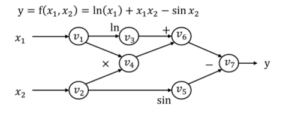

根据利用链式法则求导时固定微分的是分子还是分母，我们可以分别实现前向自动微分或者后向自动微分。但显然后向自动微分固定分子，有更多的可复用性。

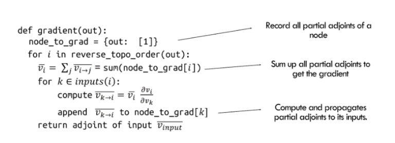

我们可以在定义神经网络时实际构建计算图，同时也实际构建反向传播的计算图。这样，我们就可以先对计算图进行编译优化，再运行/训练神经网络了。

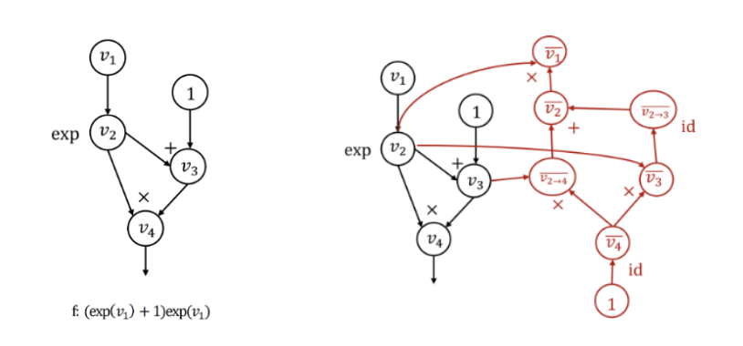

Tensorflow 原生地支持先定义计算图，再运行。在 Pytorch 中，我们可以通过给函数添加 @torch.compile 装饰器，将命令式代码也转化为计算图，然后进行编译优化。

总之，通过一次正向传播和一次反向传播得到每个参数的梯度后，我们就可以使用优化器遍历所有参数，通过一定的优化规则更新参数了。

因为神经网络中大量的矩阵运算，我们可以使用 GPU 来加速运算。CPU 中大量计算单元都用于实现流水线，超线程，动态多发射，乱序执行，以及 Speculation 和复杂的缓存机制。而 GPU 没有这么多复杂功能，却有大量简单的执行单元，我们通过 data-parallel model 来使用 GPU 的大量计算单元编程。这个 workload 与简单大量的 Tensor 运算十分相合。 

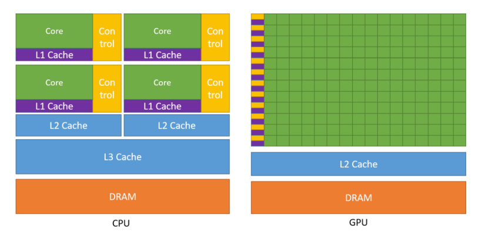

[不同厂家的GPU都着相似但不同的编程模型](https://youtu.be/9-DiGrnz8l8?si=Lcxt3g11DfiuxxiG)，幸好，Pytorch 会帮我们处理这一切。我们只需要在创建 Tensor 传入 device 参数就可以了。

## Benchmarking and profiling

我们在学习原理时往往不注意性能考量，但在各种资源有限的实践中性能却是非常重要的。就像凯恩斯说的，“站在长尺度下，我们都会死”，时间和计算资源约束在实践中往往起到决定性的作用。因此，性能优化也就成了一种必须。

但是 “Premature optimization really the root of all evil”，我们不能想当然的去任意优化，只有在 benchmark 和 profile 后，我们才知道自己的实现性能究竟如何，bottleneck 又在哪里，这样才能去针对性优化。而在当前的硬件中，计算和内存是两种最主要的资源，因此计算耗时和内存占用是我们主要 profile 的对象。

在性能优化中，我们继续使用之前训练的模型，具体参数如下：

```json
{   
  	"vocab_size": 10000,
    "context_length": 256,
    "d_model": 512,
    "num_layers": 4,
    "num_heads": 16,
    "d_ff": 2048,    
}
```


### Simple Benchmark

首先，我们需要知道我们的实现跑的有多快。我们需要分别考虑前向和后向传播的 workload，前者代表推理，后者代表训练。在 benchmark 开始前，我们需要一些 warm-up steps，以使得系统达到稳定状态（如填充 cache，部分语言的 JIT 编译，GC 达到稳定状态等）。

```python
def run_benchmark(model: nn.Module, input_data: torch.Tensor, device: torch.device,
                  warmup_steps: int, timed_steps: int, pass_type: str):
    ...
    # --- Warm-up Phase ---
    print("Running warm-up steps...")
    with context:
        for _ in range(warmup_steps):
            outputs = model(input_data)
            if pass_type == 'forward_backward':
                loss = outputs.sum() # Dummy loss
                optimizer.zero_grad(set_to_none=True) # More efficient
                loss.backward()
                optimizer.step()
            synchronize(device) # Synchronize after each warm-up step, beacuse cuda is calld asycnly

    # --- Timing Phase ---
    print(f"Running {timed_steps} timed steps...")
    total_elapsed_time = 0.0
    with context:
        for i in range(timed_steps):
            synchronize(device) # Ensure previous work is done (esp. CUDA async)
            start_time = timeit.default_timer()

            outputs = model(input_data)

            if pass_type == 'forward_backward':
                loss = outputs.sum() # Dummy loss
                optimizer.zero_grad(set_to_none=True)
                loss.backward()
                optimizer.step()

            synchronize(device) # Ensure operation completes before stopping timer
            end_time = timeit.default_timer()
            total_elapsed_time += (end_time - start_time)

    avg_time_per_step = total_elapsed_time / timed_steps
    print("--- Benchmark Complete ---")
    return avg_time_per_step

```

随机生成长度为 context-length 的向量，在我的 M4 芯片上经过 5 step 的 warm up 后再 banchmark 20 step 的反向传播，得到结果如下。

```
--- Benchmark Results ---
Device: mps
Pass Type: forward_backward
Batch Size: 16
Average time per step: 0.482039 seconds
Steps per second: 2.07

--- Benchmark Results ---
Device: mps
Pass Type: forward
Batch Size: 16
Average time per step: 0.156253 seconds
Steps per second: 6.40
```
根据上面的基准测试结果，可以得出：

在 batch size 为 16 的情况下，模型的推理吞吐量为 6.40 steps/s * 16 tokens/step = 102.4 tokens/s。但单步解码（非批处理）的速度仍然限制在 6.4 tokens/s。

对于 2GB 的训练数据：

* 估计总 Token 数：2048 MB * 250,000 tokens/MB = 512,000,000 tokens
* 有效训练样本数：512,000,000 tokens / 1024 tokens/sample ≈ 500,000 samples 
* 每个 Epoch 所需步数：500,000 samples / 16 samples/step ≈ 31,250 steps
* 单个 Epoch 训练时间：31,250 steps * 0.482039 seconds/step ≈ 15,064 秒（约 4.18 小时）

相比之前在 [Building a Transformer LM](https://rzyn2020.github.io/posts/building-a-transformer-lm/) 中仅通过 GPU 理论吞吐率进行的粗略估算，这次基于实际基准测试的时间预估显然更为准确。不过结果表明，使用 M4 芯片进行训练的效率确实不太理想。

### Profile Essence

其次，我们要知道我们的实现为什么跑这么快，这样才能针对性优化。但是 benchmark 并没有告诉我程序具体每一部分执行的时间。而这就需要 profiler 出场了。

profile 的基本原理为在程序中加入一些探针，收集运行时的信息，就像中医里的针灸一样。探针既可以编译时静态添加，也可以使用 [DTrace 等工具在运行时动态添加](https://blog.openresty.com.cn/cn/dynamic-tracing/)。而在 Python 这样的虚拟机语言中，解释器本身就提供了一套 profiler 实现，也就是 cProfile。我们可以是利用 Python 解释器提供的事件钩子（hooks）。通过 `sys.setprofile()` 函数，可以注册一个回调函数，这个回调函数会在特定的事件发生时被解释器调用。`call`，`return` 字节码指令的执行都可以是我们关心的事件。

但 cProfile 并不能很好的适配 pytorch。pytorch 提供了 torch.profiler，它会追踪 GPU执行，CPU执行以及内存分配等多种事件，并把整合起来。具体使用，如下面代码所示。

```python
def run_profile(model: nn.Module, input_data: torch.Tensor, device: torch.device,
                profile_steps: int, pass_type: str, profile_memory: bool, with_stack: bool,
                output_dir: str = "."):
    ...

    # Define the step function to be profiled
    def profile_step():
        ...
        
    profile_step()
    synchronize(device)
    print("Starting profiler context...")

    if profile_memory and device.type == 'cuda':
        torch.cuda.memory._record_memory_history(max_entries=10000)

    with profile(activities=activities,
                 record_shapes=True,
                 profile_memory=profile_memory,
                 with_stack=with_stack,
                 schedule=torch.profiler.schedule(wait=0, warmup=0, active=1, repeat=profile_steps),
                 experimental_config=torch._C._profiler._ExperimentalConfig(verbose=True)) as prof: # with_stack MUST be True for export_stacks
        for _ in range(profile_steps):
            profile_step()
            # Need to sync *inside* the step for CUDA kernel timings in profiler results
            # but *outside* the record_functions if you want to profile the sync itself.
            # Syncing after the main work is usually best for seeing kernel times.
            synchronize(device)
            prof.step() # Signal the profiler that one step is done

    print("--- Profiling Complete ---")
		...
```

在通过 profile 收集了 rawdata 之后，我们就可以展现为人类可理解的信息。如，基于事件的时间线视图 Chrome Trace，或者基于调用栈样本的聚合视图 Flame Graph。前者让我看的程序按时间顺序都做了什么，都耗时多少，后者告诉我们每个函数都运行了多少时间。

我们以 CPU profile 为例，可以看到大部分时间都在 Transformer Block 中。

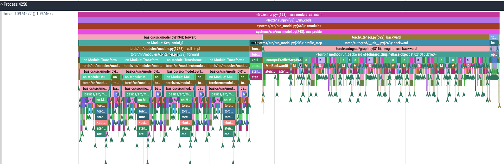

先看 forward pass，很明显，多头注意力计算占据了绝大部分时间，而其中最耗时的则是 softmax 和 Dropout 操作。

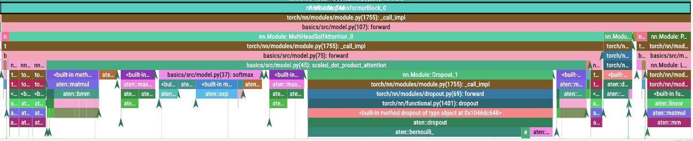

另外反向传播耗时略大于正向传播，但无明显瓶颈。

从火焰图中我们也可以验证这一点。因为在 pytorch 实现中，反向传播也通过计算图实现，也会调用 forward 方法，因此火焰图中的每个计算都是结合了正反向传播的，

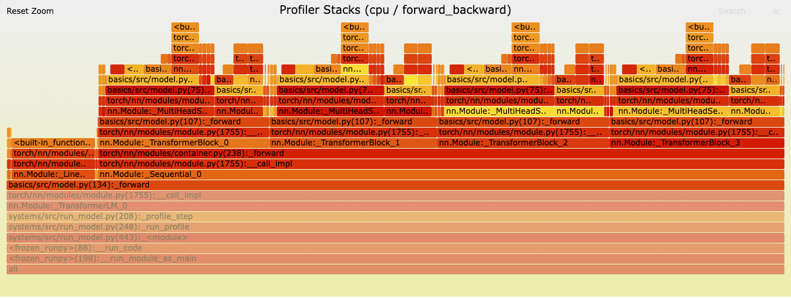

Chrome Trace 考虑了时序信息，更适合分析响应时间，暂停时间等问题。而火焰图考虑程序计算整体，更适合提升吞吐量，找到性能瓶颈。在神经网络中，显然吞吐量是更重要的，因为火焰图也就更为清楚了。从下面放大的火焰图中我们可以看出，最耗时的操作为：

1. Dropout
2. Softmax
3. Matrix mal
4. Linear
5. Mask

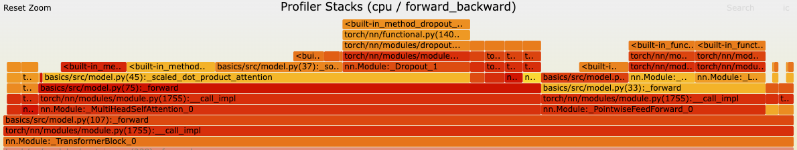

但是这并没有结束，当我们查看 mps 火焰图时，就会发现在 GPU 上 Softmax 操作反而占据了绝大部分时间。由此可见不同的设备上，瓶颈也是不同的。

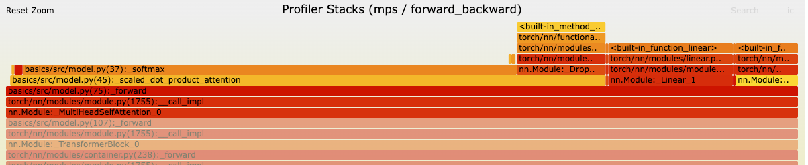

另外我们也可以对内存进行 profile（M系列芯片GPU和CPU共用内存），可以发现，与想象中的不同，参数只占据了很少一部分内存，绝大部分内存都用来存放激活值，剩下的少部分则主要为优化器状态（AdamW）。之所以内存时间图成山峰状是因为随着正向转播，激活的值越来越多。而反向传播后不需要的激活值会被及时释放。

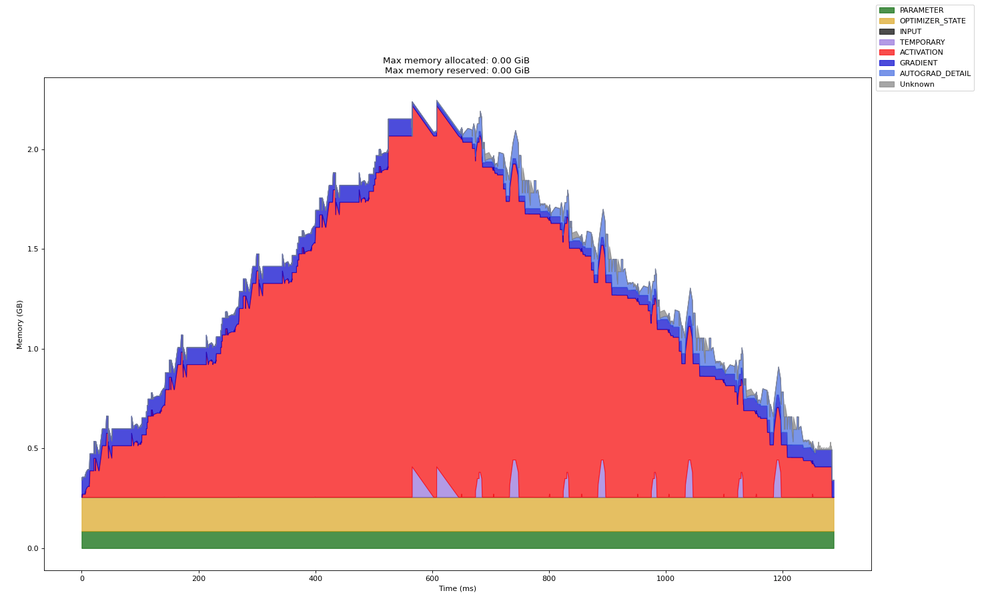


## Single GPU Optimize

既然通过 profile 知道了具体运行情况，我们就可以做进一步优化了！

### Mixed precision

首先如何降低考虑峰值 2GB 的可怕的显存占用。考虑到我们在当前的实现中全程使用 32 位浮点数，这是一笔不小的内存开销，可以考虑在准确率运行范围内降低精度。再考虑到一些 GPU 还针对低精度浮点数做了许多优化，我们就更可以获得速度上的提升了！NVIDIA A100 的规格表显示，其 FP32 的最大吞吐量为 19.5 TFLOP/秒，而其 FP16（半精度浮点数）或 BF16（脑浮点格式 bfloat16）的最大吞吐量则显著更高，达到了 312 TFLOP/秒。

然而，简单地将我们的模型转换为较低精度的格式可能会导致模型准确率下降。例如，在实践中，许多梯度值往往过小，无法用 FP16 表示，因此在使用 FP16 精度进行简单训练时这些梯度值会变成零。为了解决这个问题，在使用 FP16 进行训练时，通常会采用损失缩放（loss scaling）技术——即将损失值乘以一个缩放因子，从而增大梯度的大小，以防止它们下溢归零。

在实际使用中，我们使用 pytorch 的 autocast context manager 就可以，如：

```python
       with autocast(device_type=device.type, dtype=torch.float16, enabled=(device.type == 'cuda')):
            outputs = model(dummy_data)
            loss = criterion(outputs, dummy_labels)
```

### Fused Kernel

因为 Softmax 是我们的瓶颈之一，我们可以先考虑优化 Softmax。目前的 Softmax 实现如下。

```python
def softmax(x, dim):
    max_vals = torch.max(x, dim=dim, keepdim=True).values
    shifted_x = x - max_vals
    x_exp = torch.exp(shifted_x)
    x_exp_sum = torch.sum(x_exp, dim=dim, keepdim=True)
    return x_exp / x_exp_sum
```

考虑到在 Python 间传值效率较低，多个计算步骤融合 (fuse) 到了一个单一的 GPU Kernel（内核程序）中执行。

如同写一般程序，我们可以用汇编，可以用 c，也可以用 Python。写 kernel（针对CUDA） 我们也有 SASS，CUDA，Triton 几种选项。

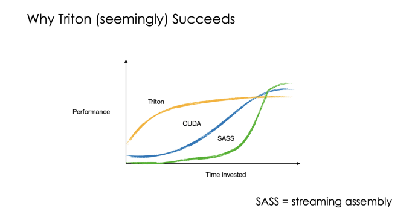

但是 Trtion 是时间投入有限时性价比最高的一种。如同 Cython 一样，Triton 语言是利用了 Python 的装饰器机制，潜入了 Python 语言之中，可以很容易地整合进一般 Python 程序。下面是使用 Triton 写的 fused softmax kernel。

```python
@triton.jit
def softmax_kernel(
    output_ptr,
    input_ptr,  
    input_row_stride,  
    output_row_stride, 
    n_cols,           
    BLOCK_SIZE_N: tl.constexpr,
):
    row_idx = tl.program_id(axis=0)
    row_start_ptr_input = input_ptr + (row_idx * input_row_stride)
    row_start_ptr_output = output_ptr + (row_idx * output_row_stride)

    col_offsets = tl.arange(0, BLOCK_SIZE_N)

    input_mask = col_offsets < n_cols

    row_data = tl.load(row_start_ptr_input + col_offsets, mask=input_mask, other=-float('inf'))
    row_max = tl.max(row_data, axis=0)

    numerator = row_data - row_max
    numerator = tl.exp(numerator)
    denominator = tl.sum(numerator, axis=0)
    softmax_output = numerator / denominator
    tl.store(row_start_ptr_output + col_offsets, softmax_output, mask=input_mask)


# --- Wrapper function to launch the kernel ---
def softmax(x: torch.Tensor):
    if not x.is_cuda:
        print("输入张量必须在 CUDA 设备上。正在移至 CUDA...")
        x = x.to('cuda')
    x = x.contiguous()
    n_rows, n_cols = x.shape
    output = torch.empty_like(x)
    BLOCK_SIZE_N = triton.next_power_of_2(n_cols)
    if BLOCK_SIZE_N > 16384 and n_cols <= 16384 : 
        BLOCK_SIZE_N = triton.next_power_of_2(n_cols) if n_cols > 0 else 1
    elif n_cols == 0:
        return output
    grid = (n_rows,) 
    softmax_kernel[grid](
        output,
        x,
        x.stride(0),
        output.stride(0),
        n_cols,
        BLOCK_SIZE_N=BLOCK_SIZE_N,
    )
    return output
```
除了简单的 Fused Kernel，我们还有更深入的优化手段。考虑到 Attention 中的注意力矩阵占据了绝大部分内存，而且 Softmax 的速度瓶颈也是由于这个庞大的注意力矩阵造成的。当 Cache 无法完全容纳注意力矩阵时，我们可以采用 Tiling 方法将其分块计算，以最大化地复用 Cache。同时，可以采用 Online Softmax 算法来替代传统 Softmax，避免读取整行数据的开销。

除此之外，还有从数据、计算、内存等多个角度出发的优化方法，在此不再赘述。

## Distributed data parallel training

性能是程序实际运行中的某种度量，但因为系统和目标的复杂性，优化手段并没有一个统一的抽象的分类体系。只有一些经验性的思路和具体的 toolbox。

在性能优化中，常见的思路有：

1. 减少不必要的工作（如编译优化中的冗余消除，近似计算，Lazy Evaluation）
2. 提高原子操作的效率（如采用硬件优化，采用高效的算法）
3. 并行化（任务分解，流水线，异步编程）
4. 减少资源访问延迟（Cache，批处理，数据局部性）
5. 有效管理和利用资源（线程池，负载均衡，资源调度）
6. 识别关键路径和瓶颈（fast path，slow path）
7. 明智权衡（如同样是性能的吞吐量和延迟间的权衡，性能和其他质量属性间的权衡）
8. 测量，分析，迭代

而在摩尔定律终结之后，并行化成为了提升性能最显著的方法之一。对于计算依赖较小的计算密集型程序，性能几乎可以随硬件数量线性提升。下面，我们将研究如何在深度学习中运用并行化方法来优化性能。

### Data Parallelism

就如同一般并行化方法中的函数并行和数据并行一样，神经网络也可以依靠这种思路并行化。首先就是数据并行，最直观的想法就是将一个 batch 分成多分，分别在各个 CPU 上前向，后向传播并计算梯度，之后再聚合梯度并更新参数。

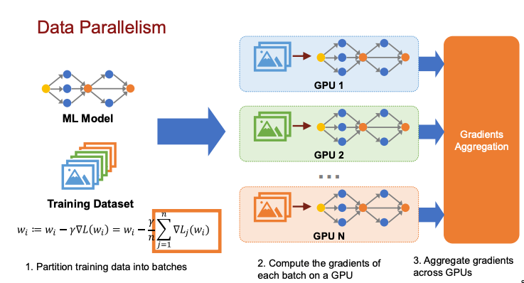

在聚合梯度时，我们也有多种选择：

1. Parameter Server：使用一个参数服务器集中管理所有参数
   1. 但是参数服务器就会变成瓶颈
2. [AllReduce](https://www.cs.cmu.edu/~15418/lectures/24-parallel_deep_learning_data_parallel.pdf)：让各个设备之间自行同步梯度，根据交流的拓扑，又可分为 Ring AllReduce, Tree AllReduce, Butterfly AllReduce 等。

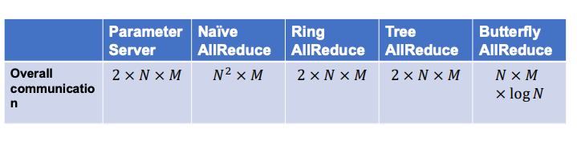

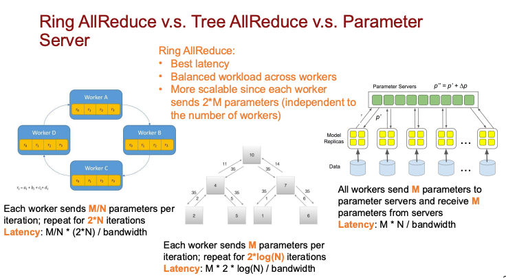

我们一般都采用 Ring AllReduce，因为其在延迟，负载均衡和扩拓展性上都比较好。

此外，因为在 Data Parallelism 中，每个 GPU 都保存了一份完整的模型，所以难以训练超过 GPU 显存的模型。因此，Deepspeed 创造了 ZeRO 框架来优化显存占用，将优化器状态，梯度和参数分散在各个 GPU 上。当然 ZeRO 也不可避免地增加了通信开销。

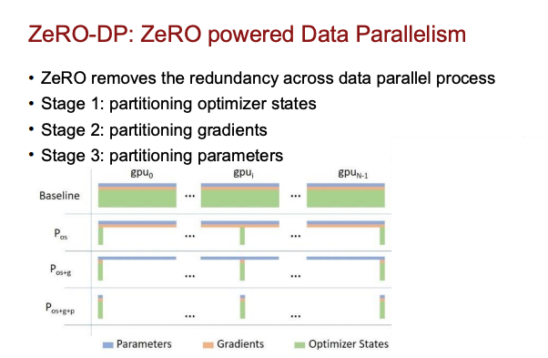

### Model & Pipeline Parallelism

对应函数并行的是 Model & Pipeline Parallelism。这种方法将模型看作一个函数，将其拆分为多个子图并分散到不同的 GPU 上。每个子图可以看作一个子函数，甚至单个矩阵乘法操作也可以分散到多个 GPU 上进行计算。

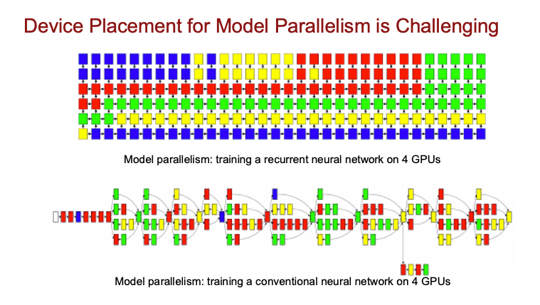

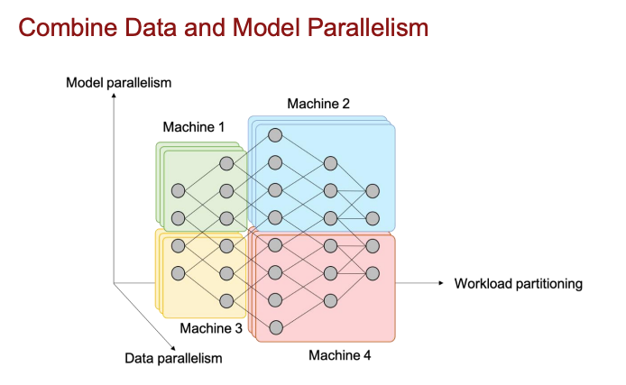

函数并行一方面可以和数据并行结合，训练更大的模型。但更为重要的是可以通过拆分函数引入流水线，进一步提高吞吐率。

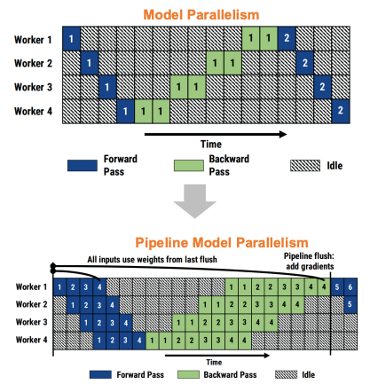

## Scaling

Scaling Law 主要用来回答这样的问题：在算力有限的情况下，我们应该如何权衡模型大小和训练数据量，以达到最低的 loss，可以数学表示为下面的公式。其核心思想是以小见大。

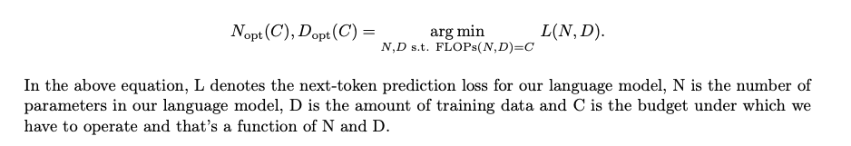

Scaling Law 的一个灵感来自于传统 ML 中的  Data Scaling Law。 Data Scaling Law 是通过训练数据量估计高斯分布模型的loss，`log(Error) = − log(n) + 2 log(σ)` 。但语言模型却没有这样简明的数学公式可以推导出来。所以我们只能按照物理学的方法，收集实验数据并提出假设。

DeepMind 在其名为 "Chinchilla" 的模型研究提出了我们常说的 Scaling Law：

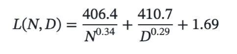

总而言之就是，模型参数量和训练数据应该同步缩放，以达到最低 loss。

## Inference and Serving

在涉及到模型的推理和部署服务时，我们需要在延迟、吞吐量和准确率之间取得平衡。以下是一些常见的优化方法：

1. 模型压缩
    - 量化：降低数值精度，减少内存和计算开销
    - 剪枝：移除不重要的网络连接
    - 知识蒸馏：将大模型知识迁移到小模型

2. 注意力机制优化
    - PagedAttention：借鉴操作系统分页机制，实现 KV Cache 的动态内存管理
    - 支持非连续显存分配，解决长序列推理时的显存碎片问题

3. 推理阶段优化
    - Chunked Prefill：将长输入分块处理，降低显存压力
    - 计算解码分离：将计算密集的预填充和内存密集的解码分配到不同硬件
    - Speculative Decoding：使用小模型预测，大模型验证，减少约 30% 解码步骤

4. 批处理策略
    - Continuous Batching：通过动态调度实现​​细粒度请求管理，如每个解码步骤（生成1个token）重新评估批次组成，新请求可立即加入，完成请求及时退出
    - Adaptive Batching：根据序列长度动态调整批次大小
    - Delayed Batching：引入固定延迟窗口以积累更多请求，提升整体吞吐量


## LLM API and SSE

我们在调用 LLM API 时，常常会使用 SSE（Server-Sent Events）协议，该协议支持服务器向客户端单向推送数据，非常适合大模型这样的流式文本输出。一个简单的 client-server 例子如下：

```javascript
const eventSource = new EventSource('/api/stream');

eventSource.onmessage = (event) => {
    const data = JSON.parse(event.data);
    document.getElementById('output').innerHTML += data.token;
};

eventSource.addEventListener('end', () => {
    eventSource.close();
});
```

```
event: message
data: {"token": "春", "finished": false}

event: end
data: {"finished": true}
```

```python
from fastapi import Request
import openai
import asyncio

@app.get("/api/stream")
async def stream_response(request: Request):
    async def event_generator():
        response = await openai.ChatCompletion.acreate(
            model="gpt-4",
            messages=[{"role": "user", "content": "写一个递归的快速排序函数"}],
            stream=True
        )
        async for chunk in response:
            token = chunk.choices[0].delta.get("content", "")
            yield f'data: {{"token": "{token}"}}\n\n'
        yield "event: end\ndata: {}\n\n"
    
    return EventResponse(event_generator())
```


