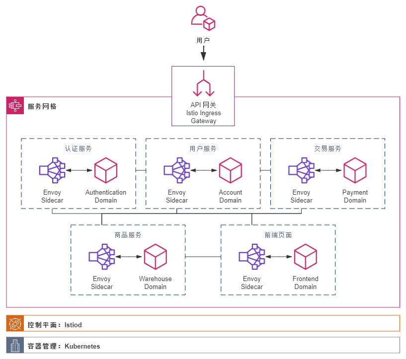

# 后台开发全景图：思考、方法与实践


> Ein Schritt wirklicher Bewegung ist wichtiger als ein Dutzend Programme.
> (One step of real movement is more important than a dozen programs.)

<!--more-->

## 前言

本文旨在从“思考”、“方法”与“实践”三个层面，系统性地勾勒出后台开发的完整蓝图，为有志于此的开发者提供一份结构化的成长指南。

**思考篇**将深入探讨软件开发的底层逻辑，追溯后台技术的演进历史，并明晰其在当今软件行业中的定位与核心技术栈。

**方法篇**将聚焦于通用的软件开发方法论，重点介绍领域驱动设计（DDD）与属性驱动设计（ADD）等现代架构思想，并分享一套实用的架构设计工具箱。

**实践篇**将以一个真实项目为例，综合运用前述的理论与方法，展示如何将抽象概念付诸于具体的工程实践。

## 思考篇：建立宏观认知

### 软件架构与团队：从混沌到秩序

软件开发的根本目的，在于运用计算机这一强大工具，高效地满足用户的多样化需求。正因需求的千变万化，才催生了形态各异的软件。从本质上讲，任何软件都可以视为一个庞大的**状态机（State Machine）**。正是其状态空间的浩瀚与复杂，使其能够精准地对现实世界进行建模，从而解决实际问题。

然而，现实世界问题的复杂性，意味着软件的状态空间也随之变得极其庞大，远超人脑的处理极限。心理学研究表明，我们的工作记忆（Working Memory）是有限的，通常只能同时处理大约七个（±2）事务。因此，我们不可能像解决一道算法题那样，将整个软件系统的所有细节都装入脑中。

解决方案在于**系统化思维**与**抽象（Abstraction）**。

我们可以将软件看作一个由不同层次构成的系统。每一层都通过若干子系统的协作来解决一个范畴的问题，而每个子系统内部又可以继续分层。**抽象的本质是信息隐藏（Information Hiding）**。通过层层抽象，隐藏非必要的细节，我们便能将一个原本无法一手掌握的复杂系统，简化到可以被我们的大脑理解和容纳的程度。

当我们能够自顶向下地清晰阐述系统在最高层如何通过子系统交互实现目标，并能逐层深入、分而治之，直至每个子系统的复杂度都能被工作记忆轻松处理时，我们才算真正“理解”了该系统。所谓的“理解”，就是能够清晰地阐述系统如何达成特定目标，甚至有能力从零开始重新构建它。

---

以一个简单的例子说明：在 IDE 中运行 Java 代码，就可以看作一个多层次的抽象系统：

- **最高层抽象（用户视角）：**
  - 在 IDE 中点击“运行”按钮，代码成功执行并输出结果。
- **往下一层（IDE 与 JDK 工具链）：**
  1. IDE 调用 `javac` 编译器，将 `.java` 源文件编译成 `.class` 字节码文件。
  2. IDE 调用 `java` 命令，启动 Java 虚拟机（JVM）来执行这些字节码。
- **再往深一层（JVM 内部）：**
  1. JVM 启动，进行类加载、验证、准备和解析。
  2. 字节码被解释器逐行执行，或由即时编译器（JIT）编译为本地机器码以提升效率。
  3. 执行过程中，JVM 会管理内存（堆、栈、方法区等）和线程。
- **继续深入（操作系统与硬件）：**
  1. 操作系统调度进程，将机器码指令送往 CPU 执行。
  2. CPU 执行指令，与内存、磁盘等硬件交互。

通过这样逐层分解，一个看似简单的“一键运行”背后所隐藏的复杂链路，便清晰地展现在我们面前。当我们遇到问题，例如“如何提升 Java 程序的执行效率？”，就可以基于这些不同的抽象层次进行分析：

1. **应用层：** 是否可以优化算法、减少不必要的对象创建？
2. **JVM 层：** 是否可以通过调整 JVM 参数（如堆大小、垃圾收集器）来优化？
3. **操作系统/硬件层：** 是否是 I/O 瓶颈或 CPU 资源不足？

---

这种精心设计的抽象分层，正是我们所说的**软件架构（Software Architecture）**。

架构之所以至关重要，在于它的**普适性**与**稳定性**。一个优秀的架构模式可以被复用于无数个不同的软件项目。所有高阶的软件设计思想，都是建立在架构这一基础之上的，例如：

- **罗伯特·马丁（Robert C. Martin）** 强调的模块化与依赖关系原则。
- **领域驱动设计（DDD）** 中对业务复杂度的划分与隔离。
- **架构权衡分析方法（ATAM）** 对质量属性（如性能、安全性）的系统性考量。

然而，无论架构设计得多么精妙，终究需要人来落地，而且通常需要一个团队协作完成。这就引出了一个著名的定律——**康威定律（Conway's Law）**：

> “设计系统的组织，其产生的设计等价于组织间的沟通结构。” (Organizations which design systems ... are constrained to produce designs which are copies of the communication structures of these organizations.)

简而言之，**软件架构会趋向于复制组织的结构**。这是因为团队内部的沟通成本远低于跨团队的沟通成本，因此系统的边界自然而然地会沿着团队的边界进行划分。

---

循着这条线索，我们便能勾勒出一幅清晰的图景：

**软件架构 ⟺ 组织结构 ⟺ 团队与岗位 ⟺ 个人能力**

对于我们求职者而言，理解这套对应关系就显得尤为重要。当你研究一家公司的岗位需求时，你不仅仅是在看一个孤立的职位描述，更是在窥探其背后的软件架构理念和组织运作方式。理解了这一点，你就能更好地展现自己的价值，并找到真正适合自己的位置。

### 互联网企业的基本图景

互联网企业的核心业务模式，是通过构建和运营软件服务来获取商业价值。无论是游戏、电商、即时通讯还是本地生活，这些看似迥异的赛道，其底层的软件与组织结构却有着惊人的相似性。

- **技术与组织：前后端的天然分野**

  一套完整的服务，必然包含运行在用户设备上的客户端（前端）和运行在公司服务器上的服务端（后台）。前端的核心关注点是用户体验、交互效果和跨平台兼容性；而后台则聚焦于高性能、高可用、高并发和数据一致性。迥异的目标与质量属性要求，使得前后端的技术栈（Tech Stack）天然分离。这种技术上的分野，直接映射到组织结构上，形成了我们熟知的“大前端”与“后台/服务端”两大技术族群。为了保障这条核心研发流水线的顺畅，测试（QA）、运维（SRE/DevOps）等支持性岗位应运而生，共同构成了研发体系的主体。

- **后台深潜：基础、中台与业务**

  庞大的后台系统，自身也存在着精细的分层。我们可以将其大致分为三个层次：

  1. **基础软件/平台（Infrastructure）：** 这是最底层，提供计算、存储、网络等最通用、最稳固的能力，如数据库、缓存系统、消息队列、容器化平台等。这一层离业务最远，追求极致的性能和稳定性，其功能相对固定。
  2. **中台（Middle Platform）：** 位于中间层，它将一些通用的业务能力（如用户中心、订单系统、支付网关）从具体的业务线中沉淀出来，形成共享服务，供多个前台业务复用。它承上启下，旨在提升研发效率，避免重复造轮子。
  3. **业务后台（Business Backend）：** 这是最贴近用户的业务逻辑层，直接服务于特定的业务场景（如电商的商品详情页、外卖的点餐流程）。这一层的核心是快速响应市场变化，敏捷迭代，因此对业务理解的要求最高。

  从基础软件到业务后台，可以看作是从“左”到“右”的依赖关系：越靠右的层级，越关注具体业务，功能迭代快，但会依赖左边更稳固的底层服务；越靠左的层级，功能越通用、稳定，但对性能、可用性等质量属性的要求也越严苛。

- **数据的价值：驱动决策与智能**

  数据是现代互联网服务的核心资产。除了支撑业务运行的在线事务处理数据库（OLTP），还有用于深度分析的在线分析处理（OLAP）数据仓库。正是海量数据的积累，催生了新的价值创造方式：通过数据分析洞察商业机会，通过算法模型优化业务效果（如推荐系统、广告投放），从而提升用户体验，增强盈利能力。这条价值链，也创造了算法工程师、数据科学家、数据分析师等炙手可热的岗位。

以上这套描述，在逻辑上概括了企业的组织全貌，即业界所称的[企业架构（Enterprise Architecture）](https://tonydeng.github.io/EA-practices/ea-theory/index.html)。


---

了解了这张“图景”，下一个关键问题是：在这张复杂的版图中，哪些团队、哪些岗位是核心？我们又该如何评估一个职位的价值？

归根结底，企业是一个追求商业成功的组织。在任何科层制组织中，资源和决策权都向高层管理者集中。因此，一个岗位的重要性，很大程度上取决于它与“权力来源”和“价值创造”的关系。我们可以从两个核心维度来构建一个分析框架：

1. **不可替代性（Irreplaceability）：** 指的是岗位所依赖的技术壁垒或业务壁垒的高度。当一个岗位的工作需要极高的专业技能、深厚的行业知识或长时间的经验积累，以至于在市场上难以找到替代者时，该岗位就具备了强大的议价能力。
   - **高不可替代性岗位：** 例如，能够构建和维护超大规模分布式数据库的工程师，或深谙特定行业（如金融风控、广告推荐）复杂逻辑的业务架构师。
2. **价值可见性（Visibility of Impact）：** 指的是岗位成果被关键决策者（管理者）或价值来源（客户/市场）感知的清晰度和直接性。俗话说“近水楼台先得月”，离最终成果越近，功劳就越容易被看见。
   - **高价值可见性岗位：** 直接面向用户的业务团队，其功能的优劣能迅速反映在用户增长、留存等核心指标上。同样，能够为管理层提供精准数据洞察、辅助关键决策的算法或数据团队，其成果也极易被感知。

---

现在，我们可以将求职者最关心的三个要素——**薪资、稳定、轻松**——与上述两个维度进行匹配，来分析不同岗位的特点：

|                  | **高价值可见性** (贴近业务/用户/决策)                        | **低价值可见性** (成果不易直接感知)                          |
| ---------------- | ------------------------------------------------------------ | ------------------------------------------------------------ |
| **高不可替代性** | **核心引擎 (Core Engine)** <br> 如：核心业务算法、商业化策略 <br> **特点**：薪资最高、地位核心，但压力巨大，与“轻松”无缘。 | **稳定基石 (Stable Foundation)** <br> 如：基础架构、数据库内核 <br> **特点**：技术护城河深，非常稳定，薪资优厚，但属于“幕后英雄”。 |
| **低不可替代性** | **前线部队 (Frontline Troop)** <br> 如：部分业务CRUD、运营活动开发 <br> **特点**：能快速产出成果，易获短期认可，但竞争激烈，稳定性相对较差。 | **支持单元 (Support Unit)** <br> 如：内部工具、非核心流程开发 <br> **特点**：可能相对边缘和安逸，但薪资和长期发展或受限。 |

**因此，作为求职者，在审视一个岗位时，不应只看其薪资待遇和技术栈，更应深入思考：**

- 这个岗位处在公司价值创造链条的哪个环节？
- 它的不可替代性体现在哪里？是深厚的技术，还是复杂的业务？
- 它的工作成果如何被衡量？是否容易被关键人物看到？

### 后台系统的演进之路

我们已经描绘了互联网企业的基本组织版图。现在，让我们将焦点汇聚于其技术心脏——后台系统。在这个领域中，我们能看到负责业务逻辑实现的应用开发、保障数据生命线的数据库（DBA/数据工程师），以及构建系统间桥梁的中间件等多种岗位。

然而，[为何今天的后台架构会演变成微服务、服务网格、Serverless 等复杂形态](https://cloud.tencent.com/developer/article/1442214)？任何架构的出现都不是空穴来风。技术，如同生物演化，每一个新物种的诞生都带有旧时代的印记。要理解“现在”的合理性，我们必须回溯“过去”的足迹。

下面，我们将沿着时间线，追溯后台系统的演进历程。

#### 第一阶段：单体巨石时代 (约 2000-2008年)

**特征：** 一体化架构（Monolithic Application）、垂直扩展（Scale-up）。

在世纪之初的“网站时代”，大多数应用都被构建为单体服务。所有功能，从用户界面到业务逻辑再到数据访问，都被打包在同一个进程中。这种架构在项目初期开发效率极高，易于部署和测试。当流量增长时，主要的应对方式是“垂直扩展”——购买性能更强的服务器。

**一个值得关注的技术路线分岔：** 大约在2008年，中美后台技术的发展出现了一个有趣的分野。

- **在美国：** Google 的上市和 Facebook 的崛起，带来了海量数据存储和处理的挑战。美国科技界开始将注意力转向**水平扩展（Horizontal Scaling）**，思考如何通过成百上千的廉价服务器集群来分散压力，分布式系统的思想开始萌芽。
- **在中国：** 当时正值大型多人在线网络游戏（MMO）的黄金年代。游戏行业的核心诉求是在单台服务器上支撑尽可能多的玩家进行高并发、低延迟的实时交互。因此，国内顶尖工程师的主要精力聚焦于**榨干单机性能**，在网络编程、内存管理、并发模型上深耕。

可以说，当时美国关注“分布式”，而中国关注“高并发”。

#### 第二阶段：中间件与SOA时代 (约 2009-2013年)

**特征：** 面向服务的架构（SOA）、中间件（Middleware）、水平扩展。

随着 Facebook 等社交网站的爆发式增长，用户间的频繁互动（搜索、推荐、消息）产生了传统单体架构无法应对的巨大压力。将巨石应用拆分成若干个独立的服务，通过标准接口进行通信的 SOA 思想开始流行。

为了解耦这些服务，处理异步任务，**中间件**迎来了发展的春天。消息队列（如 RabbitMQ）、服务通信框架（如 ZeroMQ、Dubbo）等技术被广泛应用，它们构成了服务化架构的“神经系统”。后台系统开始从“单体作战”走向“协同服务”。


#### 第三阶段：大数据与云时代 (约 2014-2017年)

**特征：** 大数据（Big Data）、云计算（Cloud Computing）、微服务（Microservices）。

大约从2014年起，中美两国的技术路线开始重新交汇，并以前所未有的速度融合。在中国，从“千团大战”到 O2O 创业浪潮的兴起，催生了对大数据实时处理、机器学习推荐、LBS 服务等复杂业务的真实需求。

这标志着一个转折点的到来：**技术开始真正驱动业务，算法开始驱动产品。**

这个时代的技术热点，至今仍是业界主流：

- **大数据生态：** 以 Hadoop、Spark 为代表的批处理和流式处理框架成为标配。
- **推荐与挖掘：** 数据挖掘和推荐系统从边缘功能走向业务核心。
- **容器化：** 以 Docker 为代表的容器技术，极大地简化了应用部署和环境一致性问题，为微服务的彻底落地铺平了道路。
- **DevOps 文化：** A/B 测试、持续集成/持续部署（CI/CD）等理念深入人心。

可以说，至今绝大多数公司，无论国内外，其技术体系仍构建在这个“云 + 大数据”的时代基石之上。微服务架构在此时被正式确立为复杂系统的主流设计模式。


#### 第四阶段：云原生与AI时代 (约 2018年至今)

**特征：** AI/ML 驱动、云原生（Cloud Native）、服务网格（Service Mesh）、无服务（Serverless）。

当大数据和云计算成为基础设施后，站在技术浪潮之巅的公司开始迈向下一个纪元。从2017年底开始，“AI驱动”从口号变为了现实。

- **AI/ML 深入核心：** 机器学习不再仅仅是离线分析工具，而是通过复杂的机器学习平台（如 Facebook 的 FBLearner、Uber 的 Michelangelo）深度融入业务核心，驱动着内容推荐、智能定价、风险控制等关键环节。
- **云原生技术栈成熟：** 为了管理成千上万的微服务，以 **Kubernetes (K8s)** 为核心的容器编排系统一统江湖，成为云时代事实上的“操作系统”。为解决微服务治理难题，**服务网格**（Service Mesh）技术应运而生。为了极致的弹性和运维效率，**无服务计算**（Serverless/FaaS）也开始崭露头角。

回望这段历史，从笨重的单体，到灵活的服务；从依赖昂贵的硬件，到拥抱分布式的云；从工程师编写固定逻辑，到由数据和AI驱动决策，后台系统的每一次演进，都是为了应对更复杂的业务挑战，追求更高的研发效率和更强的系统能力。这条演进之路，仍在继续。




### 后台开发的学习路径 (Roadmap)

了解了后台系统在企业中的定位和演进脉络后，下一个自然的问题是：作为一名有志于此的开发者，应当构建怎样的能力模型？后台开发涉及的知识领域广泛，从底层技术到上层业务，都需要有扎实的积累。以下是一个后台开发工程师的成长路径图（Roadmap），它系统性地梳理了所需的核心能力：[Back-End Development Roadmap](https://github.com/andyawang/Back-End-Development-Roadmap)。其关键能力可归纳为：

1. **计算机科学基础**：数据结构、算法、操作系统、计算机网络等。
2. **软件工程知识**：设计模式、开发方法、测试、项目管理等。
3. **业务领域知识**：深入理解所在行业的业务逻辑和流程。
4. **组织与管理能力**：沟通、协作、领导力。
5. **产品与商业思维**：从用户和市场的角度思考问题。

## 方法篇：构建系统化能力

### 软件开发方法论：在混乱中建立秩序

软件的本质，是利用计算机技术来解决现实世界中的特定问题、满足特定需求。然而，将一个模糊的“需求”转化为一个稳定、可靠、高效的软件系统，其过程远比想象中复杂。

> “软件开发行业是如此混乱，以至于对于大多数开发人员来说，常识性的基本实践可能很陌生。然而，忽视它们做再多的事情都不会加快进度。导致问题的行为不可能用来解决问题。”

这句引言点出了软件工程的核心挑战：**在混乱中建立秩序**。为了驾驭这种复杂性，行业沉淀出了两大核心概念：**软件开发生命周期模型 (SDLC)** 和 **软件开发方法 (Methodology)**。理解它们的区别与联系，是在混乱中理清头绪的第一步。

- **软件开发生命周期模型 (Software Development Life Cycle, SDLC)**
  - **它是什么？** 软件从构思到退役的**高层战略蓝图**。它定义了开发过程需要经历哪些主要阶段（如需求分析、设计、编码、测试等）以及这些阶段的先后顺序。
  - **它回答什么？** 更侧重于 **“做什么” (What)** 和 **“什么时候做” (When)**。
- **软件开发方法 (Software Development Methodology)**
  - **它是什么？** 指导团队如何执行具体开发活动的**战术手册和实践集合**。它包含了一套明确的原则、实践、角色和工具。
  - **它回答什么？** 更侧重于 **“如何做” (How)** 以及 **“如何组织团队和工作” (How to organize)**。

**一言以蔽之：生命周期模型提供了“做什么”的宏观框架，而开发方法则填充了“如何做”的具体实践。** 一个项目会选择一个生命周期模型（例如，迭代式生命周期），并在这个框架下采用一种或多种开发方法（例如，在迭代中采用Scrum进行管理）。

------

**经典的软件开发生命周期模型 (SDLC)**

SDLC 模型为项目提供了基础结构。目前业界有超过50种模型，但以下几种最为经典和重要：

1. **瀑布模型 (Waterfall Model)**
   - **核心思想：** 严格线性的、阶段化的开发模式。如同瀑布流水，一个阶段必须完成后才能进入下一个阶段。
   - **流程：** `需求分析 → 系统设计 → 编码实现 → 测试验证 → 部署上线 → 维护`
   - **适用场景：** 需求非常明确、在项目周期内几乎不会变更的项目。
2. **V模型 (V-Model)**
   - **核心思想：** 瀑布模型的演进版，也被称为“验证与确认模型”。它强调了**测试活动与开发阶段的并行关系**。
   - **特点：** 每个开发阶段都有一个与之对应的测试阶段（例如，单元测试对应详细设计，集成测试对应概要设计），从而尽早发现问题。
3. **迭代与增量模型 (Iterative and Incremental Model)**
   - **核心思想：** 将庞大的开发任务分解成一系列更小、更易于管理的部分。产品在多次**迭代 (Iterations)** 中被**增量 (Increments)** 构建。
   - **特点：** 每个迭代都会产出一个可用的、但功能不完整的软件版本。这允许团队根据早期版本的反馈进行调整，灵活性高于瀑布模型。
4. **螺旋模型 (Spiral Model)**
   - **核心思想：** 一种风险驱动的模型，它融合了原型模型和瀑布模型的优点。
   - **特点：** 开发过程呈螺旋状，项目会反复经历四个阶段：**制定计划、风险分析、工程实现、客户评估**。每一次螺旋迭代都会产生一个更完善的版本，非常适合大型、复杂且高风险的项目。

------

**主流的软件开发方法 (Methodology)**

如果说生命周期是骨架，那么开发方法就是血肉。它们让开发过程充满活力和效率。其中**敏捷开发** (Agile Development)是当今业界的核心开发思想之一。

敏捷并非一种具体的方法，而是一套旨在提升软件开发灵活性与响应能力的价值观和原则。它强调迭代开发、快速响应变化、与客户的紧密协作，并推崇“个体和互动”高于“流程和工具”。在敏捷这把大伞下，催生了众多高效的开发框架。

- **Scrum**
  - **定义：** 敏捷开发中最流行的**框架**。它通过一系列固定时长的短周期——**冲刺 (Sprint)**（通常为2-4周）来迭代地交付产品。
  - **关注点：** 侧重于如何在开发环境中管理任务，通过定义明确的角色（如产品负责人、Scrum大师）和事件（如每日站会、评审会）来改善团队协作和生产力。
- **看板 (Kanban)**
  - **定义：** 一种用于敏捷开发的可视化管理**方法**，旨在实现持续交付和流程改进。
  - **核心实践：** 通过可视化工作流、限制在制品 (WIP) 数量来识别瓶颈，优化流程效率。看板的周期非常灵活，目标是尽快完成单个任务，非常反感多任务并行。
- **极限编程 (eXtreme Programming, XP)**
  - **定义：** 一系列卓越的**工程实践**集合，可以与Scrum等框架结合使用，以提高代码质量和开发效率。
  - **核心实践：** 测试驱动开发 (TDD)、结对编程、持续集成 (CI)、简单设计等。
- **精益软件开发 (Lean Software Development)**
  - **定义：** 借鉴丰田精益生产思想的开发哲学。
  - **核心原则：** 消除浪费、内建质量、延迟决策、快速交付、尊重团队。

此外，**DevOps**也是一种非常重要的软件开发方法，它旨在统一软件开发 (Dev) 和IT运维 (Ops) 的**文化、实践和工具的集合**。通过自动化基础设施、工作流和持续监控，缩短开发生命周期，实现高质量、高频率的持续交付 (CI/CD)。

------

掌握上述方法是走向专业的必经之路。但软件工程的探索永无止境。

- **形式化方法 (Formal Methods):** 除了通过优秀的工程实践来保证质量，我们能否用数学的严谨性来定义和验证软件？形式化方法，如**演绎验证 (Deductive Verification)** 和 **模型检查 (Model Checking)**，正是在尝试回答这个问题，以确保软件的最高可靠性。

- **架构设计：** 当我们对各种方法了然于胸后，下一个高地便是架构设计。如何从宏观上设计一个健壮、可扩展、易于维护的系统？

  接下来，我们将深入探讨两种业界核心的架构设计方法——**领域驱动设计 (DDD)** 与 **属性驱动设计 (ADD)**。

### DDD：驾驭业务复杂度

2003年，软件开发大师 Eric Evans 发布了他的里程碑式著作《**领域驱动设计：软件核心复杂性应对之道**》（Domain-Driven Design: Tackling Complexity in the Heart of Software）。这本书并非提出了一种全新的技术，而是提出了一套旨在解决软件核心复杂性的设计思想和方法论。

从标题中我们可以直观地理解，DDD 的核心目标是**驾驭业务复杂度**。在传统的软件开发中，我们常常看到这样的场景：

- 业务逻辑散落在代码的各个角落，无人能说清完整的业务规则。
- 开发人员和业务专家之间存在巨大的沟通鸿沟，使用的词汇和理解完全不同。
- 随着系统迭代，代码变得越来越难以维护，牵一发而动全身，最终形成一个巨大的、无法撼动的“泥球系统”（Big Ball of Mud）。

DDD 正是为了应对这些挑战而生。它不是一个框架，而是一种**战略和战术的集合**，指导我们如何将软件的核心关注点放在业务本身，通过建立清晰的模型来构建出易于理解、演化和维护的系统。

DDD 的精髓在于“**模型驱动设计**” (Model-Driven Design)。它强调，一个软件系统的核心价值在于它对业务领域的建模能力。这个“模型”不是指UML图或数据库ER图，而是一个经过精心提炼、能够准确反映业务规则和流程的知识体系。

为了构建和维护这个强大的模型，DDD 提供了两大支柱：**战略设计**和**战术设计**。

---

**1. 战略设计：划分边界，聚焦核心**

战略设计关注的是宏观层面，它帮助我们理解复杂的业务全景，并将其分解为一系列更小、更内聚、更易于管理的部分。

- **通用语言 (Ubiquitous Language):** 这是DDD的基石。它要求**开发团队和业务专家共同创建并使用一套统一的、无歧义的语言**来描述业务领域中的所有概念和规则。当代码中的类名、方法名、变量名都与业务专家口中的术语完全一致时，沟通的壁垒就被打破了，模型也变得更加精确。
- **限界上下文 (Bounded Context):** 这是DDD中最重要的战略模式。一个复杂的业务系统通常包含多个子领域，同一个词汇在不同子领域可能有完全不同的含义（例如，“商品”在销售上下文和在仓储上下文中的属性和行为就不同）。限界上下文就是一个明确的边界，它圈定了一个特定模型的应用范围。**在这个边界内，通用语言有其唯一的、确定的含义**。通过划分限界上下文，我们可以将一个庞大的单体系统分解为多个高度内聚、低耦合的服务或模块，这为微服务架构提供了坚实的理论基础。
- **上下文映射图 (Context Map):** 它描述了不同限界上下文之间的关系，例如它们是如何集成、通信和协作的。这帮助我们从全局视角理解整个系统的架构和依赖关系。

---

**2. 战术设计：精炼模型，构建模块**

战术设计则关注于限界上下文内部的模型实现，提供了一系列具体的构建块（Building Blocks）来精细地表达业务逻辑。

- **实体 (Entity):** 具有唯一标识符（ID），并且其状态会随着时间发生变化的对象。例如，“用户”、“订单”等。我们关心的是它“是谁”，而不是它的属性是什么。
- **值对象 (Value Object):** 用于描述事物属性，没有唯一标识符的对象。它的核心在于其包含的属性值，例如“地址”（由省、市、区组成）或“金额”（由数值和币种组成）。值对象通常是不可变的。
- **聚合 (Aggregate) 与聚合根 (Aggregate Root):** 在复杂的业务场景中，一些实体和值对象在逻辑上紧密相关，必须作为一个整体来维护数据的一致性。这个整体就是“聚合”。**聚合根**是这个整体的管理者，是聚合中唯一允许被外部直接访问的实体。所有对聚合内部的修改都必须通过聚合根来完成，从而保证业务规则的完整性。例如，“订单”聚合可能包含订单头（聚合根）、多个订单行（实体）和收货地址（值对象）。
- **领域服务 (Domain Service):** 当某个业务操作不属于任何一个实体或值对象时，就可以将其逻辑放在领域服务中。它封装了核心的业务规则。
- **仓储 (Repository):** 封装了数据访问的细节，为领域层提供一个面向集合的接口来访问聚合根。它使得领域模型可以不关心数据是如何持久化的（是存入MySQL、MongoDB还是其他地方）。
- **工厂 (Factory):** 负责创建复杂的对象或聚合，将创建过程的复杂性与业务逻辑分离。


---

**DDD 的内核：守护易变的业务核心**

知道了DDD的过程，那么自然有了问题：领域驱动设计（DDD）的内核究竟是什么？一言以蔽之，就是**以业务为绝对中心，并利用依赖倒置原则（DIP），让所有外部服务都依赖于业务**。

这恰好与 Robert C. Martin 在《整洁架构》中反复强调的“稳定抽象原则”不谋而合：一个模块的抽象程度越高，其稳定性就越强。DDD的架构理想，正是将业务领域（Domain）设计成那个最稳定、最抽象的核心。在这个理想模型中，数据库、消息队列、外部API等基础设施被视为易变的细节，它们会因技术升级或需求变更而频繁更换；唯有核心业务逻辑，是那块需要被精心守护、不轻易动摇的基石。这种思想，与传统以数据或技术框架为起点的开发模式，形成了鲜明的对比。


这个疑问切中了要害，也正是理解DDD架构精髓的关键。要解开这个悖论，我们必须区分两种“稳定”：

1. **架构稳定度 (Architectural Stability):** 这是 Robert C. Martin 定义的稳定。一个模块被依赖得越多，依赖出去的模块越少，它在**架构上**就越稳定。因为任何对它的改动，都可能引发连锁反应。
2. **业务稳定性 (Business Stability):** 指模块内部的**代码变化频率**。在产品探索期，业务规则的调整速度往往远超基础设施的更迭速度。

传统架构下，业务逻辑依赖于数据库实现，导致业务的“代码变化”与架构的“不稳定”绑定，改动成本极高。而DDD的魔力在于，它通过**依赖倒置**这一利器，将这两种稳定度彻底**解耦**了。

我们通过在领域层定义接口，强制让基础设施层（具体实现）来依赖领域层（抽象定义）。如此一来，无论业务逻辑（代码）如何频繁地变化，它在**架构中的稳定地位**始终不变——它永远是那个被依赖的核心。这种解耦赋予了我们巨大的灵活性：我们可以在一个稳固的架构上，安全、高效地应对易变的业务需求。

一旦想通了这点，我们便会豁然开朗：既然架构的稳定核心是可以通过设计来“指定”的，那么**什么应该成为核心？**

答案不言而喻：**应用的战略焦点 (Core Concern)**。

我们应当让应用的核心关注点，即核心业务逻辑，成为一个自洽、独立、不依赖任何技术细节的“基础模块”。核心开发团队的使命，就是心无旁骛地实现业务价值本身。而与外部世界打交道的一切“脏活累活”——例如适配特定的数据库、集成第三方支付接口——都应被视为“适配器”，交给边缘团队或在架构外围去完成。

这正是DDD在当今如此流行的根本原因。对于一家操作系统公司，操作系统本身就是其核心价值和战略焦点，所有应用都必须适配它。但对于绝大多数互联网企业和现代软件公司而言，**独特且复杂的业务逻辑，才是它们在市场中安身立命的根本**。因此，选择一种能够守护并赋能这一核心的架构思想，便成了必然之选。

当然，DDD并非“银弹”，它最适用于那些业务逻辑复杂、需要长期演进的系统。对于简单的CRUD（增删改查）应用，使用DDD可能会显得“杀鸡用牛刀”。

### ADD：由质量属性驱动架构

**属性驱动设计（Attribute-Driven Design, ADD）** 是由卡内基梅隆大学软件工程研究所（SEI）提出的一种架构设计方法。它的核心理念很简单：**不要让功能需求主导一切，而要让最重要的质量属性（如性能、安全性、可修改性）成为架构决策的首要驱动力。**

ADD方法提供了一套系统性的流程，引导我们从这些关键属性出发，一步步推导出稳固、合理、且面向未来的架构。

**第一步：用“质量属性场景”量化需求**

“我们的系统需要高性能”，这是一个糟糕的需求，因为它无法衡量，也无法验证。ADD方法的第一步，就是使用**质量属性场景（Quality Attribute Scenarios）**，将这些模糊的愿望变得具体、可执行。

一个清晰的场景包含六个要素。让我们以“高性能”为例：

- **刺激源 (Source):** 1000名用户。
- **刺激 (Stimulus):** 同时点击“查询商品”按钮。
- **制品 (Artifact):** 商品查询系统。
- **环境 (Environment):** 在正常负载下。
- **响应 (Response):** 系统处理所有请求并返回结果。
- **响应度量 (Response Measure):** 99%的请求必须在1.5秒内完成。

**第二步：选择架构策略与模式**

一旦确定了最重要的质量属性场景，下一步就是选择合适的**架构策略（Tactics）**和**架构模式（Patterns）**来实现它。

- **策略**（Tactics）是实现某个质量属性的“小招式”。例如，为了实现**高可用性**，我们可以使用“心跳检测”、“数据冗余”、“故障转移”等策略。
- **模式**（Patterns）则是经过验证的、解决一类问题的“大套路”，它往往是多个策略的组合。例如：
  - **目标：高可修改性** -> **可选模式：** 微服务架构、分层架构。
  - **目标：高性能** -> **可选模式：** CQRS（命令查询职责分离）、负载均衡。
  - **目标：高安全性** -> **可选模式：** 零信任网络。

ADD强调，这些技术和模式的选择不是基于时髦或个人偏好，而是严格服务于我们之前定义好的质量目标。

下面，我将总结一些不同质量属性场景下常用的策略和模式。

#### 高并发 (High Concurrency)

高并发旨在解决大量用户同时访问时，系统不被压垮的问题。关键在于解耦和异步，将瞬间的洪峰流量削平，变为平稳的处理流。

- **常用策略:**
  - **异步处理 (Asynchronous Processing):** 通过消息队列（如 Kafka, RabbitMQ）将非核心、耗时的操作异步化，让主流程快速响应。
  - **连接池 (Connection Pooling):** 复用数据库连接、HTTP连接等昂贵资源，避免频繁创建和销毁带来的开销。
  - **限流与熔断 (Rate Limiting & Circuit Breaking):** 防止恶意或突发流量冲垮下游服务，在下游服务不可用时快速失败，避免雪崩效应。
- **常用模式:**
  - **事件驱动架构 (Event-Driven Architecture):** 系统各部分通过生产和消费事件进行松耦合通信，天然适合处理并发流量。
  - **负载均衡 (Load Balancing):** 将请求流量均匀分散到多个服务器上，实现水平扩展。
  - **Actor模型 (Actor Model):** 将状态和行为封装在独立的Actor中，通过消息传递进行通信，可以非常高效地处理并发任务。

#### 高性能 (High Performance)

高性能的目标是“快”，即降低请求的响应延迟（Latency）和提高单位时间内的处理能力（Throughput）。

- **常用策略:**
  - **缓存 (Caching):** 将热点数据存储在访问速度更快的介质上（如内存），是提升性能最立竿见影的手段。包括本地缓存和分布式缓存（如 Redis）。
  - **读写分离 (Read-Write Separation):** 将数据库的读操作和写操作分离到不同的实例上，分散压力。
  - **数据索引 (Data Indexing):** 在数据库中创建合适的索引，加速数据检索过程。
  - **CDN (内容分发网络):** 将静态资源（图片、视频、JS/CSS文件）分发到离用户最近的节点，加速访问。
- **常用模式:**
  - **CQRS (命令查询职责分离):** 将数据的写入（Command）和读取（Query）操作使用不同的模型和数据存储，进行分别优化。
  - **数据分片 (Sharding):** 将海量数据水平切分到多个数据库中，降低单一数据库的负载和数据量。

#### 高可用 (High Availability)

高可用的目标是“稳”，确保系统即使在部分组件发生故障时，依然能够对外提供服务，减少停机时间。

- **常用策略:**
  - **冗余 (Redundancy):** 对关键组件（服务器、数据库、网关等）部署多个副本，实现“有备无患”。
  - **健康检测 (Health Monitoring):** 持续监控系统各组件的运行状态，例如通过心跳检测。
  - **故障转移 (Failover):** 当主节点发生故障时，自动或手动将流量切换到备用节点。
- **常用模式:**
  - **故障转移集群 (Failover Cluster):** 采用主备（Active-Passive）或双主（Active-Active）模式，实现服务的不间断。
  - **Leader选举模式 (Leader Election Pattern):** 在分布式系统中，当主节点失效时，通过选举算法在集群中选出新的主节点来接管服务。

#### 可扩展性 (Scalability)

可扩展性（Scalability）指的是系统在应对日益增长的负载时，能够通过增加资源来维持性能水平的能力。它分为垂直扩展（Scale-up）和水平扩展（Scale-out）。

- **常用策略:**
  - **水平扩展 (Horizontal Scaling):** 通过增加更多的机器来分担负载，是分布式系统的核心思想。
  - **无状态服务 (Stateless Services):** 将服务设计为无状态，使得任何一个实例都可以处理任何请求，便于轻松地添加或移除实例。
  - **数据分片 (Data Sharding):** 将数据分散到多个数据库或存储节点上，突破单点存储瓶颈。
- **常用模式:**
  - **负载均衡 (Load Balancing):** 自动将进入的流量分配到后端的多个服务器上。
  - **微服务架构 (Microservices Architecture):** 将系统拆分为独立部署和扩展的服务，允许对高负载服务进行针对性的资源扩充。
  - **基于队列的负载均衡 (Queue-Based Load Leveling):** 使用队列作为缓冲区，平滑请求高峰，让后端服务可以按照自己的节奏处理任务。

#### 可观测性 (Observability)

可观测性旨在让我们能够深入理解系统内部的运行状态，而不仅仅是监控其表面现象。它主要由三驾马车构成：**日志（Logging）、指标（Metrics）、追踪（Tracing）**。

- **常用策略:**
  - **结构化日志 (Structured Logging):** 输出机器友好的JSON格式日志，便于后续的收集、查询和分析。
  - **指标收集 (Metrics Collection):** 采集关键的性能指标（如CPU、内存、QPS、延迟）并进行聚合和可视化。
  - **分布式追踪 (Distributed Tracing):** 在微服务架构中，追踪一个请求从入口到结束所经过的完整链路，快速定位瓶颈和错误。
- **常用模式:**
  - **集中式日志系统 (Centralized Logging):** 使用ELK/EFK (Elasticsearch, Logstash/Fluentd, Kibana) 等技术栈，将所有服务的日志汇集到一处进行管理。
  - **服务网格 (Service Mesh):** 如 Istio，可以无侵入地为微服务提供丰富的流量管理、安全和可观测性能力。

#### 安全性 (Security)

安全性旨在保护系统和数据免受威胁，遵循纵深防御原则，层层设防。

- **常用策略:**
  - **身份认证与授权 (Authentication & Authorization):** 确认用户是谁（认证），并判断其有权限做什么（授权）。
  - **数据加密 (Data Encryption):** 对传输中（TLS）和静止（在数据库或文件中）的敏感数据进行加密。
  - **输入校验 (Input Validation):** 绝不相信任何来自外部的输入，严格校验以防止注入、XSS等攻击。
  - **限制攻击面 (Limit Attack Surface):** 关闭不必要的端口，移除不使用的服务，最小化系统暴露给外界的接口。
- **常用模式:**
  - **API网关 (API Gateway):** 作为所有请求的统一入口，集中处理认证、授权、限流等安全策略。
  - **零信任架构 (Zero Trust Architecture):** 默认不信任网络内部和外部的任何人/设备/系统，每次访问都需要经过严格的身份验证。

## 实践篇：从理论到代码

“纸上得来终觉浅，绝知此事要躬行”。再多的理论知识，也无法替代一次完整的实践所带来的深刻体悟。

为了将理论付诸实践，我计划以**螺旋模型**为软件开发生命周期（SDLC）的基础，通过两个开发周期，从零开始构建一个功能完善的论坛系统。

- **周期一：原型构建**。此阶段的核心目标是快速实现核心业务需求，构建一个可交互的基础原型。我们将采用 **DDD** 方法来梳理业务逻辑。
- **周期二：架构演进**。在原型之上，我们将重点关注性能、可扩展性、可维护性等**质量属性**，采用 **ADD** 方法对系统架构进行重构与优化。

### 需求分析

作为一个论坛项目，其核心需求相对明确，我们可以将其归纳为以下几个模块：

- **用户域**:
  - 用户注册、登录与会话管理
  - 个人资料查看与编辑
- **内容域**:
  - 帖子的发布、编辑与删除
  - 对帖子进行评论与回复
  - 对帖子和评论的点赞与收藏
- **社交与通知域**:
  - 当用户的帖子被回复或点赞时，发送系统通知
  - 用户可以举报违规内容
- **AI 辅助域**:
  - 引入 AI 用户进行内容互动

### 周期一：DDD 驱动设计与实现

在第一个开发周期，我们的目标是清晰地梳理业务逻辑并构建原型，因此，**领域驱动设计（Domain-Driven Design, DDD）** 成为了我们的首选方法。

#### 基本设计

**1. 建立通用语言 (Ubiquitous Language)**

DDD 的第一步是建立团队（在这里即是我自己）内部统一的、无歧义的“通用语言”。这能确保代码的命名和设计直接反映业务概念。

| 术语 (Term)   | 英文标识 (Identifier) | 核心职责 (Core Responsibility)                       |
| ------------- | --------------------- | ---------------------------------------------------- |
| **用户**      | `User`                | 系统的核心参与者，可以注册、登录、发帖、回复等。     |
| **作者**      | `Author`              | 创建主题或回复的用户，是 `User` 在特定场景下的角色。 |
| **主题/帖子** | `Thread`              | 用户发起的一个讨论话题，是论坛内容的核心载体。       |
| **回复**      | `Post`                | 对一个 `Thread` 的具体回应或评论。                   |
| **版块**      | `Forum`               | 用于组织和归类 `Thread` 的特定区域。                 |
| **点赞**      | `Upvote`              | 用户对 `Thread` 或 `Post` 表示赞同的行为。           |
| **收藏**      | `Favorite`            | 用户将感兴趣的 `Thread` 加入个人收藏列表的行为。     |
| **通知**      | `Notification`        | 当发生与用户相关的事件时，系统发送的提醒。           |

**2. 划分限界上下文 (Bounded Contexts)**

在 DDD 出现之前，许多项目试图为整个系统建立一个宏大而统一的“万能模型”。这种天真的想法往往会迅速导致灾难，其根源在于**“语义陷阱”（Semantic Ambiguity）**——同一个词，在不同业务场景下，其含义、属性和行为可能天差地别。例如，“用户”在身份认证上下文中关心的是密码和角色，而在社区上下文中则更关心声望和发帖数。

DDD 通过**限界上下文（Bounded Context）** 来解决这个问题。每个上下文都是一个独立的业务领域，内部共享一套统一的模型和语言。

对于我们的论坛项目，可以划分为以下几个内聚的限界上下文：

- **身份认证上下文 (Identity & Access Context)**: 负责用户注册、登录、密码管理、角色权限等。这里的 `User` 模型专注于安全和身份验证。
- **论坛核心上下文 (Forum Context)**: 负责帖子、评论、点赞、收藏等核心业务。这里的 `User` (通常称为 `Author`) 更像一个内容的创作者。
- **通知上下文 (Notification Context)**: 负责生成和推送通知。它只关心接收通知的 `User` ID 和通知内容。
- **搜索上下文 (Search Context)**: 专用于内容索引和搜索。它关心的是可被索引的文本和元数据。
- **AI 上下文 (AI Context)**: 负责处理由 AI 生成内容、审核或提供智能建议等相关任务。

这种划分在大型团队中尤为关键，它能有效降低沟通成本，实现团队自治和并行开发。对于单人开发，这更是一次宝贵的架构思维训练，能让系统在未来更容易扩展和维护。

**3. 架构与技术选型**

在代码实现上，我们将遵循**分层架构**（常与 DDD 结合使用），为每个限界上下文创建一个独立的 `package`。每个 `package` 内部结构如下：

- `application`: **应用层**。负责编排领域对象以完成业务用例（Use Case），例如“用户发布新帖子”。它很薄，不包含业务规则，是领域层和外部世界的“协调者”。
- `domain`: **领域层**。项目的核心，包含所有业务逻辑、实体（Entities）、值对象（Value Objects）和领域服务。它不依赖任何其他层，是纯粹的业务模型。
- `infrastructure`: **基础设施层**。负责所有技术细节的实现，如数据库访问、消息队列、第三方API调用等。通过**依赖倒置原则（DIP）**，该层依赖于应用层和领域层定义的接口，从而实现业务逻辑与技术实现的解耦。
  - `web`: 负责暴露 RESTful API 接口。
  - `persistence`: 负责将领域对象持久化到数据库。


其他的技术选型：

- **数据库**: 单体关系型数据库。在原型阶段，这能提供最快的开发速度和事务一致性保证。
- **通信方式**: 同步通信。例如，发布帖子后直接调用通知服务，这在系统初期逻辑简单，易于实现和调试。
- **API 风格**: RESTful API。作为行业标准，它拥有成熟的生态和清晰的规范。

#### 关键流程的实现

##### 身份认证与授权：无状态的 JWT

系统的入口是身份认证与授权。我们首先要解决的问题是，如何高效且安全地识别用户身份。

传统的方案是 **Cookie-Session** 机制。其原理是：用户登录后，服务端在内存或数据库中创建一个 Session 记录，并将一个唯一的 Session ID 通过 Cookie 返回给客户端。后续客户端的每次请求都会携带此 Cookie，服务端据此查找对应的 Session 信息来识别用户。这种方式的弊端在于其**有状态性**：在分布式系统中，所有服务器节点都必须能访问到同一个 Session 存储，这增加了架构的复杂度和状态同步的开销。

为了解决这个问题，我们采用了 **JWT (JSON Web Token)**。JWT 的核心原理是**无状态认证**。它将用户信息、权限、过期时间等数据通过密码学手段（HMAC 或 RSA 签名）打包成一个安全的字符串（Token），并直接返还给客户端。客户端在后续请求的 Header 中携带此 Token。服务端收到后，无需查询任何存储，只需用预置的密钥或公钥验证 Token 的签名是否有效，即可信任其中的用户信息。这使得服务端完全无状态，极大地方便了应用的水平扩展。在项目中，我们通过 **Spring Security** 框架来集成和管理 JWT 的生成与校验，以最小的配置代价构建起强大的安全体系。

##### 分层架构与持久化：MyBatis-Plus

论坛的核心功能，如帖子和评论的管理，采用**分层架构**与**领域驱动设计 (DDD)** 思想构建，确保业务逻辑的内聚和层级间的解耦。请求的处理流程严格遵循 Web 层 -> 应用层 -> 领域层 -> 基础设施层的顺序。其中，基础设施层的持久化方案选择尤为关键。

我们选择了 **MyBatis**，而不是像 Hibernate/JPA 这样的全自动 ORM 框架。

- **ORM (对象关系映射)** 的原理是将数据库表映射为程序中的对象，开发者可以直接操作对象来完成数据库交互，框架会自动生成并执行 SQL。这种方式在简单的 CRUD 场景下非常高效，但对于复杂的关联查询或需要精细优化 SQL 性能的场景，自动生成的 SQL 往往难以控制，灵活性不足。
- **MyBatis** 的原理则是一种**半自动**的 SQL 映射。它不试图隐藏 SQL，而是让开发者将 SQL 语句写在 XML 文件或注解中，然后将其映射到 Mapper 接口的方法上。MyBatis 负责处理 JDBC 的繁琐细节，如创建连接、参数设置、结果集映射等，但把 SQL 的控制权完全交还给开发者。这在灵活性和性能调优上具有巨大优势。

为了进一步提升开发效率，我们使用了 **MyBatis-Plus**。它的原理是在 MyBatis 的基础上进行**功能增强**。它通过分析实体类（Entity）的注解（如 `@TableName`, `@TableId`），在程序启动时自动生成一套完整的、针对单表的 CRUD SQL 语句。开发者只需让自己的 Mapper 接口继承 MyBatis-Plus 提供的 `BaseMapper` 接口，就能免费获得这些通用的增删改查方法，无需手写任何简单 SQL。当遇到复杂业务逻辑时，开发者依然可以像使用原生 MyBatis 一样，在 XML 中编写自定义的 SQL。MyBatis-Plus 完美结合了 ORM 的便利性和 MyBatis 的灵活性。

##### 搜索功能：Elasticsearch 与倒排索引

为实现高效的全文搜索，我们引入了 **Elasticsearch**。传统关系型数据库使用 `LIKE '%keyword%'` 进行模糊查询，在数据量大时会进行全表扫描，效率极低且无法实现复杂的相关性排序。

Elasticsearch 的核心原理是**倒排索引 (Inverted Index)**。传统的正向索引是“文档 -> 词语”，而倒排索引则反过来，建立“词语 -> 文档列表”的映射。它首先会对文档内容进行分词，得到一系列词元（Term），然后为每个词元创建一个列表，记录下所有包含该词元的文档 ID。当用户进行搜索时，Elasticsearch 只需根据搜索词快速找到对应的文档 ID 列表，然后进行合并、排序等操作，即可返回结果。这个过程避免了全量扫描，因此速度极快。

在我们的架构中，核心挑战在于**数据同步**，即保证主数据库 MySQL 与 Elasticsearch 索引之间的数据一致性。我们初期的实现方式是在业务代码中同步调用，即当一个帖子在 MySQL 中创建成功后，程序立刻调用接口将其写入 Elasticsearch。这种方式实现简单，但缺点是强耦合：一旦 Elasticsearch 服务出现故障，会导致发帖等核心功能失败。同时，需要理解 ES 的更新和删除机制：它们并非立即执行物理删除，而是将文档标记为“已删除”（软删除），真正的空间回收发生在后台的**段合并 (Segment Merging)** 过程中。这是 ES 为保证写入性能所做的设计。后续，我们将通过引入消息队列等异步机制来解耦，以提高系统的健壮性。

##### AI 用户：RAG 驱动的智能互动

为了让论坛更具智能，我们设计了一个 AI 用户，其核心技术是 **RAG (Retrieval-Augmented Generation)**，即“检索增强生成”。其原理是让大语言模型（LLM）在生成回答前，先从一个知识库中检索相关信息作为参考，以避免模型产生幻觉或回答空洞无物。

在我们的项目中，这个流程被具体实现为：当有用户发布新帖时，一个后台 AI Agent 会被触发。首先，它执行**检索 (Retrieval)** 步骤，利用上文提到的 Elasticsearch 搜索服务，根据新帖的标题和内容，在论坛的历史数据中查找最相关的帖子和高质量回答。接着，它执行**增强 (Augmented)** 步骤，将检索到的这些高质量内容与用户的原始帖子内容拼接成一个内容丰富、上下文明确的提示（Prompt）。最后，通过 **Spring Boot AI** 框架，将这个增强后的 Prompt 发送给大语言模型进行**生成 (Generation)**。Spring Boot AI 屏蔽了直接调用不同 LLM API 的复杂性。模型返回的回复，最终会由 AI Agent 调用论坛核心应用服务，以一个特殊的“AI 用户”身份发布出来，从而实现智能的、有据可依的社区互动。

#### 架构（容器）图


### 周期二：ADD 驱动设计与实现

在原型验证成功后，我们进入第二个开发周期。此阶段，我们将运用**属性驱动设计（ADD）** 的思想，针对**高性能、高可用、高并发**等关键质量属性，对系统进行架构演进。

#### 高性能设计：缓存与异步

系统性能的优劣直接影响用户体验，其核心指标是低响应延迟与高吞吐量。为达此目标，我们可以从代码和架构两个层面着手。代码层面，通过并行化处理、特化优化、对象池化以及数据库索引优化等手段提升执行效率。而在架构层面，引入缓存与异步机制是关键所在。

**1. 缓存策略：Redis深度应用**

缓存是提升读性能最有效的手段之一。将“读多写少”的数据置于Redis中，可以极大减轻数据库压力。

**深度解析：Redis有序集合（ZSET）与实时排行榜**

为了实现用户活跃度实时排行这类动态功能，Redis的有序集合（`ZSET`）是绝佳工具。

- **核心原理**：`ZSET`之所以高效，得益于其精妙的内部数据结构：它同时使用了**哈希表（Hash Map）和跳表（Skip List）**。

  - 哈希表将成员（member）映射到其分数（score），这使得我们可以在 O(1) 的时间复杂度内直接获取任意成员的分数。
  - 跳表则将所有成员按照分数进行排序，它是一种通过多层链表实现快速查找的概率性数据结构，其增加、删除、查找操作的平均时间复杂度均为 O(logN)。
  - 这种双重结构，使得`ZSET`既能快速查询单个成员，又能高效地进行范围查询和排序。

- **使用示例（以论坛用户活跃度为例）**：

  假设我们有一个名为 `user:activity:leaderboard` 的排行榜。

  1. **增加/更新用户活跃度**：当用户 "user:123" 完成一次加分行为（如发帖），我们增加其5分。

     ```bash
     # ZADD key score member
     # 如果 "user:123" 已存在，则更新其分数；如果不存在，则创建。
     ZADD user:activity:leaderboard 50 "user:123"
     
     # 使用 ZINCRBY 更方便地增加分数
     # ZINCRBY key increment member
     ZINCRBY user:activity:leaderboard 5 "user:123"
     ```

  2. **获取Top 10活跃用户**：我们需要按分数从高到低查询。

     ```bash
     # ZREVRANGE key start stop [WITHSCORES]
     # 从高到低返回排名 0 到 9 的用户（即前10名），并带上他们的分数。
     ZREVRANGE user:activity:leaderboard 0 9 WITHSCORES
     ```

     返回结果会是 `["user:888", "150", "user:123", "55", ...]`

  3. **查询某用户的排名**：

     ```bash
     # ZREVRANK key member
     # 查询 "user:123" 在排行榜中的名次（从0开始）
     ZREVRANK user:activity:leaderboard "user:123"
     ```

通过这几个简单命令，我们就能以极高性能构建一个功能完备的实时排行榜系统。

**缓存更新模式**

- **Cache-Aside（旁路缓存）**：最经典模式。应用逻辑为：读 -> 查缓存 -> 未命中 -> 查数据库 -> 回写缓存。写 -> **先更新数据库，再删除缓存**。这是业界更推崇的方案，能有效降低数据不一致的风险。
- **Read/Write-Through（读穿/写穿）**：将缓存作为抽象层，应用只与缓存交互。此模式简化了应用逻辑，但对缓存服务的实现要求更高。

**2. 异步解耦：消息队列的选型与应用**

消息队列是实现系统解耦、提升并发处理能力和削峰填谷的利器。

**主流消息队列对比**

| 特性             | RabbitMQ                                                     | Kafka                                                        | RocketMQ                                                   |
| ---------------- | ------------------------------------------------------------ | ------------------------------------------------------------ | ---------------------------------------------------------- |
| **模型**         | 遵循AMQP协议，Broker/Exchange/Queue模型，路由灵活            | 发布-订阅模型，以分区日志（Log）为核心，持久化存储           | 主题/队列模型，借鉴了Kafka和RabbitMQ的设计                 |
| **吞吐量**       | 中等，万级到十万级/秒                                        | 极高，百万级/秒，为大数据而生                                | 非常高，十万级到百万级/秒                                  |
| **延迟**         | 较低，微秒级，适合实时性要求高的场景                         | 相对较高，毫秒级，受批量处理影响                             | 较低，毫秒级                                               |
| **可靠性与功能** | 功能丰富，支持事务、确认机制、优先级队列，路由策略强大       | 可靠性极高，通过副本保证数据不丢失，但不支持标准事务         | 功能全面，支持事务消息、延迟消息、顺序消息等，可靠性高     |
| **适用场景**     | 业务逻辑复杂、实时性要求高的中小规模系统，如任务调度、金融交易 | 大数据日志采集、流式处理、数据总线，需要高吞吐和数据回溯的场景 | 业务集成、分布式事务、金融级应用，尤其在Java生态中表现优异 |

**场景化选型：我们的论坛系统**

1. **用户评论、点赞、系统通知**：这类操作要求**低延迟**和**高可靠性**，且业务逻辑可能比较复杂（如通知需要推送给不同类型的用户）。**RabbitMQ** 的灵活路由和低延迟特性非常适合。或者 **RocketMQ** 的普通消息和延迟消息功能也能很好地满足需求。
2. **数据库与Elasticsearch同步**：这个场景的核心是**高吞吐**和**数据可回溯性**。我们希望所有数据库的变更都能被顺序地、可靠地传输给多个下游系统（不仅是ES，未来可能还有数据分析平台）。**Kafka** 在此场景下是最佳选择。其基于日志的存储模型，允许不同的消费组（ES同步服务、数据仓库服务等）从各自的位置独立消费数据，互不干扰，且数据可被持久化保存以供回放。

在Java中，我们可以通过`spring-boot-starter-amqp`快速集成RabbitMQ，或通过`spring-kafka`集成Kafka。

#### **高可用与高并发设计**

**1. 高可用（HA）架构落地**

高可用旨在消除单点故障。我们需要在系统的每一层都建立冗余和自动故障转移机制。

- **网关层**：使用 **Nginx** 作为反向代理和负载均衡器。通过部署至少两个Nginx实例，并结合 **Keepalived** 使用虚拟IP（VIP）漂移技术，实现网关层的高可用。当主Nginx宕机，Keepalived会自动将VIP指向备用Nginx。
- **应用层**：将每个微服务部署多个实例，分布在不同的物理服务器上。Nginx或专门的服务网关（如Spring Cloud Gateway）会将流量负载均衡到这些健康的实例上。
- **缓存层**：
  - **Redis Sentinel（哨兵模式）**：适用于主从复制架构。哨兵节点负责监控Redis主从节点的健康状况，当主节点故障时，会自动从从节点中选举一个新的主节点，并通知应用方更新连接地址。
  - **Redis Cluster（集群模式）**：提供了原生的分布式方案，数据自动分片到多个节点，每个节点都有主从备份。它同时解决了容量和高可用的问题。
- **数据库层**：通常采用**主从复制（Primary-Replica）**模式。写入操作在主库，读取操作可在从库（读写分离）。当主库故障时，可以通过手动或自动机制（如MHA、Orchestrator）将一个从库提升为新的主库，实现故障转移。

**2. 高并发（HC）应对策略**

高并发的核心是“削峰填谷”和防止系统被流量压垮。

- **流量控制与服务保护**：在Java微服务体系中，**Alibaba Sentinel** 或 **Resilience4j** 是实现流量控制、熔断降级的首选库。

  - **限流（Rate Limiting）**：保护系统免受瞬时高流量冲击。例如，我们可以限制“发送验证码”接口每秒只能被调用100次。

    ```java
    // 使用 Sentinel 注解的示例
    @SentinelResource(value = "sendVerificationCode", blockHandler = "handleBlock")
    public Result<String> sendCode(String phone) {
        // ... 业务逻辑
    }
    // 当流量超出阈值时，会调用此方法
    public Result<String> handleBlock(String phone, BlockException ex) {
        return Result.fail("请求过于频繁，请稍后再试");
    }
    ```

  - **熔断降级（Circuit Breaking）**：当下游服务不稳定（如大量超时或错误）时，暂时切断对它的调用，直接返回一个降级响应，避免雪崩效应。熔断器具有“关闭”、“打开”和“半开”三种状态，能实现自动恢复。

    ```java
    // 使用 Resilience4j 注解的示例
    @CircuitBreaker(name = "downstreamService", fallbackMethod = "fallbackForService")
    public UserProfile getUserProfile(long userId) {
        // ... 调用下游用户服务
    }
    // 当熔断器打开时，会调用此降级方法
    public UserProfile fallbackForService(long userId, Throwable t) {
        return new UserProfile("默认用户", "default_avatar.png");
    }
    ```

- **异步处理**：除了消息队列，在应用内部，可以使用 `@Async` 注解或 `CompletableFuture` 将耗时操作（如发送邮件、记录日志）异步化，让主线程快速返回。

- **连接池优化**：数据库连接是宝贵资源。确保使用高性能的连接池，如 **HikariCP**（Spring Boot 2.x默认），并合理配置其大小，以匹配并发需求。

#### **可扩展性设计**

**微服务架构**与**数据分片**是实现水平扩展的关键。通过**领域驱动设计（DDD）指导服务拆分，并采用服务注册与发现**（如Nacos, Consul）机制管理服务实例。当数据量巨大时，采用**Sharding-JDBC**或**MyCAT**等中间件实现数据库的透明分库分表。

#### **可观测性设计**

一个复杂的分布式系统必须具备良好的**可观测性**。**ELK Stack**（现已更名为Elastic Stack）是实现集中式日志管理的主流方案。

**ELK Stack 核心组件**

- **Elasticsearch (E)**：一个分布式的搜索和分析引擎。负责存储、索引所有日志数据，并提供强大的全文检索能力。
- **Logstash (L)**：一个服务器端的数据处理管道。它可以从多个来源（inputs）接收数据，对其进行转换（filters，如解析、格式化），然后发送到多个目的地（outputs，如Elasticsearch）。
- **Kibana (K)**：一个数据可视化平台。它连接到Elasticsearch，让用户可以通过丰富的图表、表格和地图来查询、分析和可视化日志数据。
- **Beats**：轻量级的数据托运工具。其中 **Filebeat** 是最常用的，它被安装在应用服务器上，负责监控指定的日志文件，并将增量日志高效、可靠地发送给Logstash或直接发送给Elasticsearch。

**简易搭建流程**

1. **应用端改造**：配置应用的日志框架（如Logback），使其输出**结构化的JSON格式**日志。这会极大简化后续Logstash的解析工作。
2. **安装Filebeat**：在每台应用服务器上安装并配置`filebeat.yml`，指定要监控的日志文件路径，并设置output指向你的Logstash服务器地址。
3. **安装并配置Logstash**：
   
   - 安装Logstash。
   - 创建一个`pipeline.conf`文件，定义处理流程：
     ```
     input {
       beats {
         port => 5044
       }
     }
     # 如果日志是JSON格式，filter可以很简单，甚至省略
     filter {
       json {
         source => "message"
       }
     }
     output {
       elasticsearch {
         hosts => ["http://your_elasticsearch_host:9200"]
         index => "forum-logs-%{+YYYY.MM.dd}" # 按天创建索引
       }
     }
     ```
4. **安装并配置Elasticsearch**：下载并运行Elasticsearch，根据需要调整其配置（如集群名称、内存分配等）。
5. **安装并配置Kibana**：下载并运行Kibana，在`kibana.yml`中配置Elasticsearch的地址。
6. **启动与验证**：依次启动Elasticsearch, Kibana, Logstash, 和Filebeat。稍等片刻，即可在Kibana的Discover界面中看到滚动的应用日志，并可以创建仪表盘进行监控分析。

#### 演进后的架构图


## 总结：成为一名优秀的后台工程师

行文至此，我们已经共同完成了一次从宏观思考到微观实践的完整旅程。

我们从**思考**出发，探讨了软件开发的本质是驾驭复杂性，而架构则是我们对抗复杂性的核心武器。通过理解康威定律和企业架构，我们得以从更高的维度审视技术、组织与个人发展的关系。回顾后台技术的演进史，我们看到了从单体到云原生，每一次变革都是为了更高效地创造价值。

接着，我们深入**方法**论，区分了作为战略蓝图的“生命周期模型”和作为战术手册的“开发方法”。我们重点剖析了两种现代架构思想：
- **DDD** 教会我们如何以业务为核心，通过划分边界和精炼模型来驯服业务逻辑的复杂性。
- **ADD** 则让我们将目光聚焦于性能、可用性等决定系统成败的“质量属性”，并以此为驱动力进行理性的技术决策。

最后，在**实践**篇中，我们以一个论坛项目为载体，通过两个周期的迭代，将理论付诸于行动。从DDD指导下的原型构建，到ADD驱动下的架构演进，我们真切地体会到，优秀的软件系统，正是在这种理论与实践的不断螺旋上升中诞生的。

成为一名优秀的后台工程师，绝非一日之功。它需要我们既能仰望星空，进行系统性的深度思考；又能脚踏实地，掌握行之有效的设计方法，并最终通过一行行代码将其变为现实。希望这幅后台开发的全景图，能为你在这条充满挑战与机遇的道路上，提供一份有价值的参考。
