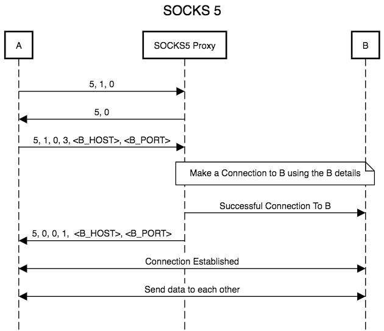
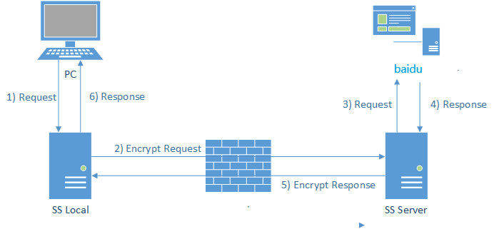
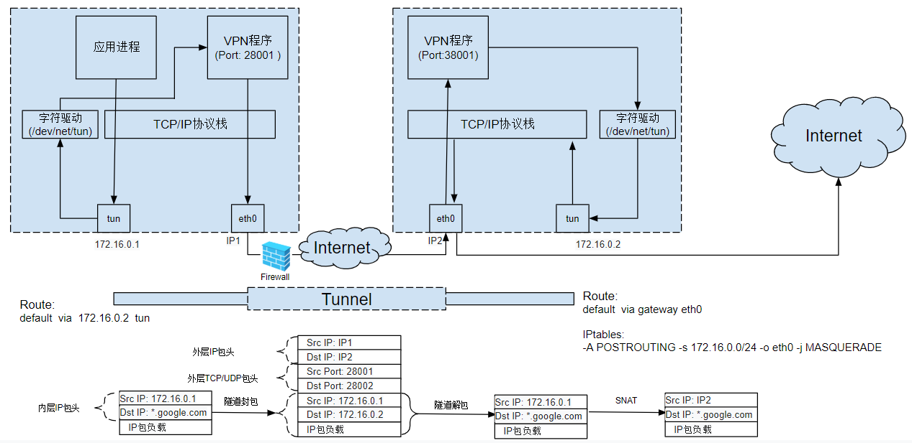

<!-- ref https://marpit.marp.app/markdown -->

# 打破壁垒
代理技术在家庭网络中的应用

---

# 运行良好的家庭网络

---

`iptables -A OUTPUT -d baidu.com -j DROP`

`iptables -A INPUT -s baidu.com -j DROP`

---

# 代理服务器

---

`iptables -I INPUT -m string --string "/baidu/i" --algo regex -j DROP`

---

# 加密的代理

---

# 透明的代理

---

# 总结：漫无止境的战斗

| 黑客的手段 | 我们的举措 |
| ---------- | ---------- |
| ip审查     | 代理       |
| 内容审查   | 加密代理   |
| 流量规律   | 换加密方式 |
| 主动嗅探   | 更好的伪装 |
